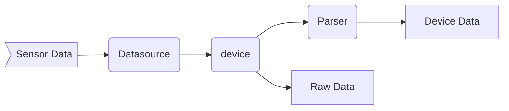

# Lobaro IoT Platform

The Lobaro IoT Platform can be found at [platform.lobaro.com](https://platform.lobaro.com){: target="_blank"}

## Overview

The platform shows device data received via various data sources like LoRaWAN, NB.IoT, GSM, etc..

Incoming data from a connected Sensor received by a `Datasource` and mapped to a single `Device` 
where the `Raw Data` is saved and a `Parser` gets executed. The result of the parser is saved as `Device Data`
used for visualization inside the dashboard.



## REST API

The API is located and documented at:  
 [https://backend.lobaro.com/api](https://backend.lobaro.com/api){: target="_blank"}

### Filter query parameters

Filters parameters can be appended to some requests in the form of `f:<parameter>=<op>:<value>` 
e.g. `f:createdAt=gt:<timestamp>` to filter by createdAt date. 

The Value must be URL encoded e.g. a timestamp might look like `gt:2000-01-01T02:37:00%2B01:00`


The allowed `<parameter>` is specified for each endpoint separately.

`<op>` must be one of the following operators:

| In Query | Meaning |
|----------|---------|
| `eq` | `=` |
| `lte` | `<=` |
| `lt` | `<` |
| `gte` | `>=` |
| `gt` | `>` |

If no operator is given the default `eq` operator will be used.

## Parser

A Parser takes raw input from the Sensor API and converts the data into a unified format used by the Dashboard.
In addition the parser can access an API to set device level properties and additional meta information outside of the actual data record.

Parsers are organized in 3 levels:

* Hardcoded default parser
* DeviceType parser
* Device parser

When no parser on device level is defined, the parser for the device type will be executed. When no parser for the device type is defined, a hardcoded default parser will be executed.

Parsers are written in JavaScript.

**Example**

```javascript
function Parse(input) {
  var dataStr = atob(input.data);
  var data = bytes(dataStr);

  // Decode an incoming message to an object of fields.
  var decoded = {input: input};

  return decoded;
}
```

### JS Parser API

Helper functions

```javascript
// Bytes can convert binary data to byte array
// atob converts Base64 string to byte string
var bytes = bytes(atob("aGFsbG8gYmFzZTY0"));

// Convert Base64 to byte array, shortcut for bytes(atob(...))
var bytes = parseBase64("aGFsbG8gYmFzZTY0");

// Convert bytes to string
var str = string(bytes);

// byte parsing helper
uint16BE(bytes, idx);
uint16LE(bytes, idx);
uint32BE(bytes, idx);
uint32LE(bytes, idx);
float32LE(bytes, idx);
float32BE(bytes, idx);
```

Special parser functions

```javascript
// Parse wMbus message
Parser.parseWmbus(bytes);

// Takes bytes of a partial message and a cacheKey
// In context of the receiving device all data with the same cacheKey 
// is concatinated and the restult returned
// To start a new message, pass a new cacheKey
var joined = Parser.joinPartial(bytes, cacheKey);

// Clears all data with the given cacheKey 
// returns the joined parts that were added by joinPartial before
var joined = Parser.clearPartial(cacheKey);

// Equivalent to clearPartial followed by joinPartial
var joined = Parser.newPartial(cacheKey);
```


All functions are optional. Not calling them will not change any data.

Update the physical location of the sensor
```javascript
Device.setLocation(lon, lat)
```

Set an device config value, displayed on the "Config" tab of the device
```javascript
Device.setConfig("key", "value");
```

Set an arbitary device property, displayed on the "Overview" tab of the device
```javascript
Device.setProperty("key", "value");
```

Get an arbitary device property, displayed on the "Overview" tab of the device
```javascript
var value = Device.getProperty("key");
```

Set the Sensor time of the current data record. Used for display, filter, sorting
```javascript
Record.setTime(new Date());
```


