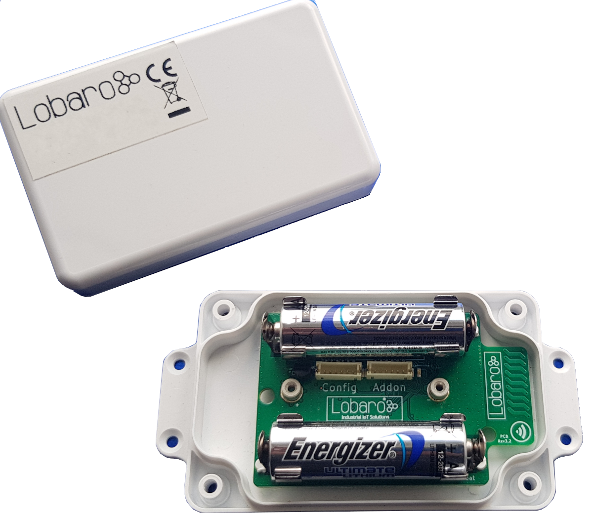
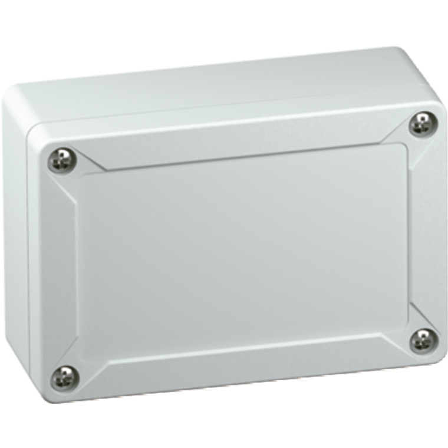
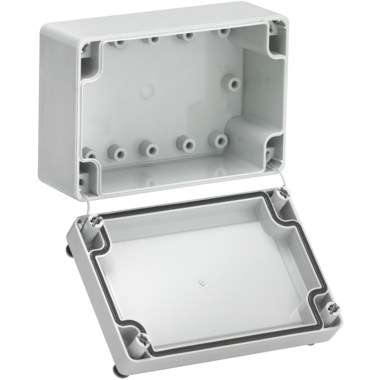
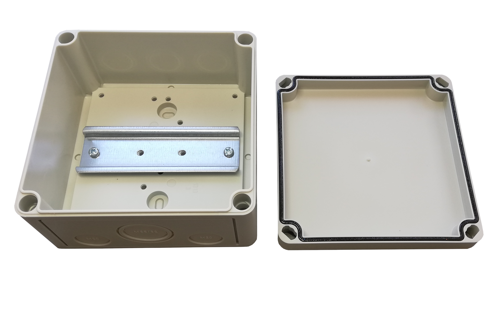
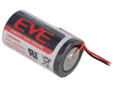
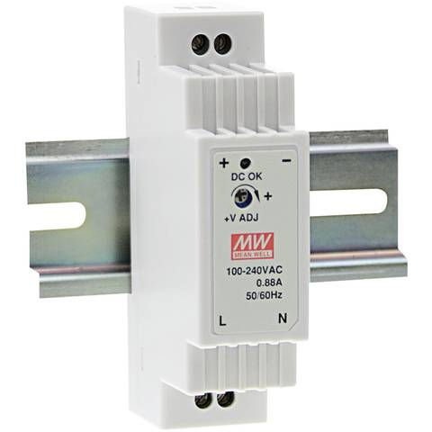
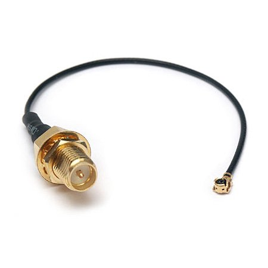

# Hardware Variations

!!! note
    **We are offering all our hardware in different housings with different power supply and antenna options.**

Most of our products are compatible with the following variations, for details about a specific product and pricing please contact us at [support@lobaro.de](mailto:support@lobaro.de)

## Housing

### Lobaro Box Housing

 
{: style="width:45%"}

* Size: 114,30mm (w) x 59,30mm (l) x 26,80mm (h)

### Spelsberg IP67

{: style="width:45%"}
{: style="width:45%"}

* [Product Page](https://www.spelsberg.de/nc/produkt/an/20040401/){: target="_blank"}

* Size: 122mm (w) x 82mm (l) x 55mm (h)

### DIN-Rail Housing

All DIN-Rail housings that fit our hardware are possible. The DIN-Rail mount can also be used without any housing.

We offer to deliver our hardware in the following housings:

{: style="width:70%"}

**130x130 (RK 4/12-L)**

* [Product Page](https://www.spelsberg.de/produkt/p/rk-412-l-leergehaeuse/an/61390601/cHash/faa47391816be2ba3b9c866cfd17a000/){: target="_blank"}
* Size: 130mm (w) x 130mm (l) x 75mm (h)

**110x110 (RK 4/07-L)**

* [Product Page](https://www.spelsberg.de/nc/produkt/an/61990701/){: target="_blank"}
* Size: 110mm (w) x 110mm (l) x 90mm (h)

## Power Supply

### AA-Batteries (3Ah)

{: style="height:100px"}

!!! note "Only for LoRaWAN products"
    Only our LoRaWAN hardware supports AA-Batteries inside the Lobaro Box Housing.

We recommend to use [Energizer Ultimate Lithium](https://www.energizer.eu/de/product/energizer-ultimate-lithium-aa/) for our products.

* Size: AA-Cell
* Voltage: 1.5V
* Capacity: 3Ah
* Operating temperature: -40°C...+60°C

### ER34615 3.6V Battery (D-Cell, 19Ah)

* Size: D-Cell (34mm x 61.5mm)
* Voltage: 3.7V
* Capacity: 19Ah
* Operating temperature: -55°C...+60°C
* Li-SOCl2 (not rechargeable)

### 5-30V External Supply

{: style="width:30%"}

Can be used standalone on an existing DIN-Rail or inside the DIN-Rail Housing [(see above)](#din-rail-housing)

## Antennas

By default all our products are shipped with an internal antenna. An external Antenna can be mounted on request.

External antennas are connected with a standard SMA connector:

{: style="width:30%"}