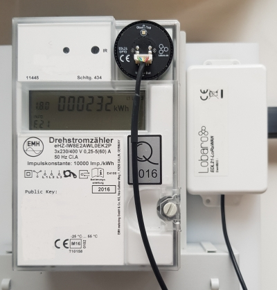
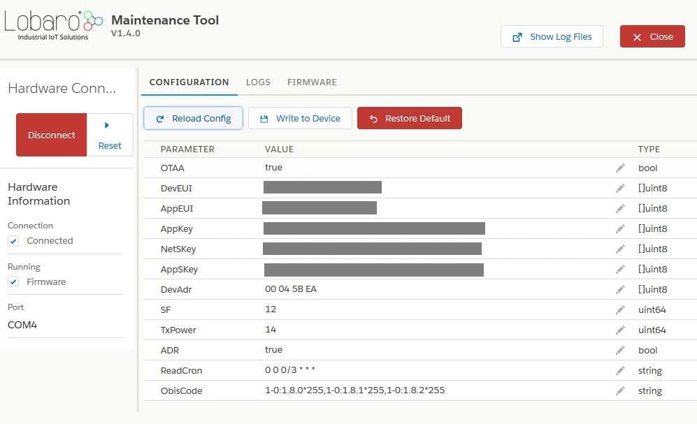

# EDL21 Electricity meter over LoRaWAN Bridge



## Quickstart 
1. Connect to the device with the [Lobaro Tool](https://www.lobaro.com/lobaro-maintenance-tool/) using the [Lobaro Config Adapter](https://www.lobaro-shop.com/product_info.php?info=p7_lobaro-usb-konfigurations-adapter.html) 
2. Under Configuration click "Reload Config" and change the fields ReadCron and ObisCode as you need followed by clicking on "Write to Device".
    
3. Register the device in your LoRaWAN network
4. Insert 2 batteries ('AA' size, 1.5V) / Connect external powersupply
5. If not connected to anything the red LED will start blinking as long as no data is received, after 1 minute it will sleep for 15 seconds after every 5 retries
6. Tighten the screws and install the bridge beside your electric meter
7. Place the EDL21 opto head on the "Info" interface
8. As soon as the EDL21 receives data its green LED will light up for 5 seconds, when connected to a LoRa Network its blue LED will light up for 5 seconds
9. Check the sent data (port 3), if payload is zero the EDL21 was not able to read data, recheck proper alignment

## Reference decoder

This is a decoder written in JavaScript that can be used to parse the device's 
LoRaWAN messages. It can be used as is in 
[The Things Network](https://thethingsnetwork.org).

```
function readName(bytes, i) {
    return bytes.slice(i, i + 6);
}

function readValue(len, bytes, i) {
    if (len <= 0) {
        return [];
    }
    return bytes.slice(i, i + len);
}

function toHexString(byteArray) {
    var s = '';
    byteArray.forEach(function (byte) {
        s += ('0' + (byte & 0xFF).toString(16)).slice(-2);
    });
    return s;
}

function parse_int8(bytes, idx) {
    bytes = bytes.slice(idx || 0);
    var t = bytes[0];
    if ((t & 1 << 7) > 0) { // temp is negative (16bit 2's complement)
        t = ((~t) & 0xff) + 1; // invert 16bits & add 1 => now positive value
        t = t * -1;
    }
    return t;
}

function parse_int16(bytes, idx) {
    bytes = bytes.slice(idx || 0);
    var t = bytes[0] << 8 | bytes[1] << 0;
    if( (t & 1<<15) > 0){ // temp is negative (16bit 2's complement)
        t = ((~t)& 0xffff)+1; // invert 16bits & add 1 => now positive value
        t=t*-1;
    }
    return t;
}
function parse_uint16(bytes, idx) {
    bytes = bytes.slice(idx || 0);
    var t = bytes[0] << 8 | bytes[1] << 0;
    return t;
}

function toNumber(bytes) {
    var res = 0;
    for (var i = 0, s = 0; i < bytes.length; i++) {
        res |= bytes[i] << s;
        s += 8;
    }
    return res;
}

function readVersion(bytes) {
    if (bytes.length<3) {
        return null;
    }
    return "v" + bytes[0] + "." + bytes[1] + "." + bytes[2];
}

function decodeStatus(bytes) {
    var decoded = {
        "version":readVersion(bytes),
        "flags": bytes[3],
        "vBat": parse_uint16(bytes, 4) / 1000,
        "temp": parse_int16(bytes, 6) / 10,
    };


    return decoded;
}

function decodeSmlValuesV1(bytes) {
    var decoded = {
        values: [],
    };

    if (bytes.length === 1) {
        // No Data! Read error?
        return decoded;
    }

    var pos = 0;
    while (pos < bytes.length) {
        var name = readName(bytes, pos);
        pos += 6;
        var len = bytes[pos];
        pos += 1;
        var value = readValue(len, bytes, pos);
        pos += len;

        var val = {
            nameHex: toHexString(name),
            len: len,
            value: toNumber(value),
            valueHex: toHexString(value)
        };

        decoded.values.push(val);
    }

    return decoded;
}

function decodeSmlValuesV2(bytes) {
    var decoded = {
        values: [],
    };

    if (bytes.length === 1) {
        // No Data! Read error?
        return decoded;
    }

    var pos = 0;
    while (pos < bytes.length) {
        var name = readName(bytes, pos);
        pos += 6;
        var len = bytes[pos];
        pos += 1;
        var value = readValue(len, bytes, pos);
        pos += len;
        if (len > 0) {
            var exponent = parse_int8(bytes, pos);
            pos += 1;
        }
        if (len > 0) {
            var val = {
                nameHex: toHexString(name),
                len: len,
                value: toNumber(value) * Math.pow(10, exponent),
                valueHex: toHexString(value),
            }
        } else {
            var val = {
                nameHex: toHexString(name),
                len: len,
                value: toNumber(value),
                valueHex: toHexString(value),
            }
        }

        decoded.values.push(val);
    }

    return decoded;
}

function Decoder(bytes, port) {
    // Decode an uplink message from a buffer
    // (array) of bytes to an object of fields.
    if (port === 1) {
        return decodeStatus(bytes);
    }
    if (port === 2) {
        return decodeSmlValuesV1(bytes);
    }
    if (port == 3) {
        return decodeSmlValuesV2(bytes);
    }
}
```

### Example parser result
Test input: 01 00 01 08 00 FE 08 7B 7D 23 00 00 00 00 00 FF

```
{
   "values": [
    {
      "len": 8,
      "nameHex": "0100010800fe",
      "value": 232588.30000000002,
      "valueHex": "7b7d230000000000"
    }
  ]
}
```