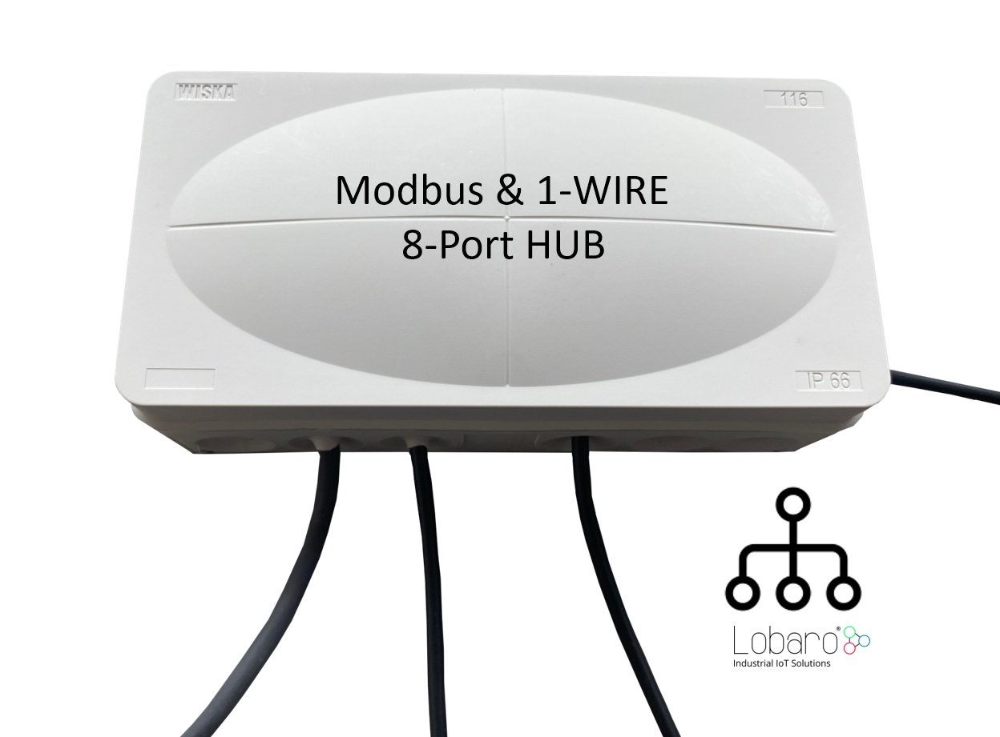
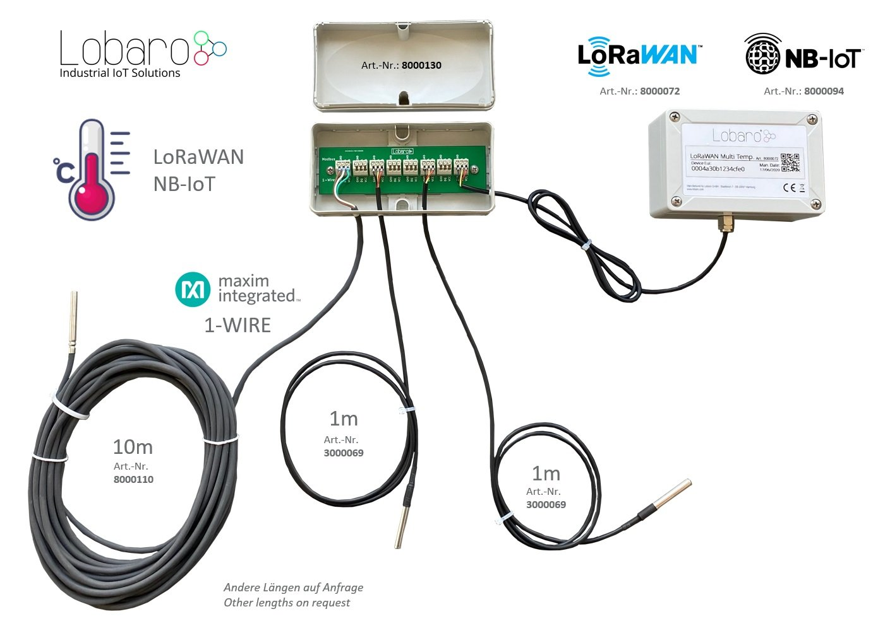

#LOB-S-1WT-LW

Multi Temperature Sensor Box

[Link to B2B Online Shop](https://www.lobaro.com/products/lorawan-multi-temperatur-box/) <br>

{: style="height:350px;"}

!!! info "Consider using the latest firmware on your hardware"
    * [**See available firmware downloads**](firmware.md){: target="_blank"}

## Quickstart 
1. Connect to the device with the [Lobaro Tool](https://www.lobaro.com/lobaro-maintenance-tool/) using the [Lobaro Config Adapter](https://www.lobaro-shop.com/product_info.php?info=p7_lobaro-usb-konfigurations-adapter.html) 
2. Under Configuration click "Reload Config" and change the configuration according to your needs
3. Register the device in your LoRaWAN network
4. Connect ER34614 3.6V D-cell Battery via XH connector / Connect external powersupply

## Key Features
- [X] Supports up to 25 [DS18x20](https://www.maximintegrated.com/en/products/sensors/DS18B20.html) 1-Wire sensors
- [X] 8-Port easy installation Hub available 
- [X] IP67 outdoor housing with pressure compensating element
- [X] Comes with one sensor attached
- [X] Sensor output order can be configured
- [X] Testmode for easy sensor identification
- [X] Big 19Ah size "D" battery for 10 years+ possible battery lifetime (not included)
- [X] LoRaWAN 1.0.x and 1.1 network servers supported
- [X] LoRaWAN Class A or Class C operation
- [X] LoRaWAN 1.1 time synchronisation
- [X] Variant with external power-supply and or external antenna available on request
- [X] Quick closing screws with cover retainer on housing


## Target Measurement / Purpose

The Multi Temperature Sensor Box is used to read out up to up to 25 [DS18x20](https://www.maximintegrated.com/en/products/sensors/DS18B20.html){: target="_blank"} 1-Wire temperature sensors. The temperature from all sensors is read regualarly and sent via LoRaWAN uplink automatically splitting the data into multiple uplinks if the payload gets too big for a single LoRaWAN message.
Sensors can be attached in series or in star configuration. 

## Additional Hardware
For easy connection of up to 7 DS18x20 1-Wire sensors consider using our [Modbus & 1-Wire 8-Port Hub](https://www.lobaro.com/products/verteilerbox-1-wire-modbus/) (`Order number: 8000130`).
Multiple Hubs can be connected to each other to achieve the limit of 25 sensors per Box.

{: style="height:250px;"}
{: style="height:250px;"}


## Configuration
The configuration is done using [Lobaro Maintenance Tool](/tools/lobaro-tool/) and the Lobaro USB PC adapter.

### LoRaWAN
The connection to the LoRaWAN network is defined by multiple configuration parameters.
This need to be set according to your LoRaWAN network and the way your device is 
supposed to be attached to it, or the device will not be able to send any data.

For a detailed introduction into how this values need to be configured, please 
refer to the chapter [LoRaWAN configuration](/background/lorawan.html#lorawan-configuration) 
in our LoRaWAN background article.

| Name       | Description | Type | Values |
|------------|-------------|------|-------|
|`OTAA`      |Activation: OTAA or ABP              |`bool`    | `true`= use OTAA, `false`= use ABP |
|`DevEUI`    |DevEUI used to identify the Device   |`byte[8]` | e.g. `0123456789abcdef` | 
|`JoinEUI`   |Used for OTAA (called AppEUI in v1.0)|`byte[8]` | e.g. `0123456789abcdef` | 
|`AppKey`    |Key used for OTAA (v1.0 and v1.1)    |`byte[16]`| |
|`NwkKey`    |Key used for OTAA (v1.1 only)        |`byte[16]`| |
|`SF`        |Initial / maximum Spreading Factor   |`int`     | `7` - `12` |
|`ADR`       |Use Adaptive Data Rate               |`bool`    | `true`= use ADR, `false`= don't |
|`OpMode`    |Operation Mode                       |`string`  | `A`= Class A, `C`= Class C |
|`TimeSync`  |Days after which to sync time        |`int`     | days, `0`=don't sync time | 
|`RndDelay`  |Random delay before sending          |`int`     | max seconds |
|`RemoteConf`|Not supported by this firmware       |`bool`    | `false`=deactivate |
|`LostReboot`|Days without downlink before reboot  |`int`     | days, `0`=don't reboot |

### Operation
Without configuration the sensors will be transmitted ordered by the 48 Bit id, ignoring the Sensorfamily prefix and the Checksum.
 
| name | description | example value |
|------|-------------|----------------|
| `TestMode`         | Run device in Testing Mode to help identify sensors. Must be `false` for normal operations. | `true` or `false` |
| `MeasureCron`      | Cron expression<sup>&dagger;</sup> defining when to read out sensors| `0 0/15 * * * *`(every 15 minutes)|
| `SendInternalTemp` | Toggle output of internal sensor. Will alway be sent first.  | `true` or `false` |
| `SendSensorId`     | Include Sensor ID in upload. Changes Payload format and Port.      | `true` or `false` |
| `SensorIdOrder`    | Semicolon separated list of 48 Bit IDs in hex (up to 25) | `22ffffff0000;44ffffff0000;11ffffff0000` |


<sup>&dagger;</sup> See also our [Introduction to Cron expressions](/background/cron-expressions.html).

## Temperature and Error values
Temperature is transmitted in 10th of degrees Centigrade (d°C), to avoid having to deal with floating point numbers.
Error conditions for individual sensors are transmitted as temperatures below -300°C.

| temperature | hex value | error condition |
|-------------|-----------|-----------------|
| -899.0°C    | `0xdce2`  | Sensor not found (for sensors set in `SensorIdOrder`). |
| -997.0°C    | `0xd90e`  | Communication timed out. |
| -998.0°C    | `0xd904`  | Temperature read out error. |
| -999.0°C    | `0xd8fa`  | No temperature value. |

## Sensor IDs
A complete sensor ID consists of 8 bytes:

```
byte    0: family code
bytes 1-6: serial number
byte    7: crc cecksum 
```

Only the serial number is used by the device. Family code and checksum are omitted for uploads and in configuration.

## Internal Sensor
There is a temperature sensor included in the board of the device. If `SendInternalTemp` is set to `true`, that sensor 
will be included in uploads. It will always be the first sensor in the list.

## Sensor order 
The sensors will be ordered by their IDs (without the leading byte indicating the sensor type). You can fix the 
upload order by listing sensors in `SensorIdOrder`. Sensors included here will always be included in upload messages, 
whether the sensor is found or not. If the sensor cannot be found, a temperature value of -899.0°C (=`0xdce2`) is sent.

If the internal sensor is included (by `SendInternalTemp`=`true`), the internal sensor will still be sent first, 
before the first sensor listed in `SensorIdOrder`.

Any sensors that are found and are neither internal nor listed in `SensorIdOrder` will be appended after the last 
sensor from `SensorIdOrder`, ordered by their IDs.

## Payload

Example payloads for each port:

### Status Message (Port 1)

Payload: `00040001070ce3`

Decoded:
```json
{
  "temp": 26.3,
  "vBat": 3.299,
  "version": "v0.4.0"
}
```

### Data Message (Port 2)
Payload with temperature measurements when Sensor-ID is included.

Structure:

| name        | len | type       | description |
| ----------- | :-- | ---------- | ----------- |
| success     |   1 | `uint8`    | 0 = Read error, 1 = Success |
| sensor id   |   6 | `uint8[6]` | 6-Byte 1-Wire Sensor Id |
| temperature |   2 | `int16 BE` | Temperature in 1/10 °C |
| ...         |     |            | ... sensor id and temperature fields repeat ...  |

When the total length of data exceeds 50 bytes, the message will be split and uploaded 
in multiple packets using this format.

Example Payload:
`01551e46920d0200da96b446920c0200d7dafc46920d0200d5202e4692050200dc`

Decoded:
```json
{
  "sensors": [
    {
      "id": "551e46920d02",
      "temp": 21.8
    },
    {
      "id": "96b446920c02",
      "temp": 21.5
    },
    {
      "id": "dafc46920d02",
      "temp": 21.3
    },
    {
      "id": "202e46920502",
      "temp": 22
    }
  ],
  "success": true
}
```

### Data Message (Port 3)
Payload with temperature measurements when Sensor-ID is omitted.

Before v0.4.0 this format is sent on Port 2.

Structure:

| name        | len | type       | description |
| ----------- | :-- | ---------- | ----------- |
| success     |   1 | `uint8`    | 0 = Read error, 1 = Success |
| temperature |   2 | `int16 BE` | Temperature in 1/10 °C |
| ...         |     |            | ... temperature field repeats ...  |

When the total length of data exceeds 50 bytes, the message will be split and uploaded 
in multiple packets using this format.

Example Payload:
`0100f500f500f800f500f300f8`

Decoded:
```json
{
    "sensors": [
      24.5,
      24.5,
      24.8,
      24.5,
      24.3,
      24.8
    ],
    "success": true}
```

## Parser

### TheThingsNetwork (TTN) / ChirpStack
```javascript
function readVersion(bytes) {
    if (bytes.length<3) {
        return null;
    }
    return "v" + bytes[0] + "." + bytes[1] + "." + bytes[2];
}
function parse_sint16(bytes, idx) {
    bytes = bytes.slice(idx || 0);
    var t = bytes[0] << 8 | bytes[1] << 0;
    if( (t & 1<<15) > 0){ // temp is negative (16bit 2's complement)
        t = ((~t)& 0xffff)+1; // invert 16bits & add 1 => now positive value
        t=t*-1;
    }
    return t;
}
function parse_uint16(bytes, idx) {
    bytes = bytes.slice(idx || 0);
    var t = bytes[0] << 8 | bytes[1] << 0;
    return t;
}

function parse_hex(bytes, idx, end) {
    var chars = "0123456789abcdef";
    bytes = bytes.slice(idx || 0, end || null);
    var s = "";
    for (var i=0; i<bytes.length; i++) {
        var byte = bytes[i];
        s += chars.charAt(byte>>4);
        s += chars.charAt(byte & 0xf);
    }
    return s;
}

function DecoderPort1(bytes) {
    return {
        "version":readVersion(bytes),
        "temp": parse_sint16(bytes, 3) / 10,
        "vBat": parse_uint16(bytes, 5) / 1000,
    };
}

function DecoderPort2(bytes) {
    // Decode an uplink message from a buffer
    // (array) of bytes to an object of fields.
    var sensors = [];
    var success = false;

    var pos = 0;
    if ( bytes.length ) {
        pos+=1;
        success = bytes[0] !== 0;
    }
    var left = bytes.length - pos;
    while (left>=8) {
        var sensor = {
            //'id_': bytes.slice(pos, pos+6),
            'id': parse_hex(bytes, pos, pos+6),
            'temp': parse_sint16(bytes, pos+6) / 10.0
        };
        sensors.push(sensor);
        pos += 8;
        left = bytes.length - pos;
    }
    // if (port === 1) decoded.led = bytes[0];

    var decoded = {};
    decoded['success'] = success;
    decoded['sensors'] = sensors;
    return decoded;
}

function DecoderPort3(bytes) {
    // Decode an uplink message from a buffer
    // (array) of bytes to an object of fields.
    var sensors = [];
    var success = false;

    var pos = 0;
    if ( bytes.length ) {
        pos+=1;
        success = bytes[0] !== 0;
    }
    var left = bytes.length - pos;
    var nr=0;
    while (left>=2) {
      var temp = parse_sint16(bytes, pos) / 10.0
        sensors.push(temp);
        pos += 2;
        left = bytes.length - pos;
    }
    // if (port === 1) decoded.led = bytes[0];

    var decoded = {};
    decoded['success'] = success;
    decoded['sensors'] = sensors;
    return decoded;
}

function Decoder(bytes, port) {
    switch (port) {
        case 1:
            return DecoderPort1(bytes);
        case 2:
            return DecoderPort2(bytes);
        case 3:
            return DecoderPort3(bytes);
    }
    return {
        "error": "Invalid port",
        "port": port
    };
}

// Wrapper for Lobaro Platform
function Parse(input) {
    // Decode an incoming message to an object of fields.
    var b = bytes(atob(input.data));
    var decoded = Decoder(b, input.fPort);

    return decoded;
}

// Wrapper for Loraserver / ChirpStack
function Decode(fPort, bytes) {
    return Decoder(bytes, fPort);
}

// Wrapper for Digimondo niota platform
/*
module.exports = function (payload, meta) {
    const port = meta.lora.fport;
    const buf = Buffer.from(payload, 'hex');

    return Decoder(buf, port);
}
*/
```
## CE Declaration of Conformity

[CE Declaration of Conformity](files/ce-OneWire-lorawan.pdf) (pdf).

