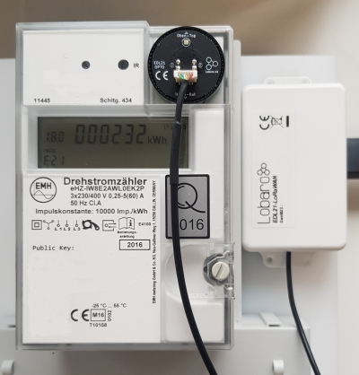

# EDL21 Electricity meter LoRaWAN Bridge

{: style="width:45%; vertical-align: top;"}

The EDL21 over LoRaWAN bridge is a device that can be used to readout modern utility meters with standardized infrared "INFO" interface. 

These type of meters are called in Germany to be "EDL21"-compatible - hence the name.
The meter outputs over its infrared "INFO" interface a serial protocol conforming to the [Smart Meter Language Protocol 1.04](https://de.wikipedia.org/wiki/Smart_Message_Language) (SML). This interface
is intended to be used by end-users and **not** for billing purposes of the electricity supplier.
The read information normally contains the current consumption values of the meter and gets interpreted and forwarded by the EDL21 bridge via a LoRaWAN network to web based applications 
interested in further processing this data.

!!! warning
    Older meters with "infrared pulse" output are **not** compatible to the Lobaro EDL21 bridge. Please check our list of [compatible meters](#compatible-utility-meters) to make sure it is equipped with
    the correct interface.

 
!!! info  "Consider using the latest firmware on your hardware"
    * [**See available firmware downloads**](firmware.md){: target="_blank"}
    
## Top Features
- [X] LoRaWAN 1.0.x and 1.1 network servers supported
- [X] LoRaWAN Class A or Class C operation
- [X] LoRaWAN 1.1 time synchronisation
- [X] Configuration via USB or remotely via LoRaWAN downlink
- [X] Compatible with many electrical utility meters
- [X] RGB Status LED
- [X] Variants with external power-supply and D-cell batteries available on request
- [X] Separation of infrared readout head and LoRaWAN antenna possible

## Compatible utility meters

| Electricity meter  | Manufacturer    | More information |
| :-------------     |:----------------|:----------------|
| DTZ541-ZEBA        | Holley          | [External Link](https://www.holleytech.de/holleytech/produkte/moderne-messeinrichtung-mme/drehstromzaehler-dtz541/){: target="_blank"}  |
| LK13 series               | Logarex         | [External Link](http://www.logarex.cz/en/products){: target="_blank"}  |
| OpenWay® 3.HZ      | iTron           | [External Link](https://www.itron.com/de/solutions/product-catalog/openway-3hz){: target="_blank"} |
| SGM-C4 series             | efr             | [External Link](https://www.efr.de/?id=17#/SGM-C4-Kompaktzaehler){: target="_blank"}  |
| SGM-D series             | efr             | [External Link](https://www.efr.de/?id=17#/FNN-Basiszaehler){: target="_blank"} |
| eHZ-K series | EMH             | [External Link](https://www.emh-metering.de/produkte/smart-meter/ehz-k){: target="_blank"}  |
| mMe4.0 series | EMH             | [External Link](https://www.emh-metering.de/produkte/smart-meter/mme4-0){: target="_blank"}  |
| ED300 series  | EMH             | [External Link](https://www.emh-metering.de/produkte/smart-meter/ed300l){: target="_blank"}  |
| eBZD series  | EMH             | [External Link](https://www.emh-metering.de/produkte/smart-meter/ebzd-g){: target="_blank"}  |
| ITZ series  | EMH             | [External Link](https://www.emh-metering.de/produkte/smart-meter/itz){: target="_blank"}  |
| E320  | Landis+Gyr      | [External Link](https://www.landisgyr.de/product/landisgyr-e320/){: target="_blank"} |
     
!!! note "Alternative IEC 62056-21 protocol"     
On request we offer also the integration of electricity meters using the D0 interface conforming to **IEC 62056-21**. This interface is not compatible to the SML protocol.
Please contact us if you need an offer for a custom firmware supporting your meter of interest.

## Product variants
`EDL21-LoRaWAN Bridge (universal head, AA, int. Ant.), Order number: 8000057` <br>
{: style="width:100%;"}

!!! note "Customization Options"
    The product variant shown above is the *standard* variant in our compact housing and powered by two AA batteries.
     
    [**Other power supply options & housing are available on request**](../../hardware.md){: target="_blank"}
    
    * External antenna
    * D-cell batteries
    * External power-supply
    * NB-IoT instead of LoRaWAN
    * Different infrared data formats other than SML
    
    Contact us via [support@lobaro.de](mailto:support@lobaro.de) if you need our offer for a special variant.

## Quickstart 
1. Connect to the device with the [Lobaro Tool](https://www.lobaro.com/lobaro-maintenance-tool/) using the [Lobaro Config Adapter](https://www.lobaro-shop.com/product_info.php?info=p7_lobaro-usb-konfigurations-adapter.html) 
2. Under Configuration click "Reload Config" and change the fields ReadCron and ObisCode as you need followed by clicking on "Write to Device" [click here for a configuration example](files/edl21_config_tool.jpg)
3. Register the device in your LoRaWAN network
4. Insert 2 batteries ('AA' size, 1.5V) / Connect external powersupply
5. If not connected to anything the red LED will start blinking as long as no data is received, after 1 minute it will sleep for 15 seconds after every 5 retries
6. Tighten the screws and install the bridge beside your electric meter
7. Place the EDL21 opto head on the "Info" interface
8. As soon as the EDL21 receives data its green LED will light up for 5 seconds, when connected to a LoRa Network its blue LED will light up for 5 seconds
9. Check the sent data (port 3), if payload is zero the EDL21 was not able to read data, recheck proper alignment

## Configuration
The configuration is done using [Lobaro Maintenance Tool](/tools/lobaro-tool/) and the Lobaro USB PC adapter.

### LoRaWAN
The connection to the LoRaWAN network is defined by multiple configuration parameters.
This need to be set according to your LoRaWAN network and the way your device is 
supposed to be attached to it, or the device will not be able to send any data.

There are two different methods to attach a device to a LoRaWAN network: 
Over-the-air-activation (OTAA) and Activation-by-personalisation (ABP). 
Depending on which method you are using you will have to set different values.

Several values are a number of bytes, that need to be entered as hexstrings (without 
`0x`-prefix). So e.g. the DevEUI is a value of 8 bytes encoded in hex will be 
16 hexdigits long. A sample value would be `0123456789abcdef`.

| name | used | type | description |
|------|------|------|-------------|
| `OTAA` | both | bool | `true` &equiv; use OTAA, `false` &equiv; use ABP |
| `DevEUI` | OTAA | hexbyte[8] | the 8 byte DevEUI identifies the hardware on the join operation. The default value is a world wide unique value predefined in the hardware. Should not be changed unless required by the network provider.
| `AppEUI` | OTAA | hexbyte[8] | ID defining the application used in the LoRaWAN network. |
| `AppKey` | OTAA | hexbyte[16] | Key used to encrypt communication with the LoRaWAN network. |
| `AppSKey` | ABP | hexbyte[16] | Application Session Key to be synced with the LoRaWAN network. |  
| `NetSKey` | ABP | hexbyte[16] | Network Session Key to be synced with the LoRaWAN network. |  
| `DevAdr` | ABP | hexbyte[4] | Device Address used to identify device in the LoRaWAN network. |  
| `SF` | both | int | Initial LoRa spreading factor used for transmissions. Valid range is 7-12. The actual spreading factor used by change during operation if ADR is used. |
| `ADR` | both | bool | Should adaptive data rate be used? `true` &equiv; use ADR, `false` &equiv; don't | 


### Operation
Configuration values defining the behaviour of the device. 

| name | description | example value |
|------|-------------|----------------|
| `ReadCron` | Cron expression defining when to read | `0 0/15 * * * *` for every 15 minutes |
| `ObisCode` | Comma separated list of ObisCodes to select a subset of the available information | `1-0:1.7.255*255` = Leistung (Momentan)

See also our [Introduction to Cron expressions](/background/cron-expressions) and our [Introduction to Obis Codes](/background/obis-codes).

## LED blinking patterns
The following pattery are explained in the order in which they appear after initial power on / reset of the device.

| color | duration | description
|------|-------------|----------------|
| `red/green/blue` | 300ms each | initial pattern after reset |
| `red/green` | 1s | NEW in 0.3.2: single readout success/failure before OTAA join |
| `red` | short, blinking | trying to receive meter optical data for the first time after OTAA join |
| `green` | 5 seconds | successfully received meter optical data |
| `blue` | 5 seconds | LoRaWAN network join |
| `blue` | short | sending LoRaWAN data uplink |
| `off` | - | low-power mode until next sendout cycle |

As you can see by this the device will start the LoRaWAN join only after receiving optical data at least once.
## Appendices

### Technical characteristics

|                          |                                                                         |
|--------------------------|-------------------------------------------------------------------------|
| **Product**              |                                                                         |
| Type name                | EDL21-LoRaWAN                                                       |
| Description              | Electricity meter over LoRaWAN Bridge                                              |
| **RF tranceiver**        |                                                                         |
| Type                     | Semtech SX1272                                                          |
| Frequency                | 863 MHz to 870 MHz                                                      |
| Max. TX Power            | max. +14 dBm                                                            |
| Typical RF Range         | &le;2km                                                                 |
| Ideal RF Range           | &le;10km (free line of sight)                                           |
| **LoRa communication**   |                                                                         |
| Protocol                 | Class A LoRaWAN 1.0.1 EU868                                             |
| Activation method        | Over-the-air-activation (OTAA) <br> Activation by personalization (ABP) |
| Encryption               | AES128                                                                  |
| **Environmental Requirements** |                                                                   |
| Operating temperature    | -20°C &ndash; 55°C                                                      |
| Max installation height  | 2m                                                                      |
| **Standards** <br>   |
|                          |                                                                         |

### Disposal / WEEE / Entsorgung

[Information about the disposal of the Device](/background/weee-disposal).


## Payload Format (old, Port 2, without exponent)

The payload consists of multiple entries, one entry per OBIS code given in the configuration.
Each entry follows the following structure:
 
| OBISCode (hex) | lenght of value (n)| value |
|------|------|------|
|6 bytes|1 byte|n bytes, LSB first|

Example packet: 01 00 01 08 00 FE 08 FF 01 00 00 00 00 00 00 01 00 01 08 00 FE 08 FF 02 00 00 00 00 00 00

Entry 1: 

| OBISCode (hex) | lenght of value (n)| value |
|------|------|------|
|01 00 01 08 00 FE|08|FF 01 00 00 00 00 00 00| 
|1-0:1.8.0*254|8|511|  

Entry 2: 

| OBISCode (hex) | lenght of value (n)| value |
|------|------|------|
|01 00 01 08 00 FE|08|FF 01 00 00 00 00 00 00| 
|1-0:1.8.0*254|8|767|  

## Payload Format (new, Port 3, with exponent)

The payload consists of multiple entries, one entry per OBIS code given in the configuration.
Each entry follows the following structure:
  
| OBISCode (hex) | lenght of value (n)| value | exponent |
|------|------|------|-----|
|6 bytes|1 byte|n bytes, LSB first| 1 byte (signed) |

Example packet: 01 00 01 08 00 FE 08 FF 01 00 00 00 00 00 00 ff 01 00 01 08 00 FE 08 FF 02 00 00 00 00 00 00 02

Entry 1: 

| OBISCode (hex) | lenght of value (n)| value | exponent |
|------|------|------|------|
|01 00 01 08 00 FE|08|FF 01 00 00 00 00 00 00| ff |
|1-0:1.8.0*254|8|511| -1 |  
Value = 511 * 10^-1 = 51.1

Entry 2: 

| OBISCode (hex) | lenght of value (n)| value | exponent |
|------|------|------|------|
|01 00 01 08 00 FE|08|FF 01 00 00 00 00 00 00| 02 |
|1-0:1.8.0*254|8|767| 2 | 
Value = 767 * 10^2 = 76700


## Reference decoder

This is a decoder written in JavaScript that can be used to parse the device's 
LoRaWAN messages. It can be used as is in 
[The Things Network](https://thethingsnetwork.org).

```javascript
function readName(bytes, i) {
    return bytes.slice(i, i + 6);
}

function readValue(len, bytes, i) {
    if (len <= 0) {
        return [];
    }
    return bytes.slice(i, i + len);
}

function toHexString(byteArray) {
    var s = '';
    byteArray.forEach(function (byte) {
        s += ('0' + (byte & 0xFF).toString(16)).slice(-2);
    });
    return s;
}

function parse_int8(bytes, idx) {
    bytes = bytes.slice(idx || 0);
    var t = bytes[0];
    if ((t & 1 << 7) > 0) { // temp is negative (16bit 2's complement)
        t = ((~t) & 0xff) + 1; // invert 16bits & add 1 => now positive value
        t = t * -1;
    }
    return t;
}

function parse_int16(bytes, idx) {
    bytes = bytes.slice(idx || 0);
    var t = bytes[0] << 8 | bytes[1] << 0;
    if( (t & 1<<15) > 0){ // temp is negative (16bit 2's complement)
        t = ((~t)& 0xffff)+1; // invert 16bits & add 1 => now positive value
        t=t*-1;
    }
    return t;
}
function parse_uint16(bytes, idx) {
    bytes = bytes.slice(idx || 0);
    var t = bytes[0] << 8 | bytes[1] << 0;
    return t;
}

function toNumber(bytes) {
    var res = 0;
    for (var i = 0, s = 0; i < bytes.length; i++) {
        res |= bytes[i] << s;
        s += 8;
    }
    return res;
}

function readVersion(bytes) {
    if (bytes.length<3) {
        return null;
    }
    return "v" + bytes[0] + "." + bytes[1] + "." + bytes[2];
}

function decodeStatus(bytes) {
    var decoded = {
        "version":readVersion(bytes),
        "flags": bytes[3],
        "vBat": parse_uint16(bytes, 4) / 1000,
        "temp": parse_int16(bytes, 6) / 10,
    };


    return decoded;
}

function decodeSmlValuesV1(bytes) {
    var decoded = {
        values: [],
    };

    if (bytes.length === 1) {
        // No Data! Read error?
        return decoded;
    }

    var pos = 0;
    while (pos < bytes.length) {
        var name = readName(bytes, pos);
        pos += 6;
        var len = bytes[pos];
        pos += 1;
        var value = readValue(len, bytes, pos);
        pos += len;

        var val = {
            nameHex: toHexString(name),
            len: len,
            value: toNumber(value),
            valueHex: toHexString(value)
        };

        decoded.values.push(val);
    }

    return decoded;
}

function decodeSmlValuesV2(bytes) {
    var decoded = {
        values: [],
    };

    if (bytes.length === 1) {
        // No Data! Read error?
        return decoded;
    }

    var pos = 0;
    while (pos < bytes.length) {
        var name = readName(bytes, pos);
        pos += 6;
        var len = bytes[pos];
        pos += 1;
        var value = readValue(len, bytes, pos);
        pos += len;
        if (len > 0) {
            var exponent = parse_int8(bytes, pos);
            pos += 1;
        }
        if (len > 0) {
            var val = {
                nameHex: toHexString(name),
                len: len,
                value: toNumber(value) * Math.pow(10, exponent),
                valueHex: toHexString(value),
            }
        } else {
            var val = {
                nameHex: toHexString(name),
                len: len,
                value: toNumber(value),
                valueHex: toHexString(value),
            }
        }

        decoded.values.push(val);
    }

    return decoded;
}

function Decoder(bytes, port) {
    // Decode an uplink message from a buffer
    // (array) of bytes to an object of fields.
    if (port === 1) {
        return decodeStatus(bytes);
    }
    if (port === 2) {
        return decodeSmlValuesV1(bytes);
    }
    if (port == 3) {
        return decodeSmlValuesV2(bytes);
    }
}

// Wrapper for niota.io
module.exports = function (payload, meta) {
    const port = meta.lora.fport;
    const buf = Buffer.from(payload, 'hex');

    return Decoder(buf, port);
}

```

### Example parser result
Test input (Port 3): 01 00 01 08 00 FE 08 FF 01 00 00 00 00 00 00 FF 

```json
{
  "values": [
    {
      "len": 8,
      "nameHex": "0100010800fe",
      "value": 51.1,
      "valueHex": "ff01000000000000"
    }
  ]
}
```
