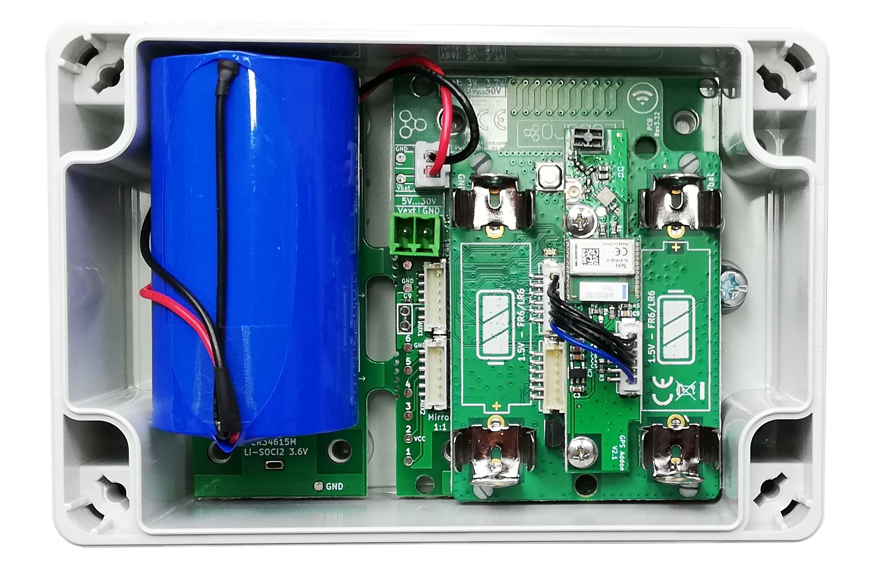
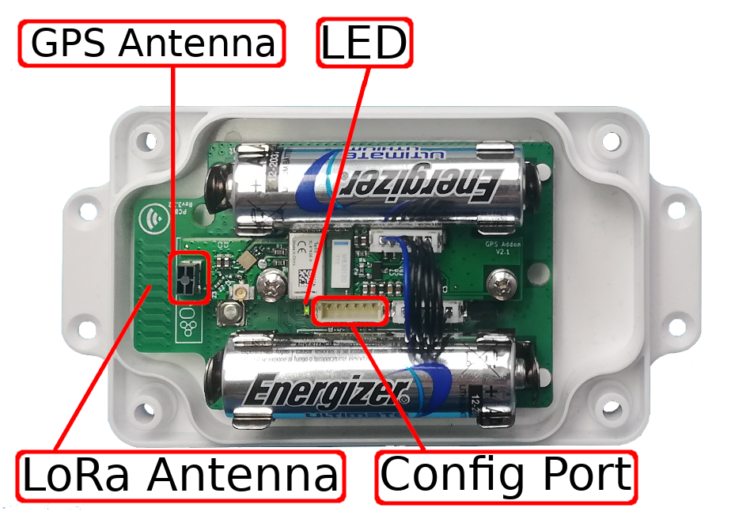
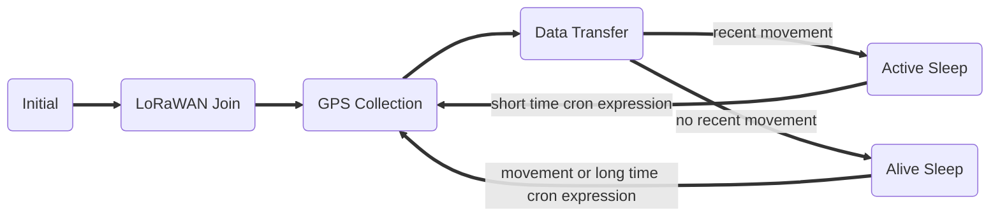

# GPS / GLONASS LoRaWAN Tracker

!!! warning "New version available"
    This is the manual for a version of our GPS-Tracker, which is no longer manufactured.
    This hardware revision uses has an addon strip screwed on the basis board, labeled *GPS Addon V2.x*
    (compare the photograph below). Our current hardware revision is labeled *Lobaro LoRaWAN GPS 3* and does 
    not have an addon strip (compare the photograph in the current revision's manual). Please be sure you are 
    using the manual for the correct hardware revision. Do not install firmware of version 7 or higher on the 
    old hardware revision, as it will not work! 
    
    Please refer to [GPS-Tracker Hardware Revisions](../revisions.md) to find out which hardware you have.

###Variant without Power Addon

`Order number: 8000014` <br>
{: style="height:400px;display: block; margin: 0 auto;"}

###Variant with Power Addon
`Order number: 8000082` <br>
{: style="height:300px;display: block; margin: 0 auto;"}

!!! info "Hardware Revisions"
    The picture above shows the tracker in **hardware revision 2** with GPS and additional GLONASS support for best positioning.
    Hardware revision 1 with GPS only is no longer available.
    
    [**Show pictures of different hardware revisions**](firmware.md){: target="_blank"} 
    
## Overview

The LoRaWAN GPS Tracker (GPS-LoRaWAN) is a battery powered tracking device, that
uses the satellite based positioning services GPS and GLONASS to determine its location and transmits the
obtained coordinates via LoRaWAN radio technology. Intervals between measurements can
be freely configured, in order to adjust the device to individual needs.  
An integrated motion sensor detects changes in the device's movement (if it is picked up or
transported in a vehicle). This allows the device to switch between an `Active Mode` in which
frequent updates are uploaded during phases of movement and an `Alive Mode` that saves
battery power by sending only few updates. While not sending updates, the device enters a
sleep mode that only uses ∼30 µA.  

**Please read the manual carefully before operating the device. A safe operation of the
device is only possible if you follow the guides provided in this manual. Using the device
differently than intended by Lobaro my cause damage to people, the environment, or
the device.**

{: style="width:30%; display: block; margin: 0 auto;"}

{: style="width:60%; display: block; margin: 0 auto;"}

## Operating the GPS Tracker
Once batteries are inserted into the device, it will start working. The Tracker will
most likely need to be adjusted to your personal LoRaWAN configuration (see chapter "Configuration").

### Batteries

The LoRaWAN GPS Tracker default power supply consists of two series connected off-theshelf
1.5V 'AA' sized batteries. Be sure to get the polarity right, see the '+'-Symbol on the
board. In general only AA cells of the types Alkali-Manganese (1.5V, LR6) and Lithium-Iron-
Sulphide (1.5V, FR6) are allowed to be inserted in the device. Lobaro recommends the use
of FR6 batteries like the Energizer Ultimate Lithium over LR6 types because of the higher
capacity and better discharge properties.

!!! warning 
    Other Batteries or accumulators with a nominal voltage of more than 1.5V must not inserted into the device under any circumstances. 
    In particular, lithium based cells with a nominal voltage of 3.6V or 3.7V must not be used on the AA battery slots!

On request we can supply custom product variants with special housings powered by even
bigger batteries. For example a 3.6V C sized mono cell typically has a capacity of 9Ah with
leads to a 3x increased battery life compared to the standard AA-cells. With D sized cells of
typically 19Ah capacity this value can be doubled once again (6x). Also available on request
are options with permanent external power supply (230V, 9-24V, 5V USB).

### Installation

The device can be fixed on a flat surface using the lateral mounting holes of the case, see
[Hardware Variations](../../hardware.md) for a detailed description of all housing dimensions. Alternatively we offer as
accessory a mounting clip for a standard 35mm DIN rail. The device can then easily snapped
on a such rails. It can therefore be added to a variety of racks alongside other devices.

!!! note 
    Under any circumstances the device must not be mounted higher than 2 meters above ground to avoid any risks in case of falling down!

For optimal RF performance (e.g. LoRa range) any metal obstacles near the internal antenna
should be avoided. In this case 'near' is defined as keep-out distance of about 3-5 centimeters
around the antenna. The internal helix antenna can be identified by the winding pcb traces
near the white printed encircled 'connectivity' symbol. In any case a device mounting directly
on top of a metal surface is not advisable since it will degrade the possible RF range. Stone
walls, wood or plastic standoffs are perfectly ok.
In case of challenging installation locations (e.g. in basements) or unavoidable long distances
to the next LoRaWAN gateway, Lobaro offers on request custom product variant equipped
with a 'SMA' connector to support a external antenna connection.

## Work Cycle


The GPS Tracker has a work cycle that adapts to detected motion of the device.

#### Initial Phase

This is the phase that is executed after the device is started of restarted. The LED flashes
once and the configuration is evaluated. If successful, the LoRaWAN Join phase is executed
next.

#### LoRaWAN Join Phase

If the Device is configured to use over the air activation (OTAA), the OTAA Join is performed
at this point. The device will repeatedly try to join its LoRaWAN network until the process
is successful. It then enters the Data Collection Phase.
If the Device is configured to use ABP instead of OTAA, this phase is left immediately and
the Data Collection Phase is entered.

#### GPS Collection Phase

During the GPS Collection Phase the device will try to determine its coordinates (latitude,
longitude, and height) using GPS. You can identify this phase by the onboard LED flashing
on and off in one second intervals.
Once the position has been determined successfully (or the attempt timed out and failed,
because of bad GPS reception), the device enters the Data Transfer Phase.

#### Data Transfer Phase

During the Data Transfer Phase the Tracker uploads the GPS coordinates to the LoRaWAN
network. The message contains the information if the measurement was successful. Some
status information about the device are included as well.
For a detailed description of the data sent refer to "LoRaWAN Data Upload Formats".
After data transfer, the GPS Tracker enters a sleep state to save power. Depending on
how much time passed since the last physical movement of the device (determined by the
internal motion sensor), the Tracker enters diferent sleep phases. If the time since the last
detected motion is less than a timeout value (configurable, standard value is 65 minutes),
the device remains in `Active mode` enters only a short sleep phase (`Active Sleep`). If no
motion was detected for a time longer than the timeout, the device enters the `Alive Sleep`
Phase, which typically has a much longer sleeping time, but in which the device will also be
activated through movement.

#### Active Sleep Phase

Even in Active Mode, the device spends most of its time in a deep sleep state to conserve
energy. The frequency with which the Tracker wakes up in Active Mode can be configured
using a Cron expression (see "GPS configuration parameters"). Typical values for active sleep time are 5 or 15
minutes.
When in Active Sleep Phase, the device will not be triggered to gather more GPS positions
through motion, but movement of the device will still be registered to keep the Tracker in
Active Mode.

#### Alive Sleep Phase
When no movement has been detected for a long amount of time (configurable), the device
stops sending updates, since there is not much point in sending frequent position information
when the device does not change its position. In Alive Mode, only very few updates are sent
to keep the network informed about the device's health. Typically one message is sent per
day in this mode (frequency can be configured with a cron expression, see "GPS configuration parameters").
When physical movement is detected by the internal motion sensor during this phase, the
GPS Tracker immediately wakes up and switches to Active Mode.

## Configuration

###The Lobaro Maintenance Tool

{: style="width:60%; display: block; margin: 0 auto;"}

The initial device configuration can be done very comfortably from your PC via the serial
configuration interface. Beside the needed Lobaro USB to UART adapter the 
[**Lobaro Maintenance Tool**](../../tools/lobaro-tool.md){: target="_blank"} needs to be installed. This tool is freely available for various operating systems
including Windows, Linux, Mac and Linux-ARM (e.g. Raspberry-PI) on and works with all
Lobaro sensors.

Technically this software opens a webserver on port 8585 that runs in a background console
window. The actual user interface can be accessed normally using a standard web browser
at address http://localhost:8585. Normally your default browser should be
opened with this URL automatically after tool startup . Even remote configuration and logobservation
over the Internet is possible, e.g. having a Raspberry PI via USB connected to
the Lobaro device and accessing the maintenance tool from a remote machines browser over
the Internet.

Additionally to the device setup the tool can also be used for firmware updates ('Firmware
Tab') , watching real-time device diagnostic output ('Logs Tab') and initiating device restarts.


!!! info "Info"
    Please note that the device might be restarted each time the configuration gets plugged/unplugged!

### Connecting the USB config adapter
For configuration and Firmware updates we provide a special serial-USB adapter that can be
connected as shown in the picture underneath. The corresponding connector on the PCB is marked with
the word 'Config'.

The USB-adapter will add a virtual serial 'COM' Port to your system. Your operating system
needs the [CP210x USB to UART bridge](https://www.silabs.com/products/development-tools/software/usb-to-uart-bridge-vcp-drivers){: target="_blank"} driver installed. A download link is provided next
to the 'Connect' button when you start the Maintenance Tool.
While the config adapter is connected, the device will be powered from the USB port with
a regulated voltage of 3.3V. It is not necessary - although it would be no problem - having
batteries inserted or a different supply connected while using the config adapter. All
configuration parameters will be kept non-volatile regardless of the power supply.

{: style="width:50%; display: block; margin: 0 auto;"}

!!! info "Hardware Revisions"
    The picture above shows the tracker in **hardware revision 1** with GPS only support.
    Hardware revision 1 with GPS only is no longer available. 

### System Parameters
After being successfully connected to the hardware using the Lobaro Maintenance Tool you
can press 'Reload Config' in the 'Configuration' tab to read the current configuration from the
device. For every parameter a default value is stored non volatile inside the hardware to which
you can revert using the 'Restore default' button in case anything got miss configured.
All LoRaWAN & other firmware parameters are explained in the following.

### LoRaWAN
The connection to the LoRaWAN network is defined by multiple configuration parameters.
This need to be set according to your LoRaWAN network and the way your device is 
supposed to be attached to it, or the device will not be able to send any data.

For a detailed introduction into how this values need to be configured, please 
refer to the chapter [LoRaWAN configuration](/background/lorawan.html#lorawan-configuration) 
in our LoRaWAN background article.

| Name       | Description | Type | Values |
|------------|-------------|------|-------|
|`OTAA`      |Activation: OTAA or ABP              |`bool`    | `true`= use OTAA, `false`= use ABP |
|`DevEUI`    |DevEUI used to identify the Device   |`byte[8]` | e.g. `0123456789abcdef` | 
|`JoinEUI`   |Used for OTAA (called AppEUI in v1.0)|`byte[8]` | e.g. `0123456789abcdef` | 
|`AppKey`    |Key used for OTAA (v1.0 and v1.1)    |`byte[16]`| |
|`NwkKey`    |Key used for OTAA (v1.1 only)        |`byte[16]`| |
|`SF`        |Initial / maximum Spreading Factor   |`int`     | `7` - `12` |
|`ADR`       |Use Adaptive Data Rate               |`bool`    | `true`= use ADR, `false`= don't |
|`OpMode`    |Operation Mode                       |`string`  | `A`= Class A, `C`= Class C |
|`TimeSync`  |Days after which to sync time        |`int`     | days, `0`=don't sync time | 
|`RndDelay`  |Random delay before sending          |`int`     | max seconds |
|`RemoteConf`|Not supported by this firmware       |`bool`    | `false`=deactivate |
|`LostReboot`|Days without downlink before reboot  |`int`     | days, `0`=don't reboot |

###GPS configuration parameters
The behaviour of the GPS Tracker and how it switches between its two operation modes
('Active' and 'Alive') can be adjusted to your needs. The table explains the configuration
parameters used for this.

|      Name     |     Type  | Description| default value |
|---------------|-----------|------------|---------------|
|ActiveCron     |string |   Cron expression defining how often the device will take a measurement and send its position over LoRaWAN while the Tracker is in Active Mode. This expression should trigger much more frequent than the one for Alive Mode. The standard is 0 0/15 * * * *, which will trigger every 15 minutes. See chapter "Cron expressions" for an introduction to cron expressions.       | 0 0/15 * * * *|
|AliveCron      |string |   Cron expression defining how often the device will wake up when in Alive Mode. This should be less frequent than in Active Mode. The standard is 0 0 0/12 * * *, which translates to twice each day. See chapter "Cron expressions" for an introduction to cron expressions.           |0 0 0/12 * * *|
|gpsTO          |int    |   Time in seconds to wait for GPS to get a fix before timing out. |180 seconds |
|actTO          |int    |   Time in minutes without movement after which the Tracker switches to Alive Mode. | 65 minutes|
|memsTh         |int    |   Threshold for the internal motion detector to register movement. Values range from 2 to 255. A higher value makes the device less sensitive.<br>2 Environment (wind or steps) may trigger.<br>5 Standard, picking up the device will activate it. <br> 20 Carefully picking it up will not trigger the device.<br>50 When carried, running will trigger, walking won't.<br>100+ Shaking will activate, dropping the device might not.          | 5 |
|CayenneLPP     |bool   |   Use alternative Cayenne LPP upload format. Standard: false, e.g. use Lobaro Format. See chapter "myDevices Cayenne format" for an introduction to this format.      | false|
|maxHDOP        |int    |   Maximum acceptable Horizontal Dilution Of Precision,  between 1 and 50, smaller is better |2|
|maxDataAfterFix|int    |   If the HDOP target cannot be matched this value determines after how many datapackets with fix the position will be accepted | 20| 

###Cron expressions
Cron expressions are used to define specific points in time and regular repetitions of them.  
The schedule for data collecting phases is defined using the [CRON](../../background/cron-expressions.md){: target="_blank"} format which is very
powerful format to define repeatedly occurring events.

!!! info 
    Standard Lobaro devices typically do not need to know the real time for proper operation. 
    All times are relative to the initial time when batteries are inserted.

If needed by the target application Lobaro can deliver on request special hardware support for keeping
data acquisition intervals based on a real time clock which stays in sync with the real time.  
Please contact Lobaro directly if you need such a custom product variant.

A cron expression consists of 6 values separated by spaces:

* Seconds (0-59)
* Minutes (0-59)
* Hours (0-23)
* Days (1-31)
* Month (1-12)
* Day of Week (SUN-SAT b= [0,6])

Examples of CRON definitions: <br>

|       ||
|------------|-----------|
|0 5 ****    |hourly at minute 5, second 0 (at 00:05:00, 01:05:00, ...)|
|0 1/10 * * * *  |every 10 minutes from minute 1, second 0 (minutes 1, 11, 21, ...)|
|0 0 6 * * *     |daily at 6:00:00|
|0 0 13 1,15 * * |1st and 15th day of every month at 13:00:00|
|0 0 9 1-5 * *   |every month daily from day 1 till 5 at 9:00:00|

##LoRaWAN Data Upload Formats
After reading GPS coordinates (either successfully or unsuccessfully), the Tracker uploads the
data using LoRaWAN. As LoRaWAN can only transmit very short messages, the message
formats contain only data bytes, no keys or data types are included. The meaning of a byte
is determined by its position within a message. The tracker supports two different upload
formats as described in the following:

###Lobaro upload format (since Firmware Version 5)
Only a single massage format is used by the GPS Tracker, it has a fixed length of 17 bytes.
The table explains the message format used.
This format uses the decimal degrees notation for the location, e.g. 53.4724° north and
9.9334° east. Positive (+) values indicate north longitudes and east latitudes, negative (-)
values indicate south longitudes and west latitudes. Both location values are transmitted as
signed integers in *big endian* format and get multiplied by 100.000. So after receiving the
location data must be divided by this factor.
Multi byte integers are transmitted as big endian. Values that would require decimal places
are transmitted in smaller units, e.g. 1/100000 degree (as described before), to handle only with
integers.

###Fields, Data Packet

|name|bytes|type|description|example / range|
|-|-|-|-|-|
|temp|0-1|int16|Temperature inside the device in 1/10°C|246 =  24.6 °C|  
|v_bat|2-3|uint16|Current battery voltage in mV|3547 = 3.547 V|
|latitude deg|4-7|int32|int32 degrees of the latitude x 100 000|-9 000 000 to 9 000 000|
|longitude deg|8-11|int32|degrees of the longitude x 100 000|-18 000 000 to 18 000 000|
|altitude|12-14|int24|Altitude of the device in centimeters|-8 388 607 to 8 388 606|
|flags|15|uint8|Status flag, refer to table below|00bin = invalid, alive <br> 01bin = valid, alive <br> 10bin = invalid, active <br> 11bin = valid, active|
|sat|16|uint8|GPS satellites found / in view|7|

###Status flag

|bit|function|not set|set|
|-|-|-|-|
|1|Validity of last measurement|invalid|valid|
|2|Current operation mode|alive|active|
|3-8|reserved for future use|||

If during some configurable period of time (see "gpsTO" parameter in table "GPS configuration parameters") no GPS
location can be found the last known valid GPS location will be transmitted but with the
valid flag set to false.
We provide a [JavaScript reference implementation](#parser) of a decoder for the data packages, 
which can be used directly for decoding in [The Things Network](https://www.thethingsnetwork.org/){: target="_blank"}.

###myDevices Cayenne format
As an alternative for the Lobaro data format the tracker can be configured to send Cayenne
LPP compatible LoRaWAN uploads. [myDevices Cayenne](https://mydevices.com/){: target="_blank"} allows you to quickly visualize the
via LoRaWAN transmitted data of the Lobaro GPS-tracker. You can use Cayenne as a tool
to visualize real-time and historical data, sent over The Things Network and various other
LoRaWAN providers.
To use the alternative upload format configuration parameter "CayenneLPP" must be set to
"true" as described in section "GPS configuration parameters" The advantages of using the cayenne format is a quick
device evaluation without programming some custom backend and/or front software. Disadvantages
are bigger LoRaWAN message sizes due to the additional schema meta information
overhead the format needs.

The Lobaro GPS Trackers maps its data to cayenne channels as follows:

|description|cayenne channel|cayenne type|
|-|-|-|
|Internal Temperature|0|Temperature|
|Battery Voltage|1|AnalogOutput|
|GPS data|2|GPS|
|satellites found|3|Digital Output|

### Legacy upload format (up to Firmware Version 4)
This format is not supported any more since firmware version V5.0.0! Please consider updating
your device firmware using the Lobaro maintenance tool.
Only a single massage format is used by the GPS Tracker, it has a fixed length of 15 bytes.
This format uses the degrees with decimal minutes notation for the location.
Multi byte integers are transmitted as big endian. Values that would require decimal places
are transmitted in smaller units (e.g. mV instead of V).
The table underneath explains the message format used.


|name|type|description|example/range|
|-|-|-|-|
|flags|uint8|Status flags, for internal use|0|
|temp|int16|Temperature inside the device in 1/10°C|246 ≙ 24.6 °C|
|v_bat|uint16|Current battery voltage in mV|3547 ≙ 3:547 V|
|latitude deg|int8|Whole degrees of the latitude|-90 to 90|

####Example

!!! info "As an illustration, if the received data would consist of the 15 bytes (hexencoded):" 
    **00 01 18 0D 69 35 1C 0F 71 09 38 02 4B 01 06**

|type|example|description|
|-|-|-|
|flag|**00**|for internal use, ignore|
|temp|**01 18**|0118 hex = 0280dec ≙ 280 d°C = 28.0 °C|
|v_bat|**0D 69**|0D89 hex = 3465dec ≙ 3465mV = 3.465V|
|latitude|**35 1C 0F 71**|35hex = 53dec ≙ 53° <br> 1C hex = 28dec ≙ 28' <br> 0F71 hex = 3953dec ≙ 0.3953' <br> 351C0F71 ≙ 53°28.3952' = 53.473255° = 53°28'23.718'' North|
|longitude|**09 38 02 4B**|09 hex = 09dec ≙ 09°<br> 38 hex = 56dec ≙ 56' <br> 024B hex = 0587dec ≙ 0.0587'<br> 0938024B ≙ 9°56.0587' = 9.934 312° = 9°56'3.522'' East|
|valid|**01**|01hex ≙ valid measurement, could receive GPS signal|
|sat|**06**|06hex = 06dec ≙ Signal of 6 satellites received for measurement|

## Technical characteristics
|||
|-|-|
|**Product**||
|Type name|GPS-LoRaWAN|
|Description|LoRaWAN GPS Tracker|
|**RF transceiver**||
|Chipset|Semtech SX1272|
|Frequency Range|863 to 870 MHz|
|TX Power|≤ 14 dBm|
|Typically RF range|≤ 2km|
|Ideal RF range|≤ 10km (free line of sight)|
|**LoRa communication**||
|LoRaWAN Protocol|LoRaWAN 1.0.1, Class A, EU868|
|Activation method|Over-the-air activation (OTAA) <br> Activation by personalization (ABP)|
|Encryption|AES128|
|**Power**||
|Power supply|2xAA sized battery, 1.5 V, LR6/FR6|
|Supply voltage|UNom = 3.0V, UMin = 2.2V, UMax = 3.7V|
|Capacity|∼ 30000 LoRaWAN messages @SF11|
|**Current consumption @3V**||
|Normal|≤3 mA|
|Wireless M-BUS RX|≤14 mA|
|LoRa RX|≤14 mA|
|LoRa TX|≤80 mA|
|Sleep with GPS standby and MEMS running|≤20 µA|
|**Mechanical dimensions**||
|Size|114.3 mm x 59.3 mm x 26.8 mm|
|Housing Material|ABS plastic|
|**Environmental Requirements**||
|Operating temperature range|-20°C to +55°C|
|Max. Installation height|2m|
|**Conformity**||
| ||


## Parser

### The Things Network

For Version 4.x, 5.x and 6.x

```javascript
function signed(val, bits) {
    if ((val & 1 << (bits-1)) > 0) { // value is negative (16bit 2's complement)
        var mask = Math.pow(2, bits) - 1;
        val = (~val & mask) + 1; // invert all bits & add 1 => now positive value
        val = val * -1;
    }
    return val;
}

function int16_BE(bytes, idx) {
    bytes = bytes.slice(idx || 0);
    return signed(bytes[0] << 8 | bytes[1] << 0, 16);
}

function int24_BE(bytes, idx) {
    bytes = bytes.slice(idx || 0);
    return signed(bytes[0] << 16 | bytes[1] << 8 | bytes[2] << 0, 24);
}

function int32_BE(bytes, idx) {
    bytes = bytes.slice(idx || 0);
    return signed(bytes[0] << 24 | bytes[1] << 16 | bytes[2] << 8 | bytes[3] << 0, 32);
}

function DecoderPort2(bytes) {
    // Format for firmware 5.0.x
    // Decode an uplink message from a buffer
    // (array) of bytes to an object of fields.

    var Temp = int16_BE(bytes, 0) / 10;
    var VBat = int16_BE(bytes, 2) / 1000;
    var Lat = int32_BE(bytes, 4) / 100000;
    var Lon = int32_BE(bytes, 8) / 100000;
    var Alt = int24_BE(bytes, 12) / 100;
    var Valid = bytes[15] & 0x01;
    var Active = bytes[15] & 0x02;
    var SatCnt = bytes[16];

    return {
        Temp: Temp || 0,
        VBat: VBat || 0,
        Lat: Lat || 0,
        Lon: Lon || 0,
        Alt: Alt || 0,
        Valid: Valid,
        Active: Active,
        SatCnt: SatCnt
    };
}

function DecoderPort1(bytes) {
    // legacy format, firmware 4.x
    // Decode an uplink message from a buffer
    // (array) of bytes to an object of fields.

    var button_number = bytes[0];
    var Temp10tel = (bytes[1] << 8) | (bytes[2] << 0);
    var VBat1000tel = (bytes[3] << 8) | (bytes[4] << 0);
    var lat_deg = bytes[5];
    var lat_min = bytes[6];
    var lat_10000min = (bytes[7] << 8) | (bytes[8] << 0);
    var long_deg = bytes[9];
    var long_min = bytes[10];
    var long_10000min = (bytes[11] << 8) | (bytes[12] << 0);
    var gpsValid = (bytes[13] !== 0);  // Missing byte = true

    return {
        button_number:button_number || 0,
        Temp10tel: Temp10tel || 0,
        VBat1000tel: VBat1000tel || 0,
        lat_deg: lat_deg || 0,
        lat_min: lat_min || 0,
        lat_10000min: lat_10000min || 0,
        long_deg: long_deg || 0,
        long_min: long_min || 0,
        long_10000min: long_10000min || 0,
        gps_valid: gpsValid || false
    };
}

function Decoder(bytes, port) {
    switch (port) {
        case 1:
            return DecoderPort1(bytes);
        case 2:
            return DecoderPort2(bytes);
        default:
            return {"error":"Unsupported port","port":port};
    }
}

// Wrapper for Lobaro Platform
function Parse(input) {
    // Decode an incoming message to an object of fields.
    var b = bytes(atob(input.data));
    var decoded = Decoder(b, input.fPort);

    return decoded;
}

// Wrapper for Loraserver / ChirpStack
function Decode(fPort, bytes) {
    return Decoder(bytes, fPort);
}

// Wrapper for Digimondo niota.io (uncomment only when used in niota)
/*
module.exports = function (payload, meta) {
    const port = meta.lora.fport;
    const buf = Buffer.from(payload, 'hex');

    return Decoder(buf, port);
}*/
```

## PDF Documentation
* [Product Dimensions (pdf)](files/Lobaro-Compact-Housing.pdf){: target="_blank"}
* [User Manual (en)](files/lorawan-gps-tracker_en.pdf)
* [CE Declaration of Conformity](files/ce-GPS-LoRaWAN.pdf)