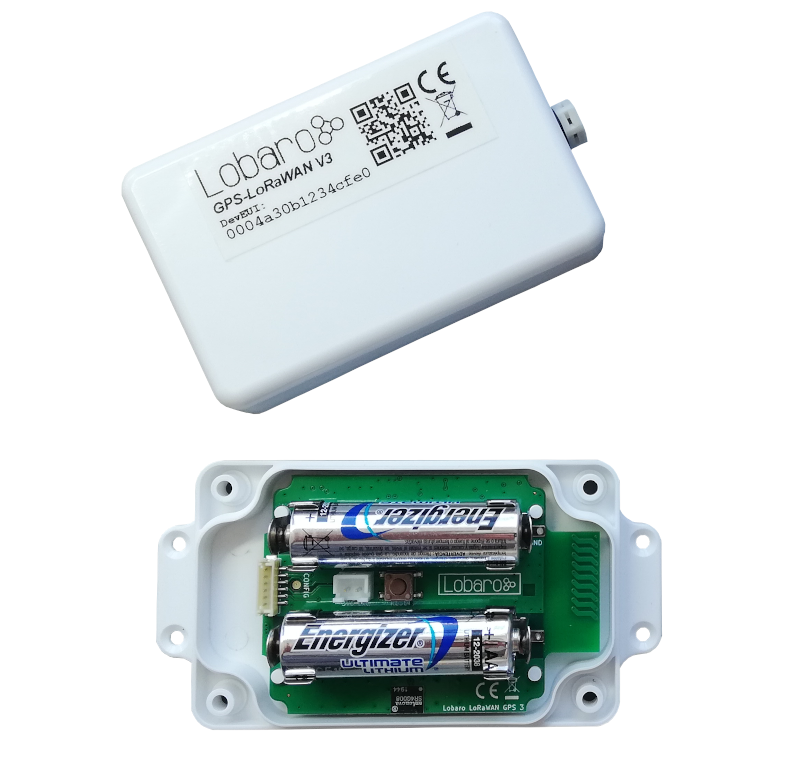
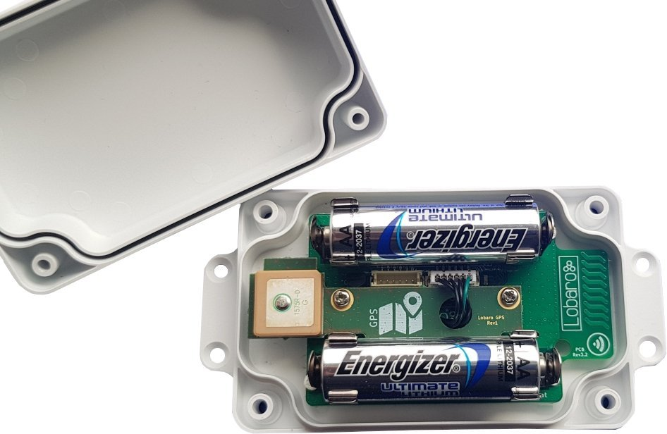

# LoRaWAN GPS Tracker

## Firmware Downloads

!!! warning "Make sure you install the correct firmware for your hardware revision"
    The device will not work if an incompatible firmware is installed. 
    If you are unsure, which hardware revision your device is, check with the 
    [description of hardware revisions](revisions.md).

### Hardware Revision 3

{: style="height:250px;display: block; margin: 0 auto;"}

* [app-lorawan-gps-8.0.3.hex](firmware/app-lorawan-gps-8.0.3.hex) (hardware v3.x) [current release]

!!! hint "Firmware Release Notifications"
    We normally send e-mail notifications upon release of new firmware versions. To receive this mails you can sign up
    to the Lobaro newsletter here.
    
    [**Subscribe to our email newsletter here**](http://eepurl.com/gQYRbH){: target="_blank"} 
    
    Make sure to select the **"Firmware Updates"** checkbox!    

### Hardware Revision 2

{: style="height:250px;display: block; margin: 0 auto;"}

**Downloads**: 

* [app-lorawan-gps-button-6.1.0.hex](6.0.0/firmware/app-lorawan-gps-button-6.1.0.hex) (hardware v2.x) [current release]
* [app-lorawan-gps-button-6.0.3.hex](6.0.0/firmware/app-lorawan-gps-button-6.0.3.hex) (hardware v2.x)

!!! warning
    This hardware revision is no longer available for sale! Consider using the improved HW Rev 3.

### Hardware Revision 1 

{: style="height:150px; display: block; margin: 0 auto;"}

**Downloads**:

* [app-lorawan-gps-button-5.0.5.hex](6.0.0/firmware/app-lorawan-gps-button-5.0.5.hex) (hardware v1.x)
* [app-lorawan-gps-button-4.0.9.hex](6.0.0/firmware/app-lorawan-gps-button-4.0.9.hex) (hardware v1.x)

!!! info 
    The LoRaWAN GPS data uplink data encoding has been changed between firmware 4.x ("legacy format") and 5.x. See the manual for details.
    
!!! warning
    This hardware revision is no longer available for sale! Consider using the improved HW Rev 3.

## Changelog
--------------------
### 8.0.3 - 2020-08-06
#### Fix
- Remove random payload in reboot request ACK upload

### 8.0.1 - 2020-08-05
#### Fix
- Fix config problem with low SF.

### 8.0.0 - 2020-08-05
#### Changed
- Change official product name to `LOB-S-GPS-LW-3`.
- Verify LoRaWAN Stack using official testing tool by LoRaWAN-Alliance.
- Remove OpMode (class C), ADR, and time sync over LoRaWAN
- Change internal logic of LostReboot-feature to use ACKs for checking for Network.
#### Added
- Low Voltage Protection
#### Fix
- Fix Voltage StepUp logic for GPS and LoRa
- Send uplink before reboot when ACK required.

### v7.1.0 - 17.06.2020
#### Added
- Add timestamp for last movement event to Port 2 payload
- Add config parameter `movementDistance` that configures how GPS-position changes 
  are calculated as movement events.
#### Fixed
- LoRaWAN 1.1 issue that sometimes led to invalid DevNonces used for OTAA Join.
- Make sure, mode changes from active to passive are reported in final uplink before change
- Fix an issue that could lead to all zero position data sent as valid position
- Upgrade to Lobaro LoRaWAN Stack 1.2.2 (RX Window adjustment).

### v7.0.0 - 28.04.2020
* Completely rewrite firmware for new board rev3 with new LoRaWAN features and concepts.
* Extend Payload format on port 2 (add HDOP and Timestamp of last Fix).
* Listen to MEMS events while not asleep.
* Check for movement by GPS to update activity mode.
* New LED blinking patterns.
* Add regular status message on port 1.
* Update to new Lobaro LoRaWAN Stack (LoRaWAN v1.1, remote Configuration via Downlink, Class C, ...).
* Enable Time synchronisation from GPS.
* Change naming from "Alive Mode" to "Passive Mode" for easier distinguishing from "Active Mode".
* Reduce power consumption during deep sleep by ~20%.
* Removed Cayenne Payload Format

### v6.1.0 - 09.12.2019
* added new parameters to increase accuracy: maxHDOP & maxDataAfterFix

### v6.0.3 - 02.08.2019
* fixed temperature sensor readout

### v6.0.2 - 22.07.2019
- inverted powerpin for telit module (hardware v2.1)
- added nmea prefix GN ( Glonass+GPS ) to the parser

### v5.0.5 - 09.01.2019
- Update LoRaWAN Stack
- Enable stepUp if needed by battery condition

### v5.0.4 - 15.11.2018
- update board driver

### v5.0.3 - 15.11.2018
- fix signed issue with longitude

### v5.0.0 - 26.10.2018
- Add option for Cayenne LLP Payload format
- Adjust payload format to support neagtive values
- Add Altitude
- Send GPS coordinates in Lat/Lon Format

- Update LoRaWAN Stack

### v4.0.9 - 05.10.2018
- Update LoRaWAN Stack

### v4.0.7 - 15.08.2018
- Fixed bugs with some LoRaWAN Network providers

### v4.0.6 - 28.05.2018
- Clear pending mems IRQ before sleep
- Updated internal state handling

### v4.0.4 - 20.03.2018
- Disable mems in active mode

### v4.0.3 - 20.03.2018
- compile against new board revision (lower power in sleep)
- disable external rtc 
- default tx power to 14dBm

### v4.0.2 - 23.02.2018
- Fix lost GPS messages due to broken CRC checks

### v4.0.1 - 29.01.2018
- Port to LoRa v3.2 Board

### v3.2
- Measure vBat when 3.3V Step Up is off
- Add config parameter gps timeout
- Add config parameter LoRaWAN ADR

### v3.1
- Enable buttons for sending (Reed contact connectors)
