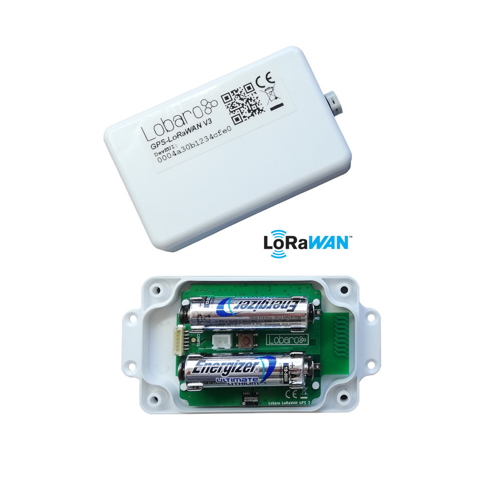
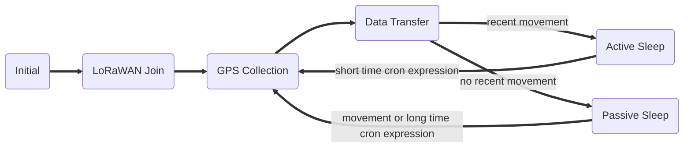
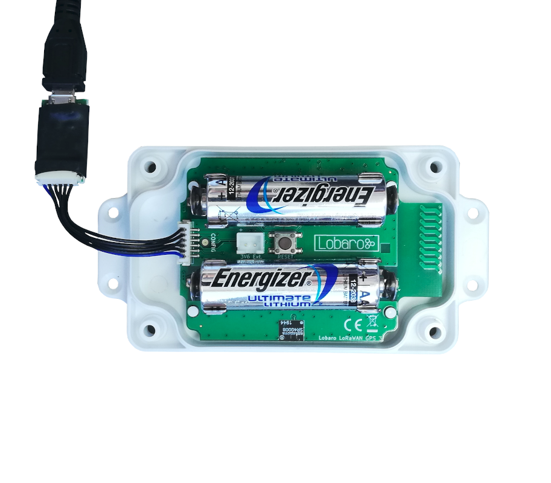

# GPS / GLONASS LoRaWAN Tracker

!!! info "Different Hardware Revision"
    This manual is for the GPS-Tracker in hardware revision 3 running firmware starting 
    with version 7.0.0. It is not compatible to older hardware revisions. If you have an 
    older revision of the device or are unsure which revision you have, please refer to 
    the [Hardware Revisions Overview](revisions.md), which also links to the manuals for 
    each revision.
    
## Overview

`Order number: 8000116` <br>
{: style="height:500px;display: block; margin: 0 auto;"}

The LoRaWAN GPS Tracker (GPS-LoRaWAN V3) is a battery powered tracking device, that
uses the satellite based positioning services [GPS](https://en.wikipedia.org/Global_Positioning_System) 
and [BeiDou](https://en.wikipedia.org/wiki/BeiDou) to determine its location and transmits the
obtained coordinates via LoRaWAN radio technology. Intervals between measurements can
be freely configured, in order to adjust the device to individual needs.  
An integrated motion sensor detects changes in the device's movement (if it is picked up or
transported in a vehicle). This allows the device to switch between an `Active Mode` in which
frequent updates are uploaded during phases of movement and an `Passive Mode` that saves
battery power by sending only few updates. While not sending updates, the device enters a
sleep mode that only uses ∼25 µA (or ~14 µA without motion sensor).  

**Please read the manual carefully before operating the device. A safe operation of the
device is only possible if you follow the guides provided in this manual. Using the device
differently than intended by Lobaro my cause damage to people, the environment, or
the device.**


## Operating the GPS Tracker
Once batteries are inserted into the device, it will start working. The Tracker will
most likely need to be adjusted to your personal LoRaWAN configuration (see chapter "Configuration").

### Batteries

The LoRaWAN GPS Tracker default power supply consists of two series connected off-theshelf
1.5V 'AA' sized batteries. Be sure to get the polarity right, see the '+'-Symbol on the
board. In general only AA cells of the types Alkali-Manganese (1.5V, LR6) and Lithium-Iron-
Sulphide (1.5V, FR6) are allowed to be inserted in the device. Lobaro recommends the use
of FR6 batteries like the Energizer Ultimate Lithium over LR6 types because of the higher
capacity and better discharge properties.

!!! warning 
    Other Batteries or accumulators with a nominal voltage of more than 1.5V must not inserted into the device under any circumstances. 
    In particular, lithium based cells with a nominal voltage of 3.6V or 3.7V must not be used on the AA battery slots!

On request we can supply custom product variants with special housings powered by even
bigger batteries. For example a 3.6V C sized mono cell typically has a capacity of 9Ah with
leads to a 3x increased battery life compared to the standard AA-cells. With D sized cells of
typically 19Ah capacity this value can be doubled once again (6x). 

### Installation

The device can be fixed on a flat surface using the lateral mounting holes of the case, see
[Hardware Variations](../../hardware.md) for a detailed description of all housing dimensions. Alternatively we offer as
accessory a mounting clip for a standard 35mm DIN rail. The device can then easily snapped
on a such rails. It can therefore be added to a variety of racks alongside other devices.

!!! note 
    Under any circumstances the device must not be mounted higher than 2 meters above ground to avoid any risks in case of falling down!

For optimal RF performance (e.g. LoRa range) any metal obstacles near the internal antenna
should be avoided. In this case 'near' is defined as keep-out distance of about 3-5 centimeters
around the antenna. The internal helix antenna can be identified by the winding pcb traces
on the right side of the board. In any case a device mounting directly
on top of a metal surface is not advisable since it will degrade the possible RF range. Stone
walls, wood or plastic standoffs are perfectly ok.
In case of challenging installation locations (e.g. in basements) or unavoidable long distances
to the next LoRaWAN gateway, Lobaro offers custom product variant equipped
with a 'SMA' connector to support a external antenna connection on request.

## Work Cycle


The GPS Tracker has a work cycle that adapts to detected motion of the device.

#### Initial Phase

This is the phase that is executed after the device is started of restarted. The LED flashes
once and the configuration is evaluated. If successful, the LoRaWAN Join phase is executed
next.

#### LoRaWAN Join Phase

If the Device is configured to use over the air activation (OTAA), the OTAA Join is performed
at this point. The device will repeatedly try to join its LoRaWAN network until the process
is successful. It then enters the Data Collection Phase.
If the Device is configured to use ABP instead of OTAA, this phase is left immediately and
the Data Collection Phase is entered.

#### GPS Collection Phase

During the GPS Collection Phase the device will try to determine its coordinates (latitude,
longitude, and height) using GPS. You can identify this phase by the onboard LED flashing
on and off in one second intervals.
Once the position has been determined successfully (or the attempt timed out and failed,
because of bad GPS reception), the device enters the Data Transfer Phase.

#### Data Transfer Phase

During the Data Transfer Phase the Tracker uploads the GPS coordinates to the LoRaWAN
network. The message contains the information if the measurement was successful. Some
status information about the device are included as well.
For a detailed description of the data sent refer to "LoRaWAN Data Upload Formats".
After data transfer, the GPS Tracker enters a sleep state to save power. Depending on
how much time passed since the last physical movement of the device (determined by the
internal motion sensor), the Tracker enters diferent sleep phases. If the time since the last
detected motion is less than a timeout value (configurable, standard value is 65 minutes),
the device remains in `Active mode` enters only a short sleep phase (`Active Sleep`). If no
motion was detected for a time longer than the timeout, the device enters the `Passive Sleep`
Phase, which typically has a much longer sleeping time, but in which the device will also be
activated through movement.

#### Active Sleep Phase

Even in Active Mode, the device spends most of its time in a deep sleep state to conserve
energy. The frequency with which the Tracker wakes up in Active Mode can be configured
using a Cron expression (see "GPS configuration parameters"). Typical values for active sleep time are 5 or 15
minutes.
When in Active Sleep Phase, the device will not be triggered to gather more GPS positions
through motion, but movement of the device will still be registered to keep the Tracker in
Active Mode.

#### Passive Sleep Phase
When no movement has been detected for a long amount of time (configurable), the device
stops sending updates, since there is not much point in sending frequent position information
when the device does not change its position. In Passive Mode, only very few updates are sent
to keep the network informed about the device's health. Typically one message is sent per
day in this mode (frequency can be configured with a cron expression, see "GPS configuration parameters").
When physical movement is detected by the internal motion sensor during this phase, the
GPS Tracker immediately wakes up and switches to Active Mode.

## Configuration

###The Lobaro Maintenance Tool

{: style="width:60%; display: block; margin: 0 auto;"}

The initial device configuration can be done very comfortably from your PC via the serial
configuration interface. Beside the needed Lobaro USB to UART adapter the 
[**Lobaro Maintenance Tool**](../../tools/lobaro-tool.md){: target="_blank"} needs to be installed. This tool is freely available for various operating systems
including Windows, Linux, Mac and Linux-ARM (e.g. Raspberry-PI) on and works with all
Lobaro sensors.

Technically this software opens a webserver on port 8585 that runs in a background console
window. The actual user interface can be accessed normally using a standard web browser
at address http://localhost:8585. Normally your default browser should be
opened with this URL automatically after tool startup . Even remote configuration and logobservation
over the Internet is possible, e.g. having a Raspberry PI via USB connected to
the Lobaro device and accessing the maintenance tool from a remote machines browser over
the Internet.

Additionally to the device setup the tool can also be used for firmware updates ('Firmware
Tab') , watching real-time device diagnostic output ('Logs Tab') and initiating device restarts.


!!! info "Info"
    Please note that the device might be restarted each time the configuration gets plugged/unplugged!

### Connecting the USB config adapter
For configuration and Firmware updates we provide a special serial-USB adapter that can be
connected as shown in the picture underneath. The corresponding connector on the PCB is marked with
the word 'Config'.

The USB-adapter will add a virtual serial 'COM' Port to your system. Your operating system
needs the [CP210x USB to UART bridge](https://www.silabs.com/products/development-tools/software/usb-to-uart-bridge-vcp-drivers){: target="_blank"} driver installed. A download link is provided next
to the 'Connect' button when you start the Maintenance Tool.
While the config adapter is connected, the device will be powered from the USB port with
a regulated voltage of 3.3V. It is not necessary - although it would be no problem - having
batteries inserted or a different supply connected while using the config adapter. All
configuration parameters will be kept non-volatile regardless of the power supply.

{: style="width:50%; display: block; margin: 0 auto;"}

### System Parameters
After being successfully connected to the hardware using the Lobaro Maintenance Tool you
can press 'Reload Config' in the 'Configuration' tab to read the current configuration from the
device. For every parameter a default value is stored non volatile inside the hardware to which
you can revert using the 'Restore default' button in case anything got miss configured.
All LoRaWAN & other firmware parameters are explained in the following.

### LoRaWAN
The connection to the LoRaWAN network is defined by multiple configuration parameters.
This need to be set according to your LoRaWAN network and the way your device is 
supposed to be attached to it, or the device will not be able to send any data.

For a detailed introduction into how this values need to be configured, please 
refer to the chapter [LoRaWAN configuration](/background/lorawan.html#lorawan-configuration) 
in our LoRaWAN background article.

| Name       | Description | Type | Values |
|------------|-------------|------|-------|
|`OTAA`      |Activation: OTAA or ABP              |`bool`    | `true`= use OTAA, `false`= use ABP |
|`DevEUI`    |DevEUI used to identify the Device   |`byte[8]` | e.g. `0123456789abcdef` | 
|`JoinEUI`   |Used for OTAA (called AppEUI in v1.0)|`byte[8]` | e.g. `0123456789abcdef` | 
|`AppKey`    |Key used for OTAA (v1.0 and v1.1)    |`byte[16]`| |
|`NwkKey`    |Key used for OTAA (v1.1 only)        |`byte[16]`| |
|`SF`        |Initial / maximum Spreading Factor   |`int`     | `7` - `12` |
|`ADR`       |Use Adaptive Data Rate               |`bool`    | `true`= use ADR, `false`= don't |
|`OpMode`    |Operation Mode                       |`string`  | `A`= Class A, `C`= Class C |
|`TimeSync`  |Days after which to sync time over LoRaWAN |`int`     | days, `0`=don't sync time | 
|`RndDelay`  |Random delay before sending          |`int`     | max seconds to wait |
|`RemoteConf`|Not supported by this firmware       |`bool`    | `true`=enabled, `false`=deactivated |
|`LostReboot`|Days without downlink before reboot  |`int`     | days, `0`=don't reboot |

### GPS configuration parameters
The behaviour of the GPS Tracker and how it switches between its two operation modes
('Active' and 'Passive') can be adjusted to your needs. The table explains the configuration
parameters used for this.

|      Name     |     Type  | Description| default value |
|---------------|-----------|------------|---------------|
|`statusCron`     |`string` |   Cron expression defining how often the device will Send a status message.       | `0 0 0 * * *` |
|`activeCron`     |`string` |   Cron expression defining how often the device will take a measurement and send its position over LoRaWAN while the Tracker is in Active Mode. This expression should trigger much more frequent than the one for Passive Mode. The standard is 0 0/15 * * * *, which will trigger every 15 minutes. See [Cron expressions](#cron-expressions) for an introduction to cron expressions.       | `0 0/15 * * * *` |
|`passiveCron`    |`string` |   Cron expression defining how often the device will wake up when in Passive Mode. This should be less frequent than in Active Mode. The standard is 0 0 0/12 * * *, which translates to twice each day. See [Cron expressions](#cron-expressions) for an introduction to cron expressions.           | `0 0 0/12 * * *` |
|`gpsTO`          |`int`    |   Time in seconds to wait for GPS to get a fix before timing out. | `180` seconds |
|`activeTO`       |`int`    |   Time in minutes without movement after which the Tracker switches to Passive Mode. | `65` minutes |
|`timeSyncGps`    |`bool`   |   Update internal clock from GPS signal? | `true` |
|`memsTh`         |`int`    |   Threshold for the internal motion detector to register movement. Values range from 2 to 255. A higher value makes the device less sensitive.<br>2 Environment (wind or steps) may trigger.<br>5 Standard, picking up the device will activate it. <br> 20 Carefully picking it up will not trigger the device.<br>50 When carried, running will trigger, walking won't.<br>100+ Shaking will activate, dropping the device might not.          | `5` |
|`maxHDOP`        |`int`    |   Maximum acceptable Horizontal Dilution Of Precision,  between 1 and 50, smaller is better | `2` |
|`maxDataAfterFix`|`int`    |   If the HDOP target cannot be matched this value determines after how many datapackets with fix the position will be accepted | `20` | 

###Cron expressions
Cron expressions are used to define specific points in time and regular repetitions of them.  
The schedule for data collecting phases is defined using the [CRON](../../background/cron-expressions.md){: target="_blank"} format which is very
powerful format to define repeatedly occurring events.

!!! info "Internal Device's Clock"
    Standard Lobaro devices typically do not need to know the real time for proper operation. 
    If time synchronisation is disabled (or did not succeed, yet), all times are relative to the 
    initial time when batteries are inserted.
    
    Also be aware that the internal clock runs using [UTC](https://en.wikipedia.org/wiki/Coordinated_Universal_Time), 
    so a cron expression triggering at midnight will trigger at one or two 'o clock in the morning in Germany, 
    depenting on the status of daylight saving time.


A cron expression consists of 6 values separated by spaces:

* Seconds (0-59)
* Minutes (0-59)
* Hours (0-23)
* Days (1-31)
* Month (1-12)
* Day of Week (SUN-SAT = 0-6)

Examples of CRON definitions: <br>

|                  |           |
|------------------|-----------|
|`0 5 * * * *`     |hourly at minute 5, second 0 (at 00:05:00, 01:05:00, ...)|
|`0 1/10 * * * *`  |every 10 minutes from minute 1, second 0 (minutes 1, 11, 21, ...)|
|`0 0 6 * * *`     |daily at 6:00:00|
|`0 0 13 1,15 * *` |1st and 15th day of every month at 13:00:00|
|`0 0 9 1-5 * *`   |every month daily from day 1 till 5 at 9:00:00|

## LoRaWAN Data Upload Formats

!!! info "Compatibility note"
    Please be aware, that the payload format changed for the version 7.0.0 of the 
    firmware. It is only party compatible to older payload formats. Refer to 
    older manuals, for the legacy download format (see the [Hardware Revision Overview](revisions.md) page).

The device uploads several different message types each with their own purpose and on their own port.

| Port       | Size     | Message |
|------------|----------|---------|
| `1`        | 14 bytes | Status Message, containing information about the status of the device. |
| `2`        | 23 bytes | Data Message, containing positional information gained by GNSS (GPS/Beidou). |
| `128`-`131`| varying  | Responses to remote configuration commands. | 

### Numerical values
Numerical values are uploaded as integers. If a value needs a higher precision, it is encoded using 
a smaller unit, for example the measured temperature is transmitted in 10th °C. The value can easily be 
converted to °C by the parser in your network server. Integers are used signed or unsigned and in various 
sizes as needed, so unusual sized, like `int24` or `int40` can be found. All multi byte values are
encoded in [big endian](https://en.wikipedia.org/wiki/Endianness) (Network Byte Order). 
See our [Reference Parser](#parser) implementation to see how you can handle those values.

### Status Message
After booting and joining the LoRaWAN-Network, the device uploads a Status Message on Port `1` that 
contains information about the device itself and state. This message is sent regularly, configured 
by the parameter `statusCron`. The default behaviour is to send the status message once every day. 
Lobaro recommends this setting to make sure you are always up to date on your devices whereabouts, 
and to make remote configuration reliable. The message has a fixed length of 14 bytes and is transmitted on port 1.
Byte positions are counted starting with 0.

| Name     | Bytes   | Type     | Description | Values |
|----------|---------|----------|-------------|--------|
| Firmware | `0-2`   | char[3]  | Firmware identifier | constant: `GPS` |
| Version  | `3-5`   | uint8[3] | Three numbers indicating firmware version | `0x07000a` = `v7.0.10` |
| Status   | `6`     | uint8    | Status Code indicating device's condition | `0` = `OK` |
| Reboot reason | `7`| uint8    | Code indicating reason for last reboot | `0x06` = Reset button pressed | 
| Final words   | `8`| uint8    | reserved for future use | `0` |
| Voltage  | `9-10`  | uint16   | Battery voltage in mV | `0x0c38` = `3128` = `3.128V` |
| Temp     | `11-12` | int16    | Internal Temperature in 10th °C | `0x0102` = `258` = `25.8°C` |
| Flags    | `13`    | bit[8]   | Application state | `0b01` = passive mode, position valid | 

#### Firmware and Version
*Firmware* is a constant three byte value containing three ASCII chars, indicating what firmware is running 
on the device. For this firmware it is always 'GPS'.

*Version* shows the version of the firmware running on the device, encoded as three independent `uint8` values.

#### Status Code
*Status* is a numeric code transmitted as `uint8`, that gives a self diagnostic:

| Status Code | Status Name          | Meaning |
|-------------|----------------------|---------|
| `0`         | `OK`                 | Normal operation, no problems detected.         |
| `101`       | `GPS_ERROR`          | The devices GPS-Module does not respond.        |
| `102`       | `MEMS_ERROR`         | The motion detector does not respond.           |
| `103`       | `GPS_AND_MEMS_ERROR` | Neither GPS-Module nor motion detector respond. |

#### Reboot reason
*Reboot reason* is a numeric code transmitted as `uint8`, that tells why the device did restart when 
it last booted (which might me a long time ago, the value is repeated in every status message).
This value is useful for troubleshooting and error detection. 
           
| Reboot Code | Reboot Reason | Explanation |
|-------------|---------------|-------------|
| `1`         | `LOW_POWER_RESET` | Supply voltage broke, batteries might need replacing.    |
| `2`         | `WINDOW_WATCHDOG_RESET` |                                                    |
| `3`         | `INDEPENDENT_WATCHDOG_RESET` |                                               |
| `4`         | `SOFTWARE_RESET`  | Firmware triggered a reboot.                             |
| `5`         | `POWER_ON_RESET`  | Power was turned on / Batteries where inserted.          |
| `6`         | `EXTERNAL_RESET_PIN_RESET` | Reset button pressed / Reset by config adapter. |
| `7`         | `OBL_RESET` | |

#### Final word
This value is currently not used and reserved for future usage.

#### Voltage
Supply voltage fed into the device, either from battery of external power source. Gives an 
indication on the state of the battery used. The voltage is measured in millivolts (`mV`) and
transmitted as a `uint16`.

#### Temperature
The device has an internal temperature sensor, that is used to measure the temperature 
of the device itself. This can give an help get an idea where the device is located 
(inside/outside) and acts as a diagnostic in case of failure (if the device is exposed to 
hazardous temperatures). The temperature is measured in 10th of °C and transmitted as an 
`int16`.

#### Flags {#status-flags}
Internal application state, see same value in [Data Message](#flags).


### Data Message
After reading coordinated from GPS, the device uploads a data message containing the 
position data. This happens even when the device did not get a fix on it's position. 
If no new position could be determined, the last known valid position is uploaded 
(together with a timestamp of when that position was valid). This makes it possible to 
get position data, even if the Tracker does not have GPS coverage and LoRaWAN coverage at 
the same time.

The data message is 23 bytes long and transmitted on port 2.
The message is partly compatible with the data message of older firmware (versions 5 and 6); 
only new values have been appended at the end. Byte positions are counted starting with 0.

| Name      | Bytes   | Type     | Description | Values/Examples |
|-----------|---------|----------|-------------|--------|
| Temperature | `0-1`   | int16    | Internal Temperature in 10th °C | `0x0102` = `258` = `25.8°C` |
| Voltage   | `2-3`   | uint16   | Battery voltage in mV | `0x0c38` = `3128` = `3.128V` |
| Latitude  | `4-7`   | int32    | Degrees Latitude  * 100000 | `-9000000`&ndash;`9000000` |
| Longitude | `8-11`  | int32    | Degrees Longitude * 100000 | `-18000000`&ndash;`18000000` |
| Altitude  | `12-14` | int24    | Altitude in cm    | `0x0034c6` = `13510` = `135.1m` |
| Flags     | `15`    | bit[8]   | Application state | `0b01` = passive mode, position valid | 
| SatCnt    | `16`    | uint8    | Number of satellites used for fix | `0x06` = `6` |
| HDOP      | `17`    | uint8    | 1/10 * [Horizontal Dilution of Precision](https://de.wikipedia.org/wiki/Dilution_of_Precision) | `0x0f` = `15` = `HDOP 1.5` |
| Timestamp | `18-22` | int40    | UNIX Timestamp of position data in message (0 for never) | `0x005eccd15f` = `1590481247` = `2020-05-26T08:20:47` UTC |

#### Temperature and Voltage
Same as in Status Message, useful for checking the health of the device.

#### Position and Timestamp {#position}
The Position data is the main purpose of the Tracker. It is always combined with a timestamp. This timestamp is 
independent of the internal clock of the Tracker, but taken directly from the GPS data. It is therefore the 
exact point of time that the position was determined. The time is encoded as a 
[UNIX-Timestamp](https://en.wikipedia.org/wiki/Unix_time). 
A value of `0` (which translates to `1970-01-01T00:00:00`) indicates that the Tracker did never get a fix 
on it's position. So if the timestamp is `0` the position data is invalid. If there is a timestamp `> 0`, the 
transmitted position data always refers to a valid position (even if the Flag *Position Valid* is `0`), 
but at the indicated time. So the position could be quite outdated. 
This behaviour ensures that valid position information can be transmitted to the backend, 
even if the Tracker never has GPS-coverage and a LoRaWAN-connection at the same time. 

!!! info "Advice for use with TTN-Mapper"
    If you are using the device with TTN-Mapper, you must make sure that those outdated positions 
    are not sent to TTN-Mapper! See [TTN-Mapper](#ttn-mapper) for details.

The Position is encoded as signed *Latitude* and *Longitude* with five decimal digits of precision, 
put into two `int32` values. Divided by 100000 you get the degrees. Positive values stand for North/East, 
negative values for South/West.

The *Altitude* is encoded as cm in an `int24`.

The the [Example Data Message](#example-data-message) and the [Reference Parser](#parser) for further 
documentation.

#### Position Quality
*SatCnt* and *HDOP* are indicators for how good the position in the data message is.

*SatCnt* is a `uint8` that gives the number of satellites that were used for calculating the coordinates 
(more is better). The minimal number for a fix is 4. 10 satellites and more are a good value.

*HDOP* is the [Horizontal Dilution of Precision](https://en.wikipedia.org/wiki/Dilution_of_precision_(navigation)). 
That is a dimensionless value that indicates how precise the position can be for the current satellites' positions. 
The HDOP is transmitted multiplied by 10 as a `uint8`, so you need to divide it by 10 to get the actual HDOP, and 
it maxes out at `25.5`, which is a terrible rating. Values of `1` and below are ideal, values up to `5` are considered 
good.

!!! info "Quality of GPS data"
    Please be aware that position data generated using GPS and other GNSS systems has certain physical
    limitations in its precision. This is mainly caused by signal distortions in the atmosphere and when 
    signals are reflected by walls (multipath effects). Therefore even with high *SatCnt* and ideal 
    *HDOP*, the calculated position can be far of the actual position. For an introduction into the topic,
    you can start at [Error_analysis_for_the_Global_Positioning_System on Wikipedia](https://en.wikipedia.org/wiki/Error_analysis_for_the_Global_Positioning_System).

#### Flags
The status Flag indicates the current conditions inside the application. Only two bits are used. Bit counting 
starts with the least significant bit with `0`.

| Bit | Meaning                  | Values |
|-----|--------------------------|--------|
| `0` | Position currently valid | `0` = not valid, `1` = valid |
| `1` | Current operation mode   | `0` = Passive Mode, `1` = Active Mode |

The *Position valid* flag indicates if the device did get a fix on it's position just before sending 
the upload. So it indicates if the message contains a new valid position. Any position uploaded with 
a valid timestamp is a real measured position taken at that time. See [Position](#position) for details.

#### Example Data Message
```
Payload on Port 2: '00D40BC40051B427000F45DA0016A803060F005ECCCE29'
-------------------------------------------------------------------
'00D4' - Temperature
    0x00d4 = 212 = 21.2°C
'0BC4' - Voltage
    0x0bc4 = 3012 = 3.012V
'0051B427' - Latitude
    0x0051b427 = 5354535 = 53.54535°N = N 53° 32' 43.26"
'000F45DA' - Longitude
    0x000f45da = 1000922 = 10.00922°E = E 10°  0' 33.19"
'0016A8' - Altitude
    0x0016a8 = 5800 = 58m
'03' - Flags
    0x03 = 0b11 = Mode Active, Position current and valid
'06' - SatCnt
    0x06 = 6 = 6 Satellites
'0F' - HDOP
    0x0f = 15 = 1.5 HDOP
'005ECCCE29'
    0x005eccce29 = 1590480425 = 2020-05-26T08:07:05 UTC
```

## Parser {#parser}

Here is a reference message parser written in JavaScript, that can be used in 
[The Things Network](https://www.thethingsnetwork.org/) to parse the Status Message and Data Message 
into JSON objects. If you are using your device with TTN-Mapper, please read the advices on how 
to modify parser and configuration under [TTN-Mapper](#ttn-mapper).

```javascript
/**
 * Parser for Lobaro GPS-Tracker v3 to be used in The Things Network
 *
 * When used with TTN-Mapper integration (
 *
 * Copyright 2020 Lobaro GmbH - https://www.lobaro.com
 * Free to be used under MIT License:
 * 
 * Permission is hereby granted, free of charge, to any person obtaining a copy of this software and associated documentation files (the "Software"), to deal in the Software without restriction, including without limitation the rights to use, copy, modify, merge, publish, distribute, sublicense, and/or sell copies of the Software, and to permit persons to whom the Software is furnished to do so, subject to the following conditions:
 * The above copyright notice and this permission notice shall be included in all copies or substantial portions of the Software.
 *
 * THE SOFTWARE IS PROVIDED "AS IS", WITHOUT WARRANTY OF ANY KIND, EXPRESS OR IMPLIED, INCLUDING BUT NOT LIMITED TO THE WARRANTIES OF MERCHANTABILITY, FITNESS FOR A PARTICULAR PURPOSE AND NONINFRINGEMENT. IN NO EVENT SHALL THE AUTHORS OR COPYRIGHT HOLDERS BE LIABLE FOR ANY CLAIM, DAMAGES OR OTHER LIABILITY, WHETHER IN AN ACTION OF CONTRACT, TORT OR OTHERWISE, ARISING FROM, OUT OF OR IN CONNECTION WITH THE SOFTWARE OR THE USE OR OTHER DEALINGS IN THE SOFTWARE.
 */

/* === CONFIG === */
// Set this to true, if you are using TTN-Mapper integration. This avoids sending 
// outdated positions that TTN-Mapper would use as new data.
var TTN_MAPPER = false;

/* Helper functions used by this parser */
function signed(val, bits) {
    if ((val & 1 << (bits-1)) > 0) { // value is negative (16bit 2's complement)
        var mask = Math.pow(2, bits) - 1;
        val = (~val & mask) + 1; // invert all bits & add 1 => now positive value
        val = val * -1;
    }
    return val;
}
function uint40_BE(bytes, idx) {
    bytes = bytes.slice(idx || 0);
    return bytes[0] << 32 |
        bytes[1] << 24 | bytes[2] << 16 | bytes[3] << 8 | bytes[4] << 0;
}
function uint32_BE(bytes, idx) {
    bytes = bytes.slice(idx || 0);
    return bytes[0] << 24 | bytes[1] << 16 | bytes[2] << 8 | bytes[3] << 0;
}
function uint24_BE(bytes, idx) {
    bytes = bytes.slice(idx || 0);
    return bytes[0] << 16 | bytes[1] << 8 | bytes[2] << 0;
}
function uint16_BE(bytes, idx) {
    bytes = bytes.slice(idx || 0);
    return bytes[0] << 8 | bytes[1] << 0;
}
function int40_BE(bytes, idx) {return signed(uint40_BE(bytes, idx), 40);}
function int32_BE(bytes, idx) {return signed(uint32_BE(bytes, idx), 32);}
function int24_BE(bytes, idx) {return signed(uint24_BE(bytes, idx), 24);}
function int16_BE(bytes, idx) {return signed(uint16_BE(bytes, idx), 16);}
function readVersion(bytes, i) {
    if (bytes.length < 3) {
        return null;
    }
    return "v" + bytes[i] + "." + bytes[i + 1] + "." + bytes[i + 2];
}

/**
 * Decode status/error codes from GPS-Tracker to human readable tags.
 */
function decode_status_code(code) {
    switch (code) {
        case 0:
            return "OK";
        case 101:
            return "GPS_ERROR";
        case 102:
            return "MEMS_ERROR";
        case 103:
            return "GPS_AND_MEMS_ERROR";
        default:
            return "UNKNOWN";
    }
}

/**
 * Decode reboot reason explaining last reboot of device.
 */
function decode_reboot_reason(code) {
    // STM reboot code from our HAL:
    switch (code) {
        case 1:
            return "LOW_POWER_RESET";
        case 2:
            return "WINDOW_WATCHDOG_RESET";
        case 3:
            return "INDEPENDENT_WATCHDOG_RESET";
        case 4:
            return "SOFTWARE_RESET";
        case 5:
            return "POWER_ON_RESET";
        case 6:
            return "EXTERNAL_RESET_PIN_RESET";
        case 7:
            return "OBL_RESET";
        default:
            return "UNKNOWN";
    }
}

function DecoderPort2(bytes) {
    // Data Message containing position data.
    var Temp = int16_BE(bytes, 0) / 10;
    var VBat = int16_BE(bytes, 2) / 1000;
    var Lat = int32_BE(bytes, 4) / 100000;
    var Lon = int32_BE(bytes, 8) / 100000;
    var Alt = int24_BE(bytes, 12) / 100;
    var Valid = !!(bytes[15] & 0x01);
    var Active = !!(bytes[15] & 0x02);
    var SatCnt = bytes[16];
    var Hdop = bytes[17] / 10;
    var Time = int40_BE(bytes, 18);

    if (TTN_MAPPER && (!Valid)) {
      // TTN-Mapper specific:
      // Position is not valid, so this is outdated data. TTN-Mapper cannot handle those
      // so we drop this packet on purpose:
      return {};
    }

    return {
        "temperature": Temp || 0,
        "voltage": VBat || 0,
        "latitude": Lat || 0,
        "longitude": Lon || 0,
        "altitude": Alt || 0,
        "valid": Valid,
        "active": Active,
        "satellites": SatCnt,
        "hdop": Hdop,
        "time": Time * 1000
    };
}

function DecoderStatus(bytes) {
    var firmware = String.fromCharCode.apply(null, bytes.slice(0, 3));
    var version = readVersion(bytes, 3);
    var status_code = bytes[6];
    var status_text = decode_status_code(status_code);
    var reboot_code = bytes[7];
    var reboot_reason = decode_reboot_reason(reboot_code);
    var final_code = bytes[8];
    var vcc = (int16_BE(bytes, 9) / 1000) || 0.0;
    var temp = (int16_BE(bytes, 11) / 10) || -0x8000;
    var app_data = bytes.slice(13);

    return {
        "firmware": firmware,
        "version": version,
        "status_code": status_code,
        "status_text": status_text,
        "reboot_code": reboot_code,
        "reboot_reason": reboot_reason,
        "final_code": final_code,
        "temperature": temp,
        "voltage": vcc,
        "app_data": app_data
    };
}

function DecoderPort1(bytes) {
    var d = DecoderStatus(bytes);
    var flags = d.app_data[0] || 0x00;
    d.valid = !!(flags & 0x01);
    d.active = !!(flags & 0x02);
    return d;
}

function Decoder(bytes, port) {
    switch (port) {
        case 1:
            // Port 1: Status Message
            return DecoderPort1(bytes);
        case 2:
            // Port 2: Data Message (containing position data)
            return DecoderPort2(bytes);
        default:
            return {"error":"Unsupported port","port":port};
    }
}
```

## TTN-Mapper
[TTN-Mapper](https://ttnmapper.org){: target="_blank"} is a community project that tries to create a global 
map of LoRaWAN-Coverage of the open LoRaWAN Network [The Things Network](https://www.thethingsnetwork.org/).
Anyone with a compatible GPS-capable LoRaWAN-device can contribute to the project by submitting their data.
 
The Lobaro LoRaWAN GPS-Tracker can easily be used as a TTN-Mapper Node, as it uploads *Latitude*, *Longitude*, *Altitude*, 
and *Horizontal Dilution of Precision (HDOP)*. The device should be setup with a specific configuration, and 
the parser used in TTN for the device must be slightly adjusted to stop outdated position data to be used 
in the mapper.

### Configuration
The device can be used either with OTAA or ABP. The EUIs and Keys must be set accordingly to activate the 
device in TTN. The remaining configuration values can mostly remain on default value. A few should be adjusted 
as follows:

| Parameter    | Value           | Comment |
|--------------|-----------------|-------------------------------------------------------------------------------|
| `SF`         | `7`             | Spreading Factor should be set to 7 according to TTN-Mapper documentation.    |
| `ADR`        | `false`         | Adaptive Data Rate should be deactivated for mobile devices.                  |
| `OpMode`     | `A`             | No Downlinks needed.                                                          |
| `TimeSync`   | `0`             | Not supported by TTN, time is synced from GPS signal. |
| `RndDelay`   | `0`             | Random delay would distort position while moving. |
| `activeCron` | `0 0/3 * * * *` | Suggestion that uploads position every minute while active. Adjust as needed. |
| `activeTO`   | `5`             | Switch to passive mode after 5 minutes without movement. |

### Parser
The payload format decoder must be slightly adjusted for the use of TTN-Mapper, because the Lobaro GPS-Tracker will 
upload it's latest known valid position when no GPS-fix can be achieved (indicating so by a flag and giving the 
timestamp of the localisation). TTN-Mapper would parse that as a new valid position, so the parser **must drop** those 
messages in order to stop wrong data points to end up in TTN-Mapper.

Change the line at the top of the parser from to activate TTN_MAPPER conformity:
```js
var TTN_MAPPER = false;
```

Replace it with this line:
```js
var TTN_MAPPER = true;
```

### Integration
Add an integration for your TTN-Application as described under 
[https://www.thethingsnetwork.org/docs/applications/ttnmapper/](https://www.thethingsnetwork.org/docs/applications/ttnmapper/){: target="_blank"}.
The Port filter must be set to `2`. 

You can use the TTN Mapper integration side by side with other integrations that connect to your backend/platform, 
so that you get the data from the GPS-Tracker while also sending them to TTN-Mapper.


## Technical characteristics
|||
|-|-|
|**Product**||
|Type name|GPS-LoRaWAN 3|
|Description|LoRaWAN GPS Tracker HW3|
|**RF transceiver**||
|Chipset|Semtech SX1272|
|Frequency Range|863 to 870 MHz|
|TX Power|≤ 14 dBm|
|Typically RF range|≤ 2km|
|Ideal RF range|≤ 10km (free line of sight)|
|**LoRa communication**||
|LoRaWAN Protocol|LoRaWAN 1.0.1, 1.0.3, 1.1.0, Class A/C, EU868|
|Activation method|Over-the-air activation (OTAA) <br> Activation by personalization (ABP)|
|Encryption|AES128|
|**Power**||
|Power supply|2xAA sized battery, 1.5 V, LR6/FR6|
|Supply voltage|UNom = 3.0V, UMin = 2.2V, UMax = 3.7V|
|Capacity|∼ 30000 LoRaWAN messages @SF11|
|**Current consumption @3V**||
|Normal|≤3 mA  |
|Wireless M-BUS RX|≤14 mA|
|LoRa RX|≤14 mA|
|LoRa TX|≤80 mA|
|Sleep with GPS standby and MEMS running|≤20 µA|
|**Mechanical dimensions**||
|Size|114.3 mm x 59.3 mm x 26.8 mm|
|Housing Material|ABS plastic|
|**Environmental Requirements**||
|Operating temperature range|-20°C to +55°C|
|Max. Installation height|2m|
|**Conformity**||
| ||


## PDF Documentation
* [Product Dimensions (pdf)](files/Lobaro-Compact-Housing.pdf){: target="_blank"}
* [CE Declaration of Conformity](files/scan-ce-conformity-gps-lorawan.pdf)