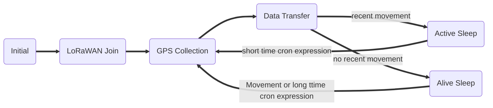

# GPS LoRaWAN Tracker


{: style="height:400px;border:1px black solid;"}

## Target Measurement / Purpose

The LoRaWAN GPS Tracker (GPS-LoRaWAN) is a battery powered tracking device, that
uses the satellite based positioning service GPS to determine its location and transmits the
obtained coordinates via LoRaWAN radio technology. Intervals between measurements can
be freely congured, in order to adjust the device to individual needs.
An integrated motion sensor detects changes in the device's movement (if it is picked up or
transported in a vehicle). This allows the device to switch between an `Active Mode` in which
frequent updates are uploaded during phases of movement and an `Alive Mode` that saves
battery power by sending only few updates. While not sending updates, the device enters a
sleep mode that only uses ∼30 µA.
Figure 1 shows the GPS Tracker with opened casing. The most important components are
indicated and explained.
Please read the manual carefully before operating the device. A safe operation of the
device is only possible if you follow the guides provided in this manual. Using the device
dierently than intended by Lobaro my cause damage to people, the environment, or
the device.

{: style="width:50%; vertical-align: top;"}

## The Device

{: style="width:60%; vertical-align: top;"}

!!! info "Consider using the latest firmware on your hardware"
    * [**See available firmware downloads**](firmware.md){: target="_blank"}


## Work Cycle


The GPS Tracker has a work cycle that adapts to detected motion of the device.

## Intial Phase

This is the phase that is executed after the device is started of restarted. The LED flashes
once and the configuration is evaluated. If successful, the LoRaWAN Join phase is executed
next.

## LoRaWAN Join Phase

If the Device is configured to use over the air activation (OTAA), the OTAA Join is performed
at this point. The device will repeatedly try to join its LoRaWAN network until the process
is successful. It then enters the Data Collection Phase.
If the Device is configured to use ABP instead of OTAA, this phase is left immediately and
the Data Collection Phase is entered.

## GPS Collection Phase

During the GPS Collection Phase the device will try to determine its coordinates (latitude,
longitude, and height) using GPS. You can identify this phase by the onboard LED flashing
on and off in one second intervals.
Once the position has been determined successfully (or the attempt timed out and failed,
because of bad GPS reception), the device enters the Data Transfer Phase.

## Data Transfer Phase

During the Data Transfer Phase the Tracker uploads the GPS coordinates to the LoRaWAN
network. The message contains the information if the measurement was successful. Some
status information about the device are included as well.
For a detailed description of the data sent refer to chapter 5.
After data transfer, the GPS Tracker enters a sleep state to save power. Depending on
how much time passed since the last physical movement of the device (determined by the
internal motion sensor), the Tracker enters diferent sleep phases. If the time since the last
detected motion is less than a timeout value (configurable, standard value is 65 minutes),
the device remains in `Active mode` enters only a short sleep phase (`Active Sleep`). If no
motion was detected for a time longer than the timeout, the device enters the `Alive Sleep`
Phase, which typically has a much longer sleeping time, but in which the device will also be
activated through movement.

## Active Sleep Phase

Even in Active Mode, the device spends most of its time in a deep sleep state to conserve
energy. The frequency with which the Tracker wakes up in Active Mode can be configured
using a Cron expression (see chapter 4.4). Typical values for active sleep time are 5 or 15
minutes.
When in Active Sleep Phase, the device will not be triggered to gather more GPS positions
through motion, but movement of the device will still be registered to keep the Tracker in
Active Mode.

## Alive Sleep Phase
When no movement has been detected for a long amount of time (configurable), the device
stops sending updates, since there is not much point in sending frequent position information
when the device does not change its position. In Alive Mode, only very few updates are sent
to keep the network informed about the device's health. Typically one message is sent per
day in this mode (frequency can be configured with a cron expression, see chapter 4.4).
When physical movement is detected by the internal motion sensor during this phase, the
GPS Tracker immediately wakes up and switches to Active Mode.

## PDF Documentation

* [User Manual (en)](files/lorawan-gps-tracker_en.pdf)
* [CE Conformity](files/scan-ce-conformity-gps-lorawan.pdf)

## Parser

### The Things Network

For Version 4.x, 5.x and 6.x

```javascript
function signed(val, bits) {
    if ((val & 1 << (bits-1)) > 0) { // value is negative (16bit 2's complement)
        var mask = Math.pow(2, bits) - 1;
        val = (~val & mask) + 1; // invert all bits & add 1 => now positive value
        val = val * -1;
    }
    return val;
}

function int16_BE(bytes, idx) {
    bytes = bytes.slice(idx || 0);
    return signed(bytes[0] << 8 | bytes[1] << 0, 16);
}

function int24_BE(bytes, idx) {
    bytes = bytes.slice(idx || 0);
    return signed(bytes[0] << 16 | bytes[1] << 8 | bytes[2] << 0, 24);
}

function int32_BE(bytes, idx) {
    bytes = bytes.slice(idx || 0);
    return signed(bytes[0] << 24 | bytes[1] << 16 | bytes[2] << 8 | bytes[3] << 0, 32);
}

function DecoderPort2(bytes) {
    // Format for firmware 5.0.x
    // Decode an uplink message from a buffer
    // (array) of bytes to an object of fields.

    var Temp = int16_BE(bytes, 0) / 10;
    var VBat = int16_BE(bytes, 2) / 1000;
    var Lat = int32_BE(bytes, 4) / 100000;
    var Lon = int32_BE(bytes, 8) / 100000;
    var Alt = int24_BE(bytes, 12) / 100;
    var Valid = bytes[15] & 0x01;
    var Active = bytes[15] & 0x02;
    var SatCnt = bytes[16];

    return {
        Temp: Temp || 0,
        VBat: VBat || 0,
        Lat: Lat || 0,
        Lon: Lon || 0,
        Alt: Alt || 0,
        Valid: Valid,
        Active: Active,
        SatCnt: SatCnt
    };
}

function DecoderPort1(bytes) {
    // legacy format, firmware 4.x
    // Decode an uplink message from a buffer
    // (array) of bytes to an object of fields.

    var button_number = bytes[0];
    var Temp10tel = (bytes[1] << 8) | (bytes[2] << 0);
    var VBat1000tel = (bytes[3] << 8) | (bytes[4] << 0);
    var lat_deg = bytes[5];
    var lat_min = bytes[6];
    var lat_10000min = (bytes[7] << 8) | (bytes[8] << 0);
    var long_deg = bytes[9];
    var long_min = bytes[10];
    var long_10000min = (bytes[11] << 8) | (bytes[12] << 0);
    var gpsValid = (bytes[13] !== 0);  // Missing byte = true

    return {
        button_number:button_number || 0,
        Temp10tel: Temp10tel || 0,
        VBat1000tel: VBat1000tel || 0,
        lat_deg: lat_deg || 0,
        lat_min: lat_min || 0,
        lat_10000min: lat_10000min || 0,
        long_deg: long_deg || 0,
        long_min: long_min || 0,
        long_10000min: long_10000min || 0,
        gps_valid: gpsValid || false
    };
}

function Decoder(bytes, port) {
    switch (port) {
        case 1:
            return DecoderPort1(bytes);
        case 2:
            return DecoderPort2(bytes);
        default:
            return {"error":"Unsupported port","port":port};
    }
}
```