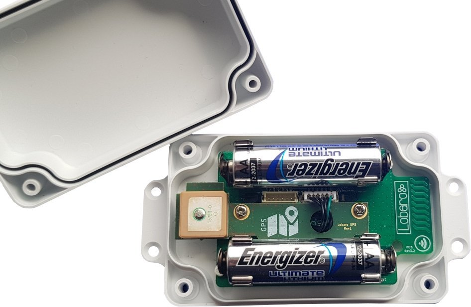

# GPS-Tracker Hardware Revisions
Our GPS-Tracker has been developed over several years. The Hardware has been improved, which lead to some 
compatibility breaking changes. The current hardware revision is *Lobaro LoRaWAN GPS 3*, which runs the 
firmware starting with *v7.0.0*. Older hardware revisions are no longer sold, but in some cases you might 
still require a firmware update for a previously acquired device. If you are unsure, which hardware 
revision your device is, you can find out with the information on this page.

## Current Revision: HW v3
The most recent revision of the LoRaWAN GPS/GSNN Tracker is 3, labeled *Lobaro LoRaWAN GPS 3* in the bottom 
right corner of the circuit board. It has the order number `8000116`.
You can also easily identify it by the position of the reset button in the 
center of the board, as well as the config port on the left side, opposite of the antenna. Please compare with the 
image bellow.

Revision 3 needs to run a firmware starting with version 7.0.0. Usage of the device is described in the 
[GPS-Tracker Manual, HW3](index.md).
 
`Order number: 8000116`  

## Deprecated Revision: HW v2
Previous revisions of the Lobaro LoRaWAN GPS-Tracker where built with a small additional board between the 
battery clips. On the board would be printed *GPS Addon 2.x* (e.g. *2.1* as in the image below). You can 
easily identify revision 2 by the blue and black cable (not green) connecting the small addon strip with the main 
board, as can be seen in the images below. This revision was available in the small white casing for use 
with two AA-batteries (order number: `8000014`) or in a bigger variant with an additional board that 
can hold a D-cell battery or be used with an external power supply (order number: `8000082`).

Revision 2 runs firmware with major releases of 6, so anything like *6.x.x*.
For instruction on this device, please refer to the [Deprecated GPS-Tracker HW2 manual](6.0.0/index.md).

`Order number: 8000014`  

`Order number: 8000082`  

## Deprecated Revision: HW v1
The initial revision of the Lobaro LoRaWAN GPS-Tracker was build with a small addon board, similar to revision 2, 
but with a different layout. The strip is labeled *Lobaro GPS Rev1*.
You can identify it by the big brown square block on the addon strip and also by the 
green and black cable (not blue) connecting the addon (see the image below).

Revision 1 used the firmware up to major version 5. For instructions on usage of the device, please refer 
to the [Deprecated GPS-Tracker HW1 manual](files/lorawan-gps-tracker_en.pdf) (pdf) or, if you are still 
using firmware 4, to [Deprecated GPS-Tracker HW1 FW4 manual](files/lorawan-gps-tracker_en_version4_old.pdf) (pdf).

