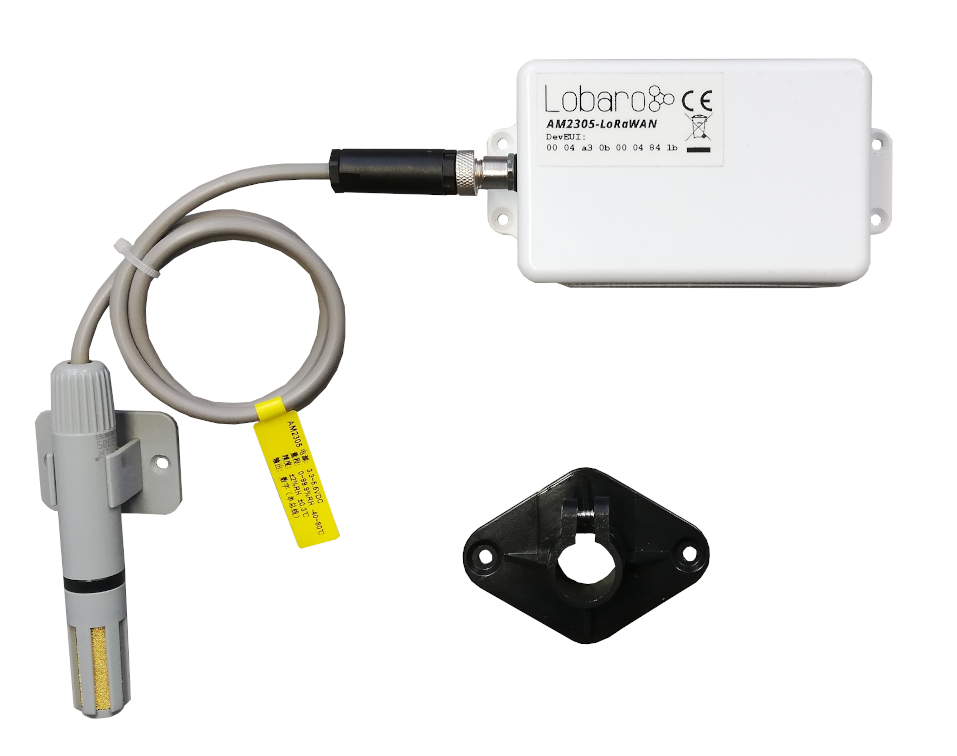
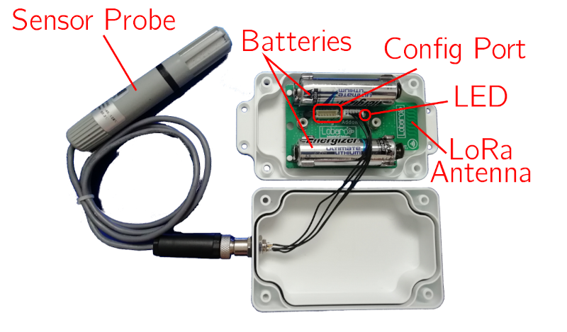
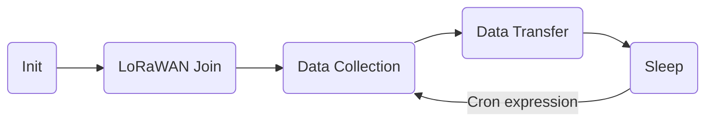
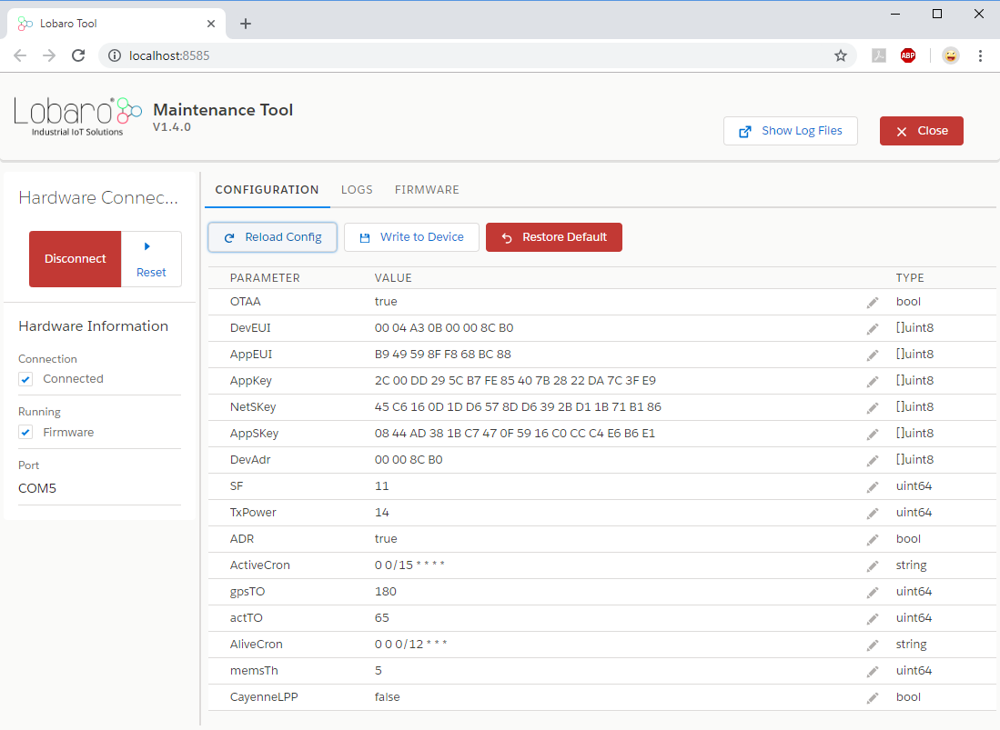
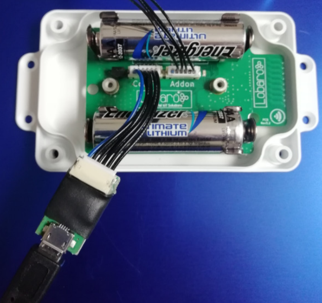

# Humidity & Temperature LoRaWAN Sensor
##Overview


{: style="height:300px; display: block; margin: 0 auto;"}

The Lobaro LoRaWAN Humidity Sensor AM2305-LoRaWAN is a battery powered radio transmitting sensor device that takes measurements at configurable intervals. Because of its low
power consumption it can operate for multiple years with standard AA batteries. The LoRa
radio technology allows it to take measurements in places that are hard to reach, and in its
water prove casing it can be installed outdoors.  
The device uses a AM2305 digital relative humidity and temperature sensor probe (also known
as RHT05 or DHT44). It is powered by the base device and communicates via a one-wire
connection.

!!! note
    Please read the manual carefully before operating the device. A safe operation of the
    device is only possible if you follow the guides provided in this manual. Using the device
    differently than intended by Lobaro my cause damage to people, the environment, or
    the device.

## The Device

{: style="height:300px; display: block; margin: 0 auto;"}

## Operating the Humidity Sensor

The RHT05 sensor probe must be attached to the device on the external socket. Insert two
1.5V AA batteries into the slots. When the device starts, its LED flashes once. If it does
not start, check that your batteries are still good and inserted the correct way. You can refer
to the picture above to check that everything is connected as it should be.  
When the device is set up correctly and running, put the lid on the base and fasten it from
the back using the supplied screws. Watch out that the cables are save inside the box and
do not get stuck in the casing, or you might damage the cables and allow water to enter the
casing. This can cause damage to the device!  
Always close the lid so that the socket for the probe is on the opposing side of the antenna
(picture above, sensor probe on the left, antenna on the right). This way there will be
less interference on the antenna and you will get the best connection possible.

###Batteries

The LoRaWAN Humidity Sensor default power supply consists of two series connected off-
the-shelf 1.5V 'AA' sized batteries. Be sure to get the polarity right, see the '+'-Symbol on
the board. In general only AA cells of the types Alkali-Manganese (1.5V, LR6) and LithiumIron-Sulphide (1.5V, FR6) are allowed to be inserted in the device. Lobaro recommends the
use of FR6 batteries like the Energizer Ultimate Lithium over LR6 types because of the higher
capacity and better discharge properties.

!!! warning 
    Other Batteries or accumulators with a nominal voltage of more than 1.5V must not inserted 
    into the device under any circumstances.  
    In particular, lithium based cells with a nominal voltage of 3.6V or 3.7V must not be used 
    on the AA battery slots!

On request, we can supply custom product variants with special housings powered by even
bigger batteries. For example a 3.6V C sized mono cell typically has a capacity of 9Ah with
leads to a 3x increased battery life compared to the standard AA-cells. With D sized cells of
typically 19Ah capacity this value can be doubled once again (6x). 
Options with permanent external power supply (230V, 9-24V, 5V USB) are also available on request.

###Installation

The device must be fixed on a flat surface using the lateral mounting holes of the case.
Alternatively we offer as accessory a mounting clip for a standard 35mm DIN rail. The device can then easily snapped
on a such rails. It can therefore be added to a variety of racks alongside other devices

!!! warning 
    Under any circumstances the device must not be mounted higher than 2 meters above ground 
    to avoid any risks in case of falling down!

For optimal RF performance (e.g. LoRa range) any metal obstacles near the internal antenna
should be avoided. In this case 'near' is defined as keep-out distance of about 3-5 centimeters
around the antenna. The internal helix antenna can be identified by the winding pcb traces
near the white printed encircled 'connectivity' symbol. In any case a device mounting directly
on top of a metal surface is not advisable since it will degrade the possible RF range. Stone
walls, wood or plastic standoffs are perfectly ok.  
In case of challenging installation locations (e.g. in basements) or unavoidable long distances
to the next LoRaWAN gateway, Lobaro offers on request custom product variant equipped
with a 'SMA' connector to support a external antenna connection.

## Work Cycle



###Initial Phase

This is the phase that is executed after the device is started of restarted. The LED flashes
once and the configuration is evaluated. If successful, the LoRaWAN Join phase is executed
next.

###LoRaWAN Join Phase

If the Device is configured to use over the air activation (OTAA), the OTAA Join is performed
at this point. The device will repeatedly try to join its LoRaWAN network until the process
is successful. It then enters the Data Collection Phase.  
If the Device is configured to use ABP instead of OTAA, this phase is left immediately and
the Data Collection Phase is entered.

### Data Collection Phase

During the Data Collection Phase is the device activates the sensor probe and reads measured
humidity and temperature. There will be up to three attempts to get a correct reading. The
communication contains a checksum value to detect data corruption between the probe and
the main device. After data collection, the probe is deactivated again to save power. The
device then enters the Data Transfer Phase.

### Data Transfer Phase

During the Data Transfer Phase the Bridge uploads the sensor values to the LoRaWAN
network. The message contains the information if the measurement was successful.
In addition to the register data, the Bridge sends a status packet once a day during this
phase. The status packet will always be transmitted prior to any data packets.

###Sleep Phase

After transferring all data packets the device enters the Sleep Phase. During this it is completely inactive to avoid wasting power. It remains sleeping until the cron expression given in
the configuration triggers. When that happens, it enters the Data Collection Phase again

## Configuration

###The Lobaro Maintenance Tool

{: style="width:60%; display: block; margin: 0 auto;"}

The initial device configuration can be done very comfortably from your PC via the serial
configuration interface. Beside the needed Lobaro USB to UART adapter the [Lobaro Maintenance Tool](../../tools/lobaro-tool.md){: target="_blank"} needs to be installed. This tool is freely available for various operating systems
including Windows, Linux, Mac and Linux-ARM (e.g. Raspberry-PI) on and works with all
Lobaro sensors.  
Technically this software opens a webserver on port 8585 that runs in a background console
window. The actual user interface can be accessed normally using a standard web browser
at address http://localhost:8585. Normally your default browser should be
opened with this URL automatically after tool startup . Even remote configuration and logobservation
over the Internet is possible, e.g. having a Raspberry PI via USB connected to
the Lobaro device and accessing the maintenance tool from a remote machines browser over
the Internet.  
Additionally to the device setup the tool can also be used for firmware updates ('Firmware
Tab') , watching real-time device diagnostic output ('Logs Tab') and initiating device restarts.

!!! info "Info"
    Please note that the device might be restarted each time the configuration has been changed!

### Connecting the USB config adapter
For configuration and Firmware updates we provide a special serial-USB adapter that can be
connected as shown in the picture underneath. The corresponding connector on the PCB is marked with
the word 'Config'.  
The USB-adapter will add a virtual serial 'COM' Port to your system. Your operating system
needs the [CP210x USB to UART bridge](https://www.silabs.com/products/development-tools/software/usb-to-uart-bridge-vcp-drivers){: target="_blank"} driver installed. A download link is provided next
to the 'Connect' button when you start the Maintenance Tool.  
While the config adapter is connected, the device will be powered from the USB port with
a regulated voltage of 3.3V. It is not necessary - although it would be no problem - having
batteries inserted or a different supply connected while using the config adapter. All
configuration parameters will be kept non-volatile regardless of the power supply.

{: style="width:50%; display: block; margin: 0 auto;"}

### System Parameters
After being successfully connected to the hardware using the Lobaro Maintenance Tool you
can press 'Reload Config' in the 'Configuration' tab to read the current configuration from the
device. For every parameter a default value is stored non volatile inside the hardware to which
you can revert using the 'Restore default' button in case anything got miss configured.  
All LoRaWAN & other firmware parameters are explained in the following.

### LoRaWAN Parameters

{!lorawan-sensors/config-lorawan.md!}

### Sensor configuration parameters

The only parameter outside of the LoRaWAN-configuration is a Cron expression used to
control the frequency of how often the device takes measurements.

|      Name  |     Type  | Description|
|------------|-----------|------------|
|MeasureCron|string|Expression defining how often the device executes a measurement. This parameter is set using a cron expression. Please refer to chapter Cron expressions for an introduction.|

###Cron expressions
Cron expressions are used to define specific points in time and regular repetitions of them.
The schedule for data collecting phases is defined using the [CRON](../../background/cron-expressions.md){: target="_blank"} format which is very
powerful format to define repeatedly occurring events.

!!! info
    Standard Lobaro devices typically do not need to know the real time for proper operation.
    All times are relative to the initial time when batteries are inserted.

If needed by the target application Lobaro can deliver on request special hardware support for keeping
data acquisition intervals based on a real time clock which stays in sync with the real time.  
Please contact Lobaro directly if you need such a custom product variant.

A cron expression consists of 6 values separated by spaces:

* Seconds (0-59)
* Minutes (0-59)
* Hours (0-23)
* Days (1-31)
* Month (1-12)
* Day of Week (SUN-SAT b= [0,6])

Examples of CRON definitions: <br>

|       ||
|------------|-----------|
|0 5 ****    |hourly at minute 5, second 0 (at 00:05:00, 01:05:00, ...)|
|0 1/10 * * * *  |every 10 minutes from minute 1, second 0 (minutes 1, 11, 21, ...)|
|0 0 6 * * *     |daily at 6:00:00|
|0 0 13 1,15 * * |1st and 15th day of every month at 13:00:00|
|0 0 9 1-5 * *   |every month daily from day 1 till 5 at 9:00:00|

###Configuration and battery life

The time the LoRaWAN Humidity Sensor can operate on one set of batteries depends on
the configuration of the device. Most of the time, the sensor remains in a sleep state, during
which a very small amount of power is consumed (a current of about 20μA). Most power is
used for sending messages via LoRa. One set of batteries lasts for about 30000 messages
(depending on details like spreading factor and transmission power), so you can estimate the
battery life for your configuration using the formula in equation 1. For example, if the device
is set to send hourly updates, it will send 25 messages per day (including the status message).
As illustrated in equation 2, the device should have a battery life of slightly over 3 years.

{: style="width:30%; display: block; margin: 0 auto;"}

##LoRaWAN Data Upload Formats

After reading from the sensor probe, the device starts uploading data via LoRaWAN. There
exist two data formats that are transmitted over different LoRaWAN ports.  
As LoRaWAN can only transmit very short messages, the message formats contain only data
bytes. The meaning of a byte is determined by its position within a message. The following
describes the package formats used by the Humidity Sensor.  
Multi byte integers are transmitted as big endian. Values that would require decimal places are
transmitted in smaller units (e.g. mV instead of V). Since data packets sent over LoRa can be
lost, a timestamp is added to every data packet. Timestamps are encoded as signed 40 bit big
endian integers and express the number of seconds passed since 00:00:00 January 1st, 1970
(UNIX timestamp). Timestamps are according to the devices internal clock, which might be
set to an incorrect value. The timestamp always indicates the begin of the corresponding
measurement phase.  
We provide a JavaScript reference implementation of a decoder for this status packet on
[**GitHub**](https://github.com/lobaro/ttn-data-formats/blob/master/wmbus-bridge/decoder.js){: target="_blank"}, which can be used directly for decoding in [**The Things Network**](https://www.thethingsnetwork.org/){: target="_blank"}.

### Status Packet

Port 1 - In order to provide some information about the health of the device itself, the
Modbus Bridge sends a status update at a daily basis. The status packet is sent on the first
upload phase after activation of the device (after reboot) and then repeatedly in every upload
phase that takes place a day or longer after the previous status packet. It has a fixed length
of 14 bytes.

|name|type|bytes|description|example|
|-|-|-|-|-|
|version|uint8[3]|0-2|Version of the firmware running on the device|1, 0, 4 ≡ v1.0.4|
|fl|uint8|3|Status flags, for internal use|0|
|temp|int16|4-5|Temperature measured inside the device in 1/10 °C|246 ≡ 24.6°C|
|v_bat|uint16|6-7|Battery voltage in mV|3547 ≡ 3.547V|
|timestamp|int40|8-12|Internal date/time at creation of the packet|1533055905|
|mod|uint8|13|Operation mode the device runs|1|

##Data Packet

Port 2 - The data packet is used to transmit the measured environmental values. It includes
a timestamp and the information if the measurement was successful. The data packet has
a fixed length of 10 bytes. Please remember that the timestamp is always in reference to
the devices internal clock, which normally does not know the real time it is still usable to put
data points into real time context if you take one reference and calculate the offset of the
devices clock to real time. Figure 6 explains the bytes in inside the data package, table 4
explains the fields.

|name|type|bytes|description|example|
|-|-|-|-|-|
|timestamp|int40|0-4|UNIX timestamp for measurement|1533055905|
|err|uint8|5|Error indicator. 0=success, 1=error|0 ≡ success|
|humidity|uint16|6-7|Rel. humidity 1/10 %|318 ≡ 31.8 %|
|temperature|int16|8-9|Temperature in 1/10 °C|-105 ≡ -10.5 °C|

## Sensor Specification


## Technical characteristics
|||
|-|-|
|**Product**||
|Type name|AM2305-LoRaWAN|
|Description|LoRaWAN Humidity Sensor|
|**RF transceiver**||
|Chipset|Semtech SX1272|
|Frequency Range|863 to 870 MHz|
|TX Power|≤ 14 dBm|
|Typically RF range|≤ 2km|
|Ideal RF range|≤ 10km (free line of sight)|
|**LoRa communication**||
|LoRaWAN Protocol|LoRaWAN 1.0.1, Class A, EU868|
|Activation method|Over-the-air activation (OTAA) <br> Activation by personalization (ABP)|
|Encryption|AES128|
|**Power**||
|Power supply|2xAA sized battery, 1.5 V, LR6/FR6|
|Supply voltage|UNom = 3.0V, UMin = 2.2V, UMax = 3.7V|
|Capacity|∼ 30000 LoRaWAN messages @SF11|
|**Humidity Sensor (Probe)**||
|Range|0%rH to 100%rH|
|Accuracy|±2%rH (max ±5%rH)|
|Resolution|0.1%rH|
|**Temperature Sensor (Probe)**||
|Range|-40°C to 80°C|
|Accuracy|±0.3°C|
|Resolution|0.1°C|
|**Mechanical dimensions**||
|Size (Box)|114.3 mm x 59.3 mm x 26.8 mm|
|Size (Probe)|100mm x 16mm|
|Housing Material|ABS plastic|
|**Environmental Requirements**||
|Operating temperature range|-20°C to +55°C|
|Max. Installation height|2m|
|**Conformity**||
| ||


!!! info "Consider using the latest firmware on your hardware"
    * [**See available firmware downloads**](firmware.md){: target="_blank"}

## Target Measurement / Purpose
Temperature and relative humidity measurements with external probe and LoRaWAN.

## PDF Documentation

* [User Manual (en)](files/lorawan-humidity-sensor_en.pdf){: target="_blank"}
* [CE Conformity](files/scan-ce-conformity-am2305-lorawan.pdf){: target="_blank"}


## Parser

### The Things Network (JavaScript)

```javascript
/**
 * TTN-compatible data decoder for the Lobaro LoRaWAN Humidity Sensor.
 */

function readVersion(bytes) {
    if (bytes.length<3) {
        return null;
    }
    return "v" + bytes[0] + "." + bytes[1] + "." + bytes[2];
}

function int40_BE(bytes, idx) {
    bytes = bytes.slice(idx || 0);
    return bytes[0] << 32 |
        bytes[1] << 24 | bytes[2] << 16 | bytes[3] << 8 | bytes[4] << 0;
}

function signed(val, bits) {

    if ((val & 1 << (bits-1)) > 0) { // value is negative (16bit 2's complement)

        var mask = Math.pow(2, bits) - 1;

        val = (~val & mask) + 1; // invert all bits & add 1 => now positive value

        val = val * -1;

    }

    return val;

}

function int16_BE(bytes, idx) {

    bytes = bytes.slice(idx || 0);

    return signed(bytes[0] << 8 | bytes[1] << 0, 16);

}

function int16_BE_1c(bytes, idx) {
    bytes = bytes.slice(idx || 0);

    var v = (bytes[0]&0x7f) << 8 | bytes[1] << 0;
    if (bytes[0]&0x80) {
      return -v;
    } else {
      return v;
    }
}
 

function port1(bytes) {
    return {
        "port":1,
        "version":readVersion(bytes),
        "flags":bytes[3],
        "temp": int16_BE(bytes, 4) / 10,
        "vBat": int16_BE(bytes, 6) / 1000,
        "timestamp": int40_BE(bytes, 8),
        "operationMode": bytes[13]
    };
}

function port2(bytes) {
    return {
        "port":2,
        "timestamp": int40_BE(bytes, 0),
        "error":!!(bytes[1]&0x01),
        "humidity":int16_BE(bytes, 6)/10.0,
        "temperature":int16_BE_1c(bytes, 8)/10.0
    };
}

function Decoder(bytes, port) {
    switch (port) {
        case 1:
            return port1(bytes);
        case 2:
            return port2(bytes);
    }
    return {"error":"invalid port", "port":port};
}

```