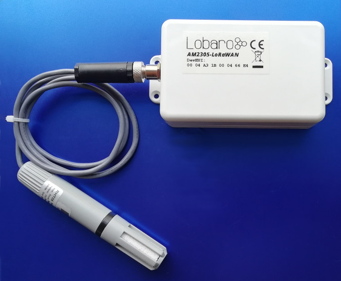
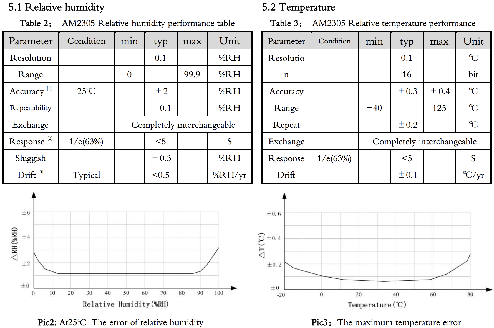

# Humidity & Temperature LoRaWAN Sensor
##Overview


{: style="height:300px; display: block; margin: 0 auto; border:1px black solid"}

The Lobaro LoRaWAN Humidity Sensor AM2305-LoRaWAN is a battery powered radio transmitting sensor device that takes measurements at configurable intervals. Because of its low
power consumption it can operate for multiple years with standard AA batteries. The LoRa
radio technology allows it to take measurements in places that are hard to reach, and in its
water prove casing it can be installed outdoors.
The device uses a AM2305 digital relative humidity and temperature sensor probe (also known
as RHT05 or DHT44). It is powered by the base device and communicates via a one-wire
connection.

**Please read the manual carefully before operating the device. A safe operation of the
device is only possible if you follow the guides provided in this manual. Using the device
differently than intended by Lobaro my cause damage to people, the environment, or
the device.**

## The Device

{: style="height:300px; display: block; margin: 0 auto;"}

## Operating the Humidity Sensor

The RHT05 sensor probe must be attached to the device on the external socket. Insert two
1.5V AA batteries into the slots. When the device starts, its LED flashes once. If it does
not start, check that your batteries are still good and inserted the correct way. You can refer
to the picture above to check that everything is connected as it should be.
When the device is set up correctly and running, put the lid on the base and fasten it from
the back using the supplied screws. Watch out that the cables are save inside the box and
do not get stuck in the casing, or you might damage the cables and allow water to enter the
casing. This can cause damage to the device!
Always close the lid so that the socket for the probe is on the opposing side of the antenna
(picture above, sensor probe on the left, antenna on the right). This way there will be
less interference on the antenna and you will get the best connection possible.

###Batteries

The LoRaWAN Humidity Sensor default power supply consists of two series connected off-
the-shelf 1.5V 'AA' sized batteries. Be sure to get the polarity right, see the '+'-Symbol on
the board. In general only AA cells of the types Alkali-Manganese (1.5V, LR6) and LithiumIron-Sulphide (1.5V, FR6) are allowed to be inserted in the device. Lobaro recommends the
use of FR6 batteries like the Energizer Ultimate Lithium over LR6 types because of the higher
capacity and better discharge properties.

!!! warning "Other Batteries or accumulators with a nominal voltage of more than 1.5V must not inserted into the device under any circumstances. In particular, lithium based cells with a nominal voltage of 3.6V or 3.7V must not be used on the AA battery slots!"

On request we can supply custom product variants with special housings powered by even
bigger batteries. For example a 3.6V C sized mono cell typically has a capacity of 9Ah with
leads to a 3x increased battery life compared to the standard AA-cells. With D sized cells of
typically 19Ah capacity this value can be doubled once again (6x). Also available on request
are options with permanent external power supply (230V, 9-24V, 5V USB).

###Installation

The device must be fixed on a flat surface using the lateral mounting holes of the case.
Alternatively we offer as accessory a mounting clip for a standard 35mm DIN rail. The device can then easily snapped
on a such rails. It can therefore be added to a variety of racks alongside other devices

!!! warning "Under any circumstances the device must not be mounted higher than 2 meters above ground to avoid any risks in case of falling down!"

For optimal RF performance (e.g. LoRa range) any metal obstacles near the internal antenna
should be avoided. In this case 'near' is defined as keep-out distance of about 3-5 centimeters
around the antenna. The internal helix antenna can be identified by the winding pcb traces
near the white printed encircled 'connectivity' symbol. In any case a device mounting directly
on top of a metal surface is not advisable since it will degrade the possible RF range. Stone
walls, wood or plastic standoffs are perfectly ok.
In case of challenging installation locations (e.g. in basements) or unavoidable long distances
to the next LoRaWAN gateway, Lobaro offers on request custom product variant equipped
with a 'SMA' connector to support a external antenna connection.

## Work Cycle


###Initial Phase

This is the phase that is executed after the device is started of restarted. The LED flashes
once and the configuration is evaluated. If successful, the LoRaWAN Join phase is executed
next.

###LoRaWAN Join Phase

If the Device is configured to use over the air activation (OTAA), the OTAA Join is performed
at this point. The device will repeatedly try to join its LoRaWAN network until the process
is successful. It then enters the Data Collection Phase.
If the Device is configured to use ABP instead of OTAA, this phase is left immediately and
the Data Collection Phase is entered.

### Data Collection Phase

During the Data Collection Phase is the device activates the sensor probe and reads measured
humidity and temperature. There will be up to three attempts to get a correct reading. The
communication contains a checksum value to detect data corruption between the probe and
the main device. After data collection, the probe is deactivated again to save power. The
device then enters the Data Transfer Phase.

### Data Transfer Phase

During the Data Transfer Phase the Bridge uploads the sensor values to the LoRaWAN
network. The message contains the information if the measurement was successful.
In addition to the register data, the Bridge sends a status packet once a day during this
phase. The status packet will always be transmitted prior to any data packets.

###Sleep Phase

After transferring all data packets the device enters the Sleep Phase. During this it is completely inactive to avoid wasting power. It remains sleeping until the cron expression given in
the configuration triggers. When that happens, it enters the Data Collection Phase again

## Configuration, The Lobaro Maintenance Tool

{: style="width:60%; display: block; margin: 0 auto;"}

The initial device configuration can be done very comfortably from your PC via the serial
configuration interface. Beside the needed Lobaro USB to UART adapter the [**Lobaro Maintenance Tool**](https://www.lobaro.com/lobaro-maintenance-tool/){: target="_blank"} needs to be installed. This tool is freely available for various operating systems
including Windows, Linux, Mac and Linux-ARM (e.g. Raspberry-PI) on and works with all
Lobaro sensors.
Technically this software opens a webserver on port 8585 that runs in a background console
window. The actual user interface can be accessed normally using a standard web browser
at address http://localhost:8585. Normally your default browser should be
opened with this URL automatically after tool startup . Even remote configuration and logobservation
over the Internet is possible, e.g. having a Raspberry PI via USB connected to
the Lobaro device and accessing the maintenance tool from a remote machines browser over
the Internet.
Additionally to the device setup the tool can also be used for firmware updates ('Firmware
Tab') , watching real-time device diagnostic output ('Logs Tab') and initiating device restarts.


!!! info "Consider using the latest firmware on your hardware"
    * [**See available firmware downloads**](firmware.md){: target="_blank"}

## Target Measurement / Purpose
Temperature and relative humidity measurements with external probe and LoRaWAN.

## PDF Documentation

* [User Manual (en)](files/lorawan-humidity-sensor_en.pdf){: target="_blank"}
* [CE Conformity](files/scan-ce-conformity-am2305-lorawan.pdf){: target="_blank"}


## Sensor Specification




## Parser

### The Things Network (JavaScript)

```javascript
/**
 * TTN-compatible data decoder for the Lobaro LoRaWAN Humidity Sensor.
 */

function readVersion(bytes) {
    if (bytes.length<3) {
        return null;
    }
    return "v" + bytes[0] + "." + bytes[1] + "." + bytes[2];
}

function int40_BE(bytes, idx) {
    bytes = bytes.slice(idx || 0);
    return bytes[0] << 32 |
        bytes[1] << 24 | bytes[2] << 16 | bytes[3] << 8 | bytes[4] << 0;
}

function signed(val, bits) {

    if ((val & 1 << (bits-1)) > 0) { // value is negative (16bit 2's complement)

        var mask = Math.pow(2, bits) - 1;

        val = (~val & mask) + 1; // invert all bits & add 1 => now positive value

        val = val * -1;

    }

    return val;

}

function int16_BE(bytes, idx) {

    bytes = bytes.slice(idx || 0);

    return signed(bytes[0] << 8 | bytes[1] << 0, 16);

}

function int16_BE_1c(bytes, idx) {
    bytes = bytes.slice(idx || 0);

    var v = (bytes[0]&0x7f) << 8 | bytes[1] << 0;
    if (bytes[0]&0x80) {
      return -v;
    } else {
      return v;
    }
}
 

function port1(bytes) {
    return {
        "port":1,
        "version":readVersion(bytes),
        "flags":bytes[3],
        "temp": int16_BE(bytes, 4) / 10,
        "vBat": int16_BE(bytes, 6) / 1000,
        "timestamp": int40_BE(bytes, 8),
        "operationMode": bytes[13]
    };
}

function port2(bytes) {
    return {
        "port":2,
        "timestamp": int40_BE(bytes, 0),
        "error":!!(bytes[1]&0x01),
        "humidity":int16_BE(bytes, 6)/10.0,
        "temperature":int16_BE_1c(bytes, 8)/10.0
    };
}

function Decoder(bytes, port) {
    switch (port) {
        case 1:
            return port1(bytes);
        case 2:
            return port2(bytes);
    }
    return {"error":"invalid port", "port":port};
}

```