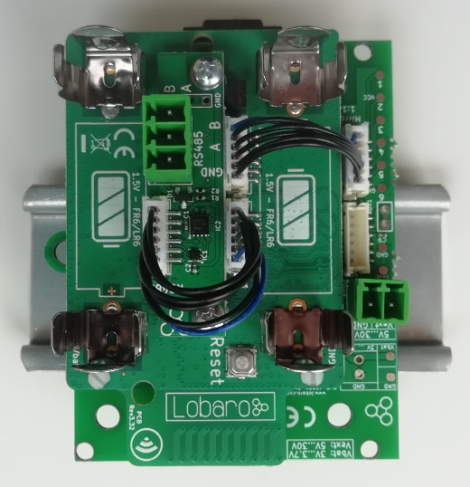
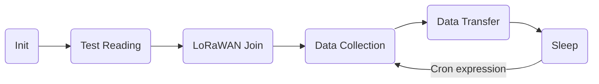

# Modbus (ASCII / RTU) over LoRaWAN Bridge
<!-- Version v0.4.1 *(since 2019-07-29)* <br>
This is the latest version. For older revisions please refer to the [version overview](versions.md). -->
Version v0.4.1 *(since 2019-07-27)* <br>
This the manual for an unreleased version of the firmware. For older revisions please refer to the [version overview](../versions.md).


{: style="width:40%;border:1px black solid;"}

## Target Measurement / Purpose
The Lobaro Modbus LoRaWAN Bridge is a low power device that can be used to communicate with 
Modbus Slave devices (ASCII/RTU) on a RS-485 bus over a LoRaWAN network. 
Modbus commands can be transmitted via Downlink message to the Bridge and are forwarded by 
the Bridge to the connected Slave Devices. Received responses are forwarded via LoRaWAN 
Uplink messages. The Modbus Bridge can also be configured to execute Modbus commands 
regularly and report the responses via Uplink.

The Bridge supports LoRaWAN Operation Mode *Class A* for power efficient operation
(for long operation periods powered by battery), as well as *Class C* to enable short 
reaction time to Downlink requests.

{: style="width:50%; vertical-align: top;"}

The Modbus Bridge supports reading of all four object types that can be provided by 
Modbus slave devices: Coil, Discrete Input, Input Register, and Holding Register. 
It also supports writing values to both writable objects: Coils and Holding Registers.
Multiple different slave devices on the Bus can be accessed individually by a single 
Bridge device. Reading intervals and register definitions can be configured very 
flexibly to suit individual requirements.

Typical applications for Modbus devices include reading out electric and water meters or 
retrieving data from environmental sensors like temperature and humidity.
Industrial machines as well as solar panel installations often include a Modbus 
connection to supply supervision and automated operation.

**PDF Download**

* [Data Sheet with dimensions](files/Modbus-LoRaWAN-Specs.pdf)

## Modbus
Modbus defines four different object types form which values can be read:
Coils, Discrete Inputs, Input Registers, and Holding Registers.
Of those four, Coils and Holding Registers can also be written to. 
Coils and Discrete Inputs hold single bit values while Input Registers and 
Holding Registers hold 16 bit values. For values that cannot fit into 16 bit, it is 
customary to use multiple consecutive registers to hold the value. Modbus does not 
define what the bytes in the registers represent; it is up to the creator of the 
Modbus Slave Device to specify how to interpret the stored bits. A 16 bit register could 
be used to hold a single byte value, for example, or four consecutive registers could 
hold a double precision floating point number. Storing texts as ASCII characters is also 
possible. For integer numbers in particular it there is no defined byte order, nor signage 
definition. Because of those ambiguities it is not possible for the Lobaro LoRaWAN Bridge to 
understand the data read from/written to Slave Devices. All communications therefore simply 
forward raw Modbus Commands and Responses with their payload, as it communicated on the Bus.
Any check sums (CRC16 for RTU, LRC for ASCII) are excluded from LoRaWAN communications or the 
Bridge's configuration, as there are other check sums in work their already.

For a deeper introduction into Modbus please refer to 
[https://en.wikipedia.org/wiki/Modbus](https://en.wikipedia.org/wiki/Modbus).


## Work Cycle
The Modbus LoRaWAN Bridge has a simple work cycle. It spends most of the time in a deep sleep 
state, to conserve energy. For every reading it wakes up for a few seconds, requests values 
from the connected slave devices, uploads the data via LoRaWAN, and then goes to sleep again.
The following flowchart illustrates the work cycle:



Init
:   When the device starts (because it has just been connected to a power source, or after 
    a reboot) it begins in the *Init* state. A quick self-check is executed; if that succeeds, 
    the green on-board LED blinks once, slowly. After that the configuration is evaluated and 
    checked for invalid values. If any problems are detected during *Init*, the device's LED 
    will light up for three times, and the device will then reboot. If everything is okay, the 
    device will continue with the *Test Reading*.
Test Reading
:   

## Configuration
The configuration is done using [Lobaro Maintenance Tool](/tools/lobaro-tool/) and the Lobaro USB PC adapter.

### LoRaWAN
The connection to the LoRaWAN network is defined by multiple configuration parameters.
This need to be set according to your LoRaWAN network and the way your device is 
supposed to be attached to it, or the device will not be able to send any data.

There are two different methods to attach a device to a LoRaWAN network: 
Over-the-air-activation (OTAA) and Activation-by-personalisation (ABP). 
Depending on which method you are using you will have to set different values.

Several values are a number of bytes, that need to be entered as hexstrings (without 
`0x`-prefix). So e.g. the DevEUI is a value of 8 bytes encoded in hex will be 
16 hexdigits long. A sample value would be `0123456789abcdef`.

| name | used | type | description |
|------|------|------|-------------|
| `OTAA` | both | bool | `true` &equiv; use OTAA, `false` &equiv; use ABP |
| `DevEUI` | OTAA | hexbyte[8] | the 8 byte DevEUI identifies the hardware on the join operation. The default value is a world wide unique value predefined in the hardware. Should not be changed unless required by the network provider.
| `AppEUI` | OTAA | hexbyte[8] | ID defining the application used in the LoRaWAN network. |
| `AppKey` | OTAA | hexbyte[16] | Key used to encrypt communication with the LoRaWAN network. |
| `AppSKey` | ABP | hexbyte[16] | Application Session Key to be synced with the LoRaWAN network. |  
| `NetSKey` | ABP | hexbyte[16] | Network Session Key to be synced with the LoRaWAN network. |  
| `DevAdr` | ABP | hexbyte[4] | Device Address used to identify device in the LoRaWAN network. |  
| `SF` | both | int | Initial LoRa spreading factor used for transmissions. Valid range is 7-12. The actual spreading factor used by change during operation if ADR is used. |
| `ADR` | both | bool | Should adaptive data rate be used? `true` &equiv; use ADR, `false` &equiv; don't | 
| `OpMode` | both | char | LoRaWAN operation mode, `A` &equiv; Class A, `C` &equiv; Class C |

### Modbus/UART
There are several values that define the configuration via Modbus. These 
values depend on the Slave devices that you want to read out. Please refer to your 
Modbus Devices's manual to find out the correct configuration.

| name | description | values |
|------|-------------|--------|
| `ModbusProtocol`   | Which Modbus-Protocol to use | `RTU`. `ASCII` |
| `ModbusBaud`       | UART Baud rate | `9600`, `19200`, `38400`, ... |
| `ModbusDataLength` | UART data length | `7`, `8`, `9` |
| `ModbusStopBits`   | UART stop bits | `0.5`, `1`, `1.5`, `2` (written exactly like this) |
| `ModbusParity`     | UART parity | `NONE`, `EVEN`, `ODD` |
| `ModbusCron`       | Cron expression<sup>&dagger;</sup> defining when to read. | `0 0/15 * * * *` for every 15 minutes |
| `ModbusCommands`   | List of Modbus Commands (see below). | `010300010003` |

<sup>&dagger;</sup> See also our [Introduction to Cron expressions](/background/cron-expressions).


### Modbus Commands

Whenever the cron expression given in the configuration value `ModbusCron` activates, the 
Modbus Bridge wakes up from hibernation (or listening mode, for Class C), a set of 
configured Modbus Commands (set in the configuration parameter `ModbusCommands`) 
is executed over the RS-485 bus. Any responses received from 
the addressed Slave Device will be uploaded via LoRaWAN. 

The Modbus Commands to be executed must be entered in the config as hexencoded bytes, 
exactly the way they are to be sent over the bus. Checksums must not be included in the 
configuration. Multiple commands can be added to the configuration, separated by commas (no 
spaces). For example if you want the Bridge to read the Holding Registers 100, 101, and 102 
on two separated Slave Devices with the addresses 9 and 10, you would need to set `ModbusCommands` 
to `090300640003,0a0300640003`.

You can configure any byte sequence you want to be sent; not all will be valid Modbus Commands. 
This feature has been developed to execute register/coil reads and upload the values retrieved. 
It is possible to use it for writing values as well, but the usefulness of that is limited. If 
you configure register writes, be aware that the commands are also executed when the 
device boots!

Keep in mind that the responses to your commands will be sent using LoRaWAN, which has only 
a very limited packet size! Modbus responses can be over 200 bytes long. For reading 
commands, the Modbus Response contains 6 bytes to repeat the command. The data format used 
by the Modbus Bridge adds another 6 bytes. On higher spreading factors with 50 byte 
message limit this only leaves 38 bytes for the actual read data (in EU LoRaWAN configuration,
other areas might have a slightly different number). 
*Responses that will not fit into a single LoRaWAN Uplink will be dropped!* 
To make sure your data can be uploaded on high spreading factors, do not read out more 
than 19 consecutive 16 bit registers in a single command.

For a short introduction into Modbus Commands and some examples of configurations and their 
created responses, please take a look at [examples](#examples).

## Payload formats

The Modbus Bridge sends two different kinds of messages over three different LoRaWAN ports:

| Direction | Port | Message |
|-----------|-----:|:--------|
| Uplink    |    1 | Status messages. |
| Uplink    |    3 | Modbus Responses triggered by configuration. |
| Uplink    |    4 | Modbus Responses triggered by Downlinks. |
| Downlink  |    4 | Modbus Commands to be forwarded by the Bridge. |

In addition to the description we also supply a [reference decoder](#reference-decoder) 
usable in TTN at the end of this document.

### Uplink

#### Status messages

The Modbus Bridge sends a status messages report on the health of the device itself.
This messages are sent along when the device is sending data packages with a 
maximum of one status message per day. 

Status messages are transmitted on port 1 and have a fixed length of 14 bytes.

| name       | pos | len | type     | description | example |
|------------|----:|----:|----------|-------------|---------|
|version     |   0 |   3 |`uint8[3]`| Version of firmware running on the device |`[0, 4, 1]` &equiv; `v0.4.1` |
|flag        |   3 |   1 |`uint8`   | Status flag, for internal use | `0` |  
|temperature |   4 |   2 |`int16`   | Device's internal temperature in tenth °C | `246` &equiv; `24.6°C` |  
|voltage     |   6 |   2 |`int16`   | Voltage supplied by power source in mV | `3547` &equiv; `3.547V` |
|timestamp   |   8 |   5 |`int40`   | Internal date/time at creation of the status packet as UNIX timestamp | `1533055905` |
|opMode      |  13 |   1 |`char`    | LoRaWAN Operation mode the device runs | `A` or `C` |

#### Data messages
Data messages contain responses to Modbus Commands received by the Bridge. 
They are sent as Uplinks on two different ports, depending on how the command 
was triggered. The format of the messages is identical for both cases.

Data messages on port 3 contain responses to the commands set in the 
configuration parameter `ModbusCommands` that are executed automatically 
every time the cron expression in `ModbusCron` activates. Data messages on 
port 4 contain responses to Modbus Commands that have been sent to the Bridge
as Downlinks via LoRaWAN.

Every Data message starts with 5 bytes containing an `int40` timestamp.
This is followed by zero or more Modbus Responses. Each Modbus Response is 
prefixed with a single byte indicating the length of the Response (as `uint8`).

The timestamp indicates when the command that triggered the Responses were 
executed. For Messages on port 3 this is the time at which the Bridge was 
activated by the cron expression. For Messages on port 4 this is the time at 
which the received Downlink was executed. Please note our information on 
[timestamps in our LoRaWAN devices](/background/lorawan.html#timestamps).

The Bridge tries to put as many Responses into a single message as possible,
so depending on the current spreading factor, the number of Responses per 
message may vary. For a short introduction to Modbus Commands and Responses
and some examples of configuration and payload refer to [Examples](#examples).

### Downlink

#### Modbus Commands
Downlinks on port 4 contain one or more Modbus Commands that the Bridge should 
forward to the RS-485 bus. Every Command must be prefixed by a single byte 
defining the Command's length. The Responses to the Commands are sent as 
Uplink messages on port 4.

Any byte sequence can transmitted this way and will be forwarded to the bus. 
If the Bridge does not receive a Response by the addressed Slave Device, create an 
error Response with the exception code `11` "Gateway Target Device Failed to Respond". 
This only makes sense if the Downlink did contain a Modbus Command.

Please be advised that not all Modbus Slave devices send Responses in all cases. If 
you receive the exception code `11` it is possible that the Slave device was reached 
but was not addressed correctly. It might even be possible, that a Command was 
executed successfully, but that the device does not send confirmations. When in doubt, 
refer to the documentation of your connected devices or try communicating with it 
directly, without the Bridge, to reduce possible error sources.

Refer to [Examples](#examples) to see some Downlinks and their answers.


## Examples
This chapter illustrates with some examples, how working with the Modbus Bridge 
looks like. The bytes that are sent via LoRaWAN are presented here as hex strings. 
Modbus Commands and Responses are broken down to their parts in the 
explanations, but explaining the format used by Modbus in detail is beyond the 
scope of this manual. You can find a short explanation on Modbus on Wikipedia: 
[https://en.wikipedia.org/wiki/Modbus](https://en.wikipedia.org/wiki/Modbus).

### Uplinks triggered by configuration
The following shows some examples of configuration for the automated reading and 
what the generated Uplinks for that could look like.

**Example A1: Read Holding Registers 0, 1, and 2 of device with address 1**
```
ModbusCommands = '010300000003'

# Example resulting Uplink after successful readout
Up, Port 3: '005d1698fd0c0103000000031234567890ab'
 '005d1698fd' -> timestamp = 1561762045 -> 2019-06-28T22:47:25 UTC
 '0c'       -> first Response is 12 bytes long
 '0103000000031234567890ab' 12 bytes modbus response:
   '01' -> slave device with address 1
   '03' -> function 3 = read Holding Register, success
   '0000' -> start reading at register 0
   '0003' -> read 3 consecutive registers
   '1234567890ab' -> 6 bytes of data
   
# Example resulting Uplink after failing readout
Up, Port 3: '005d1698fd0301830b'
 '005d1698fd' -> timestamp = 1561762045 -> 2019-06-28T22:47:25 UTC
 '03'       -> first Response is 3 bytes long
 '01830b' 3 bytes modbus response:
   '01' -> slave device with address 1
   '83' -> function 3 with error indicator 80 = read Holding Register, failed
   '0b' -> error code 11: "Gateway Target Device Failed to Respond"
```

**Example A2: Read coils 1000-1019 of device 32**
```
ModbusCommands = '200103e80014'

# Example resulting Uplink
Up, Port 3: '005d1698fd09200103e80014f1041a'
 '005d1698fd' -> timestamp = 1561762045 -> 2019-06-28T22:47:25 UTC
 '09'       -> first Response is 9 bytes long
 '200103e80014f1041a' 9 bytes of modbus response:
   '20' -> slave device with address 32
   '01' -> read coils, success
   '03e8' -> start reading at coil 1000
   '0014' -> read 20 consecutive coils
   'f1041a' -> 20 bits of data packed into 3 bytes
```

**Example A3: Read two devices**
```
ModbusCommands = '0a0300010005,3001ea600020'

# Example resulting Uplink
Up, Port 3: '005d1698fd100a0300010005111122223333444455550a3001ea60002012345678'
 '005d1698fd' -> timestamp = 1561762045 -> 2019-06-28T22:47:25 UTC
 '10' -> first Response is 16 bytes long
 '0a030001000511112222333344445555' 16 bytes of Modbus Response
   '0a' -> slave device with address 10
   '03' -> read Holding Registers, success
   '0001' -> start reading at register 1
   '0005' -> read 5 registers
   '11112222333344445555' 10 bytes of data
 '0a' -> second Response is 10 bytes long
   '30' -> slave device with address 48
   '01' -> read Coils, success
   'ea60' -> start at coil 60000
   '0020' -> read 32 coils
   '12345678' -> 32 bits of data packed in 4 bytes
```

### Uplinks triggered by Downlinks
**Example B1: Read single Input Register by Downlink**
```
Down, Port 4: '06180401000001'
  '06' -> first Command is 6 bytes long
  '180401000001' 6 bytes of Modbus Command
    '18' -> slave device with address 24
    '04' -> function 4, read Input Register
    '0100' -> start at register 256
    '0001' -> read 1 register
    
# Example resulting Uplink
Up, Port4: '004b3dd67508180401000001abcd'
  '004b3dd675' -> timestamp = 1262343797 -> 2010-01-01T11:03:17 UTC
  '08' -> first Response is 8 bytes long
  '180401000001abcd' 8 bytes of Response
    '18' -> slave device with address 24
    '04' -> read Input Register, success
    '0100' -> start at register 256
    '0001' -> read 1 register
    'abcd' -> 2 bytes of data
```

**Example B2: Writing holding registers on multiple devices**
```
Down, Port 4: '06a106aabb12340fa210a0010004081122334455667788'
  '06' -> first Command is 6 bytes long
  'a106aabb1234' 6 bytes of Modbus Command
    'a1' -> slave device with address 161
    '06' -> function 6, write single Holding Register
    'aabb' -> address of Register to write = 43707
    '1234' -> two bytes of data
  '0f' -> second Command is 15 byts long
  'a210a0010004081122334455667788' 15 byte of Modbus Command
    'a2' -> slave device with address 162
    '10' -> function 16, write multiple Holding Registers
    'a001' -> start at register 40961
    '0004' -> 4 registers to write
    '08' -> 8 bytes of data follow
    '1122334455667788' -> 8 bytes of data
    
# Example resulting Uplink
Up, Port 4: '004b3dd67503a1860206a210a0010004'
  '004b3dd675' -> timestamp = 1262343797 -> 2010-01-01T11:03:17 UTC
  '03' -> first Response is 3 bytes long
  'a18602' 3 bytes of Modbus Response
    'a1' -> slave device address 161
    '86' -> write single Holding Regsiter, failed
    '02' -> error code 2: "Illegal Data Address"
  '06' - second Response is 6 byts long
  'a210a0010004' 6 bytes od Modbus Response
    'a2' -> slave device address 162
    '10' -> read multiple Holding Registers, success
    'a001' -> start at register 40961
    '0004' -> 4 registers to write
```


## Complex setups
The Modbus Bridge as described in this manual can be individually configured to read out any
registers and coils. For some setups, this is not enough. There can be situations in which you want
to read registers at different intervals, e.g. you might need some values with hourly updates
and others only every other day. For measuring values with high variance it can be necessary
to take multiple reads over a period of time and create an average value. Maybe you need
to read a status register first and depending on its value you want to decide which registers
to read and transmit the values of. 
All this scenarios are possible to solve using the Modbus Bridge, but their complexity leave the
scope of our standard firmware. If you need any special processing for your Modbus setup,
please contact us with your requirements, and we will make you an offer for an individual
firmware that processes data the way you need.
If you find that the data rate LoRaWAN offers is a limitation for your setup, we could also
provide you with a Modbus solution that uses alternate data transmission technologies, for
example NarrowBand-IoT.

## Appendices

### Technical characteristics

|                          |                                                                         |
|--------------------------|-------------------------------------------------------------------------|
| **Product**              |                                                                         |
| Type name                | Modbus485-LoRaWAN                                                       |
| Description              | Modbus over LoRaWAN Bridge                                              |
| **RF tranceiver**        |                                                                         |
| Type                     | Semtech SX1272                                                          |
| Frequency                | 863 MHz to 870 MHz                                                      |
| Max. TX Power            | max. +14 dBm                                                            |
| Typical RF Range         | &le;2km                                                                 |
| Ideal RF Range           | &le;10km (free line of sight)                                           |
| **LoRa communication**   |                                                                         |
| Protocol                 | Class A / Class C LoRaWAN 1.0.1 EU868                                    |
| Activation method        | Over-the-air-activation (OTAA) <br> Activation by personalization (ABP) |
| Encryption               | AES128                                                                  |
| **Modbus communication** |                                                                         |
| Bus                      | RS-485 twisted pair wires (with optional GND)                           |
| Protocol                 | RTU/ASCII                                                               |
| **Environmental Requirements** |                                                                   |
| Operating temperature    | -20°C &ndash; 55°C                                                      |
| Max installation height  | 2m                                                                      |
| **Standards** <br>   |
|                          |                                                                         |

### CE Declaration of Conformity

[CE Declaration of Conformity](files/modbus-lorawan-ce-conformity.pdf) (pdf).

### Disposal / WEEE / Entsorgung

[Information about the disposal of the Device](/background/weee-disposal).

### Reference decoder

This is a decoder written in JavaScript that can be used to parse the device's 
LoRaWAN messages. It can be used as is in 
[The Things Network](https://thethingsnetwork.org).

```javascript
function readVersion(bytes) {
    if (bytes.length<3) {
        return null;
    }
    return "v" + bytes[0] + "." + bytes[1] + "." + bytes[2];
}

function int40_BE(bytes, idx) {
    bytes = bytes.slice(idx || 0);
    return bytes[0] << 32 |
        bytes[1] << 24 | bytes[2] << 16 | bytes[3] << 8 | bytes[4] << 0;
}

function int16_BE(bytes, idx) {
    bytes = bytes.slice(idx || 0);
    return bytes[0] << 8 | bytes[1] << 0;
}

function decode_status(bytes) {
    return {
        "port":1,
        "version":readVersion(bytes),
        "flags":bytes[3],
        "temp": int16_BE(bytes, 4) / 10,
        "vBat": int16_BE(bytes, 6) / 1000,
        "timestamp": int40_BE(bytes, 8),
        "operationMode": bytes[13]
    };
}

// TODO:
```
[Copyright Modbus Logo]( http://www.modbus.org){: target="_blank"}
