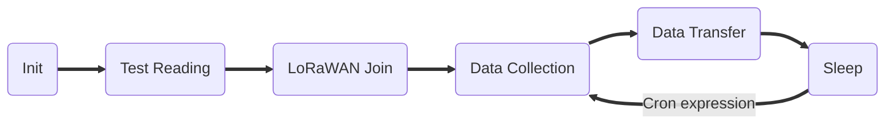

# Modbus (ASCII / RTU) over LoRaWAN Bridge
Version v1.0.0 *(since 2019-09-16)* <br>
This is the latest version. For older revisions please refer to the [version overview](versions.md).

!!! warning "This version has a different upload format than older versions!"
    If you are using 0.3.x firmware, please see the [0.3.x Manual](0.3.0). <br>
    If you are updating to this firmware, be aware that you will have to update your 
    configuration and the parser in your backend.

<!--Version v1.0.0 *(since 2019-09-16)* <br>
This the manual for an unreleased version of the firmware. For older revisions please refer to the [version overview](../versions.md).
-->

{: style="width:40%;border:1px black solid;"}

## Target Measurement / Purpose
The Lobaro Modbus LoRaWAN Bridge is a low power device that can be used to communicate with 
Modbus Slave devices (ASCII/RTU) on a RS-485 bus over a LoRaWAN network. 
Modbus commands can be transmitted via Downlink message to the Bridge and are forwarded by 
the Bridge to the connected Slave Devices. Received responses are forwarded via LoRaWAN 
Uplink messages. The Modbus Bridge can also be configured to execute Modbus commands 
regularly and report the responses via Uplink.

The Bridge supports LoRaWAN Operation Mode *Class A* for power efficient operation
(for long operation periods powered by battery), as well as *Class C* to enable short 
reaction time to Downlink requests.

{: style="width:50%; vertical-align: top;"}

The Modbus Bridge supports reading of all four object types that can be provided by 
Modbus slave devices: Coil, Discrete Input, Input Register, and Holding Register. 
It also supports writing values to both writable objects: Coils and Holding Registers.
Multiple different slave devices on the Bus can be accessed individually by a single 
Bridge device. Reading intervals and register definitions can be configured very 
flexibly to suit individual requirements.

Typical applications for Modbus devices include reading out electric and water meters or 
retrieving data from environmental sensors like temperature and humidity.
Industrial machines as well as solar panel installations often include a Modbus 
connection to supply supervision and automated operation.

**PDF Download**

* [Data Sheet with dimensions](files/Modbus-LoRaWAN-Specs.pdf)

## Modbus
Modbus defines four different object types form which values can be read:
Coils, Discrete Inputs, Input Registers, and Holding Registers.
Of those four, Coils and Holding Registers can also be written to. 
Coils and Discrete Inputs hold single bit values while Input Registers and 
Holding Registers hold 16 bit values. For values that cannot fit into 16 bit, it is 
customary to use multiple consecutive registers to hold the value. Modbus does not 
define what the bytes in the registers represent; it is up to the creator of the 
Modbus Slave Device to specify how to interpret the stored bits. A 16 bit register could 
be used to hold a single byte value, for example, or four consecutive registers could 
hold a double precision floating point number. Storing texts as ASCII characters is also 
possible. For integer numbers in particular it there is no defined byte order, nor signage 
definition. Because of those ambiguities it is not possible for the Lobaro LoRaWAN Bridge to 
understand the data read from/written to Slave Devices. All communications therefore simply 
forward raw Modbus Commands and Responses with their payload, as it communicated on the Bus.
Any check sums (CRC16 for RTU, LRC for ASCII) are excluded from LoRaWAN communications or the 
Bridge's configuration, as there are other check sums in work their already.

For a deeper introduction into Modbus please refer to 
[https://en.wikipedia.org/wiki/Modbus](https://en.wikipedia.org/wiki/Modbus).


## Quick Start Guide

!!! info "Please refer to the rest of this documentation for a save and proper use of the Modbus Bridge."
    This Quick Start Guide can only show you basic operations. It illustrates reading 
    a single value from one Slave Device.

* Connect the Modbus Bridge to your Modbus Slave Device using the RS485 connection using 
  a twisted pair cable: 
  `A` to `A`, `B` to `B`, and `GND` to `GND` (`GND` is not strictly necessary but enhances the
  connection. Not all slave devices supply a `GND` connector).
* Connect the Modbus Bridge to a computer using the 
  [Lobaro Configuration Adapter](/tools/usb-config-adapter.html) and the 
  [Lobaro Maintenance Tool](/tools/lobaro-tool.html).
* Synchronise the LoRaWAN configuration parameters between the Bridge and your 
  Network Server.
* Make sure the Bridge is in reach of a Gateway attached to your Network Server.
* Set the Modbus Parameters according to your Slave Device 
  (ASCII/RTU, Baud, Data Length, Stop Bits, Parity).
* Set `MbCmd` to the Modbus Command to read the register you need (see below).
* Save the configuration and switch to the Log tab. You should see the device
  requesting the data and uploading it via LoRaWAN.

`MbCmd` must contain the Modbus Command the Bridge will execute. The command is 
entered in Hex and without any checksums and is 6 bytes long (12 hexdigits). 
The default value is `010300000003`, it consists of 4 parts: `01`, `03`, `0000`, `0003`

`01`
:   Address of the Slave Device. 1 byte: often `01` new devices

`03`
:   What kind of Modbus Register to read. 1 byte. `03` stand for *Holding Register*.

`0000`
:   Number/address of the first register to read. 2 bytes. 
    Many devices have some value to read out at `0000`.
    
`0003`
:   Number of consecutive registers to read from the first register. 2 bytes. This
    would read the registers #0, #1, and #2 in one command.

The format used for `MbCmd` is conforming to the Modbus Standard. 
See [Configurations/Modbus Commands](#modbus-commands) for a description and 
[Examples](#examples) for some more advance examples. The Modbus Bridge has a 
[Dialog Mode](#dialog-mode) that lets you try out Modbus Commands interactively 
which helps getting used to the syntax and helps you in trying out your slave devices.


## Work Cycle
The Modbus LoRaWAN Bridge has a simple work cycle. It spends most of the time in a deep sleep 
state, to conserve energy. For every reading it wakes up for a few seconds, requests values 
from the connected slave devices, uploads the data via LoRaWAN, and then goes to sleep again.
The following flowchart illustrates the work cycle:



Init
:   When the device starts (because it has just been connected to a power source, or after 
    a reboot) it begins in the *Init* state. A quick self-check is executed; if that succeeds, 
    the green on-board LED blinks once, slowly. After that the configuration is evaluated and 
    checked for invalid values. If any problems are detected during *Init*, the device's LED 
    will light up for three times, and the device will then reboot. If everything is okay, the 
    device will continue with the *Test Reading*.
Test Reading
:   After verifying configuration, the Bridge executes all Modbus Commands stored once
    without uploading the results but logging them only to the console. 
    This makes it easy to verify all Modbus Slaves are reachable and their registers can be 
    read. Connect your computer to the Bridge using the Lobaro Config Adapter and check 
    the output using the Lobaro Maintenance Tool. 
    The device will continue with *LoRaWAN Join* to connect to the Network (whether the 
    test reading was successful or not does not change this).
LoRaWAN Join
:   The Bridge tries to connect to the LoRaWAN Network. The Details depend on the 
    device's configuration (OTAA vs. ABP, optional Time synchronisation). Unless ABP
    is used, the Bridge will remain in this state until joining succeeds. It will 
    repeat to send Join requests with decreasing frequency. 
    After successfully attaching it enters *Data Collection* for the first time and
    starts the normal operation cycle.
Data Collection
:   The Bridge sends all Modbus Commands from the Configuration on the Bus and 
    collects the answers (or lack thereof).
Data Transfer
:   The collected Modbus Responses are uploaded via LoRaWAN. This can take multiple 
    upload messages depending on the amount of data collected.  Once a day a status
    message is also uploaded, giving some information about the state of the Bridge 
    itself. If many messages are uploaded this can take a long time. At least one 
    message is uploaded during this state. When all data is uploaded, the device 
    goes to *Sleep*.
Sleep
:   Between activations the device enters a very power efficient sleep mode. It 
    stays dormant until the time specified by the Cron expression, when it changes 
    back to *Data Collection*. 

## Configuration
The configuration is done using [Lobaro Maintenance Tool](/tools/lobaro-tool/) and the Lobaro USB PC adapter.

### LoRaWAN
The connection to the LoRaWAN network is defined by multiple configuration parameters.
This need to be set according to your LoRaWAN network and the way your device is 
supposed to be attached to it, or the device will not be able to send any data.

For a detailed introduction into how this values need to be configured, please 
refer to the chapter [LoRaWAN configuration](/background/lorawan.html#lorawan-configuration) 
in our LoRaWAN background article.

| Name       | Description | Type | Values |
|------------|-------------|------|-------|
|`LwVer`     |LoRaWAN Version                      |`string`  | `1.0` or `1.1` |
|`OTAA`      |Activation: OTAA or ABP              |`bool`    | `true`= use OTAA, `false`= use ABP |
|`DevEUI`    |DevEUI used to identify the Device   |`byte[8]` | e.g. `0123456789abcdef` | 
|`JoinEUI`   |Used for OTAA (called AppEUI in v1.0)|`byte[8]` | e.g. `0123456789abcdef` | 
|`AppKey`    |Key used for OTAA (v1.0 and v1.1)    |`byte[16]`| |
|`NwkKey`    |Key used for OTAA (v1.1 only)        |`byte[16]`| |
|`SF`        |Initial / maximum Spreading Factor   |`int`     | `7` - `12` |
|`TxPower`   |Initial / maximum TX Power in dBm    |`int`     | `2` - `14` |
|`ADR`       |Use Adaptive Data Rate               |`bool`    | `true`= use ADR, `false`= don't |
|`OpMode`    |Operation Mode                       |`string`  | `A`= Class A, `C`= Class C |
|`TimeSync`  |Days after which to sync time        |`int`     | days, `0`=don't sync time | 
|`RndDelay`  |Random delay before sending          |`int`     | max seconds |
|`RemoteConf`|Support Remote Configuration         |`bool`    | `true`=allow, `false`=deactivate |
|`LostReboot`|Days without downlink before reboot  |`int`     | days, `0`=don't reboot |

### Modbus/UART
There are several values that define the configuration via Modbus. These 
values depend on the Slave devices that you want to read out. Please refer to your 
Modbus Devices's manual to find out the correct configuration.

| name       | description            | values |
|------------|------------------------|--------|
|`MbProt`    | Modbus-Protocol to use | `RTU`. `ASCII` |
|`MbBaud`    | UART Baud rate         | `9600`, `19200`, `38400`, ... |
|`MbDataLen` | UART data length       | `7`, `8`, `9` |
|`MbStopBits`| UART stop bits         | `0.5`, `1`, `1.5`, `2` (written exactly like this) |
|`MbPar`     | UART parity            | `NONE`, `EVEN`, `ODD` |
|`MbCron`    | Cron expression<sup>&dagger;</sup> defining when to read. | `0 0/15 * * * *` for every 15 minutes |
|`MbCmd`     | List of Modbus Commands (see below). | `010300010003` |
|`UlFmt`     | Uplink Format          | `1`, `2`, or `3`, see [Alternative Payload Formats](#alternative-payload-formats) |
|`EnDL`      | Enable Downlinks       | `true`= enable sending [Modbus Commands via Downlink](#downlink) | 
|`DialogMode `| Enable Dialog Mode    | `true`= set the Bridge to [Dialog Mode](#dialog-mode) |

<sup>&dagger;</sup> See also our [Introduction to Cron expressions](/background/cron-expressions).


### Modbus Commands

Whenever the cron expression given in the configuration value `MbCron` activates, the 
Modbus Bridge wakes up from hibernation (or listening mode, for Class C), a set of 
configured Modbus Commands (set in the configuration parameter `MbCmd`) 
is executed over the RS-485 bus. Any responses received from 
the addressed Slave Device will be uploaded via LoRaWAN. 

The Modbus Commands to be executed must be entered in the config as hexencoded bytes, 
exactly the way they are to be sent over the bus. Checksums must not be included in the 
configuration. Multiple commands can be added to the configuration, separated by commas (no 
spaces). For example if you want the Bridge to read the Holding Registers 100, 101, and 102 
on two separated Slave Devices with the addresses 9 and 10, you would need to set `MbCmd` 
to `090300640003,0a0300640003`.

You can configure any byte sequence you want to be sent; not all will be valid Modbus Commands. 
This feature has been developed to execute register/coil reads and upload the values retrieved. 
It is possible to use it for writing values as well, but the usefulness of that is limited. If 
you configure register writes, be aware that the commands are also executed when the 
device boots!

Keep in mind that the responses to your commands will be sent using LoRaWAN, which has only 
a very limited packet size! Modbus responses can be over 200 bytes long. For reading 
commands, the Modbus Response contains 6 bytes to repeat the command. The data format used 
by the Modbus Bridge adds another 6 bytes. On higher spreading factors with 51 byte 
message limit this only leaves 39 bytes for the actual read data (in EU LoRaWAN configuration,
other areas might have a slightly different number). 
Responses that will not fit into a single LoRaWAN Uplink will be split and uploaded 
using multiple LoRaWAN messages. Your backend will need to those parts back together.
Any message that is the continuation of an earlier uplink will be sent using port 5
(see [Split Messages](#split-messages)).

For a short introduction into Modbus Commands and some examples of configurations and their 
created responses, please take a look at the [examples](#examples).

## Payload formats

The Modbus Bridge sends two different kinds of messages over three different LoRaWAN ports:

| Direction | Port | Message |
|-----------|-----:|:--------|
| Uplink    |    1 | Status messages. |
| Uplink    |    3 | Modbus Responses triggered by configuration. |
| Uplink    |    4 | Modbus Responses triggered by Downlinks. |
| Uplink    |    5 | Continuation of Responses that do not fit in a single Uplink. |
| Downlink  |    4 | Modbus Commands to be forwarded by the Bridge. |

In addition to the description we also supply a [reference decoder](#reference-decoder) 
usable in TTN at the end of this document.

### Uplink

#### Status messages

The Modbus Bridge sends a status messages report on the health of the device itself.
This messages are sent along when the device is sending data packages with a 
maximum of one status message per day. 

Status messages are transmitted on port 1 and have a fixed length of 14 bytes.

| name       | pos | len | type     | description | example |
|------------|----:|----:|----------|-------------|---------|
|version     |   0 |   3 |`uint8[3]`| Version of firmware running on the device |`[0, 4, 1]` &equiv; `v0.4.1` |
|flag        |   3 |   1 |`uint8`   | Status flag, for internal use | `0` |  
|temperature |   4 |   2 |`int16`   | Device's internal temperature in tenth °C | `246` &equiv; `24.6°C` |  
|voltage     |   6 |   2 |`uint16`   | Voltage supplied by power source in mV | `3547` &equiv; `3.547V` |
|timestamp   |   8 |   5 |`int40`   | Internal date/time at creation of the status packet as UNIX timestamp | `1533055905` |
|opMode      |  13 |   1 |`char`    | LoRaWAN Operation mode the device runs | `A` or `C` |

#### Data messages
Data messages contain responses to Modbus Commands received by the Bridge. 
They are sent as Uplinks on two different ports, depending on how the command 
was triggered. The format of the messages is identical for both cases.

Data messages on port 3 contain responses to the commands set in the 
configuration parameter `MbCmd` that are executed automatically 
every time the cron expression in `MbCron` activates. Data messages on 
port 4 contain responses to Modbus Commands that have been sent to the Bridge
as Downlinks via LoRaWAN.

Every Data message starts with 5 bytes containing an `int40` timestamp.
This is followed by zero or more Modbus Responses. Each Modbus Response is 
prefixed with a single byte indicating the length of the Response (as `uint8`).

The timestamp indicates when the command that triggered the Responses were 
executed. For Messages on port 3 this is the time at which the Bridge was 
activated by the cron expression. For Messages on port 4 this is the time at 
which the received Downlink was executed. Please note our information on 
[timestamps in our LoRaWAN devices](/background/lorawan.html#timestamps).

The Bridge tries to put as many Responses into a single message as possible,
so depending on the current spreading factor, the number of Responses per 
message may vary. For a short introduction to Modbus Commands and Responses
and some examples of configuration and payload refer to [Examples](#examples).

#### Split messages
LoRaWAN has a very limited message size. For high spreading factors this goes 
as low as 51 bytes. If a Modbus Response is too long to fit into a single 
message, the Modbus Bridge will split it up into multiple messages that are 
sent in sequence. Patching messages back together requires a more complex 
backend that can save a state. A simple parse on *The Things Network* will not 
be able to do that. If your backend cannot handle this process, you can work 
around it by configuring your `MbCmd` in a way that no single response will 
be longer than 45 bytes (by reading out a maximum of 24 consecutive registers in 
a single command). If you have a configuration that results in longer Responses
you should make sure your backend can handle split Responses as described here.

If a Response is too long to fit into a single message, the Bridge puts as many 
bytes as possible into the message. You can tell by the length of the message
and the length of the Modbus Response indicated in the message, that this is 
only the first part of a message. This first part will be upload normally on 
port 3 (or port 4, if triggered by a downlink). Following the first part, the 
Bridge will upload the remaining data in messages sent on port 5. For very long 
Responses and high Spreading Factors, the Response could be split into up to 
6 messages. You can use the frame counter and the indicated length to verify 
if you receive all parts.

Modbus Responses that are split up will never be packed together with other 
Responses. The [Examples](#examples) section contains an illustration of 
a split up Response.

#### Alternative Payload Formats
The Modbus Bridge normally sends complete Modbus Responses as Uplinks. This makes 
the Bridge very versatile and easy to configure. When you have a changing 
configuration or multiple devices this makes it easy to make sense of your 
Uplinks: your backend does not need to know about the configuration of the 
Bridge, all information is contained in the Uplinks. It also allows to send any 
Command over the Bus, not only reading of registers/coils, but also writing of 
values, diagnostic messages, or even non-standard custom extensions to Modbus.

The downside of this format is, that it has a lot of overhead that uses up 
quite a bit of limited LoRaWAN payload. If your use case requires a lot of 
data per time, this might be a problem. The Modbus Bridge has alternative 
upload formats for this case that use less overhead. The payload format is 
configured with the parameter `UlFmt`; it can hold the values `1`, `2`, or `3`.

The default value of `UlFmt`=`1` leads to the verbose format described above.

`UlFmt`=`2` will send a 5 byte timestamp followed by only the payload of 
all Modbus Responses connected in a bunch of bytes. To make sense of this, 
you will need know the exact configuration of `MbCmd`. This format only makes 
sense for reading values of Modbus registers/coils. It cannot really indicate 
failure conditions either. If the reading of a register/coil fails, the values 
for that part will be filled with `0xff`. The data will be uploaded as it 
comes from the Slave device, without any interpretation.

`UlFmt`=`3` is using the same technique as `UlFmt`=`2`, but it does not 
prefix the date with a timestamp.

Uplinks triggered by Downlinks on port 4 (see below) will not be affected 
by this setting. Those will always contain the full Modbus Response.


### Downlink
Please be aware that Downlinks in LoRaWAN can only be received when the device 
sends an Uplink, or when the device operates in Class C mode.
See [Uplinks and Downlinks](/background/lorawan.html#uplinks-and-downlinks) in 
our LoRaWAN page for more information.


#### Modbus Commands
Downlinks on port 4 contain one or more Modbus Commands that the Bridge should 
forward to the RS-485 bus. Every Command must be prefixed by a single byte 
defining the Command's length. The Responses to the Commands are sent as 
Uplink messages on port 4.

Any byte sequence can transmitted this way and will be forwarded to the bus. 
If the Bridge does not receive a Response by the addressed Slave Device, create an 
error Response with the exception code `11` "Gateway Target Device Failed to Respond". 
This only makes sense if the Downlink did contain a Modbus Command.

Please be advised that not all Modbus Slave devices send Responses in all cases. If 
you receive the exception code `11` it is possible that the Slave device was reached 
but was not addressed correctly. It might even be possible, that a Command was 
executed successfully, but that the device does not send confirmations. When in doubt, 
refer to the documentation of your connected devices or try communicating with it 
directly, without the Bridge, to reduce possible error sources.

Refer to [Examples](#examples) to see some Downlinks and their answers.

#### Remote Configuration
The Modbus Bridge supports configuration via LoRaWAN Downlinks. It receives commands 
on port 128. See [Remote Configuration](/background/lorawan.html#remote-configuration)
in our LoRaWAN page for instructions on how to use it.

## Examples
This chapter illustrates with some examples, how working with the Modbus Bridge 
looks like. The bytes that are sent via LoRaWAN are presented here as hex strings. 
Modbus Commands and Responses are broken down to their parts in the 
explanations, but explaining the format used by Modbus in detail is beyond the 
scope of this manual. You can find a short explanation on Modbus on Wikipedia: 
[https://en.wikipedia.org/wiki/Modbus](https://en.wikipedia.org/wiki/Modbus).

### Uplinks triggered by configuration
The following shows some examples of configuration for the automated reading and 
what the generated Uplinks for that could look like.

**Example A1: Read Holding Registers 0, 1, and 2 of device with address 1**
```
MbCmd = '010300000003'

# Example resulting Uplink after successful readout
Up, Port 3: '005d1698fd0c0103000000031234567890ab'
 '005d1698fd' -> timestamp = 1561762045 -> 2019-06-28T22:47:25 UTC
 '0c'       -> first Response is 12 bytes long
 '0103000000031234567890ab' 12 bytes modbus response:
   '01' -> slave device with address 1
   '03' -> function 3 = read Holding Register, success
   '0000' -> start reading at register 0
   '0003' -> read 3 consecutive registers
   '1234567890ab' -> 6 bytes of data
   
# Example resulting Uplink after failing readout
Up, Port 3: '005d1698fd0301830b'
 '005d1698fd' -> timestamp = 1561762045 -> 2019-06-28T22:47:25 UTC
 '03'       -> first Response is 3 bytes long
 '01830b' 3 bytes modbus response:
   '01' -> slave device with address 1
   '83' -> function 3 with error indicator 80 = read Holding Register, failed
   '0b' -> error code 11: "Gateway Target Device Failed to Respond"
```

**Example A2: Read coils 1000-1019 of device 32**
```
MbCmd = '200103e80014'

# Example resulting Uplink
Up, Port 3: '005d1698fd09200103e80014f1041a'
 '005d1698fd' -> timestamp = 1561762045 -> 2019-06-28T22:47:25 UTC
 '09'       -> first Response is 9 bytes long
 '200103e80014f1041a' 9 bytes of modbus response:
   '20' -> slave device with address 32
   '01' -> read coils, success
   '03e8' -> start reading at coil 1000
   '0014' -> read 20 consecutive coils
   'f1041a' -> 20 bits of data packed into 3 bytes
```

**Example A3: Read two devices**
```
MbCmd = '0a0300010005,3001ea600020'

# Example resulting Uplink
Up, Port 3: '005d1698fd100a0300010005111122223333444455550a3001ea60002012345678'
 '005d1698fd' -> timestamp = 1561762045 -> 2019-06-28T22:47:25 UTC
 '10' -> first Response is 16 bytes long
 '0a030001000511112222333344445555' 16 bytes of Modbus Response
   '0a' -> slave device with address 10
   '03' -> read Holding Registers, success
   '0001' -> start reading at register 1
   '0005' -> read 5 registers
   '11112222333344445555' 10 bytes of data
 '0a' -> second Response is 10 bytes long
   '30' -> slave device with address 48
   '01' -> read Coils, success
   'ea60' -> start at coil 60000
   '0020' -> read 32 coils
   '12345678' -> 32 bits of data packed in 4 bytes
```

**Example A4: Split up messages**
```` text
MbCmd = '010300010020'
# Command reads 32 consecutive registers resulting in 64 bytes payload

# Example resulting Uplinks for a Spreading Factor of 12 with 51 bytes of payload per message
Up 1, Port 3: '005d1698fd46010300010020000100020003000400050006000700080009000a000b000c000d000e000f001000110012001300'
  '005d1698fd' -> timestamp = 1561762045 -> 2019-06-28T22:47:25 UTC
  '46' -> first Response is 70 bytes long
  since the remainder of the message does not contain 70 bytes, you know there must be an additional part comming 
Up 2, Port 5: '1400150016001700180019001a001b001c001d001e001f0020'
  This contains the rest of the message. Appended to the privious message, it adds up to the correct number of bytes.
````

### Uplinks triggered by Downlinks
**Example B1: Read single Input Register by Downlink**
```
Down, Port 4: '06180401000001'
  '06' -> first Command is 6 bytes long
  '180401000001' 6 bytes of Modbus Command
    '18' -> slave device with address 24
    '04' -> function 4, read Input Register
    '0100' -> start at register 256
    '0001' -> read 1 register
    
# Example resulting Uplink
Up, Port4: '004b3dd67508180401000001abcd'
  '004b3dd675' -> timestamp = 1262343797 -> 2010-01-01T11:03:17 UTC
  '08' -> first Response is 8 bytes long
  '180401000001abcd' 8 bytes of Response
    '18' -> slave device with address 24
    '04' -> read Input Register, success
    '0100' -> start at register 256
    '0001' -> read 1 register
    'abcd' -> 2 bytes of data
```

**Example B2: Writing holding registers on multiple devices**
```
Down, Port 4: '06a106aabb12340fa210a0010004081122334455667788'
  '06' -> first Command is 6 bytes long
  'a106aabb1234' 6 bytes of Modbus Command
    'a1' -> slave device with address 161
    '06' -> function 6, write single Holding Register
    'aabb' -> address of Register to write = 43707
    '1234' -> two bytes of data
  '0f' -> second Command is 15 byts long
  'a210a0010004081122334455667788' 15 byte of Modbus Command
    'a2' -> slave device with address 162
    '10' -> function 16, write multiple Holding Registers
    'a001' -> start at register 40961
    '0004' -> 4 registers to write
    '08' -> 8 bytes of data follow
    '1122334455667788' -> 8 bytes of data
    
# Example resulting Uplink
Up, Port 4: '004b3dd67503a1860206a210a0010004'
  '004b3dd675' -> timestamp = 1262343797 -> 2010-01-01T11:03:17 UTC
  '03' -> first Response is 3 bytes long
  'a18602' 3 bytes of Modbus Response
    'a1' -> slave device address 161
    '86' -> write single Holding Regsiter, failed
    '02' -> error code 2: "Illegal Data Address"
  '06' - second Response is 6 byts long
  'a210a0010004' 6 bytes od Modbus Response
    'a2' -> slave device address 162
    '10' -> write multiple Holding Registers, success
    'a001' -> start at register 40961
    '0004' -> 4 registers to write
```

## Dialog Mode
The Modbus Bridge has an additional interactive Operation Mode that can help 
finding the correct Modbus Commands for normal operations. You enter it by 
setting the Configuration Parameter `DialogMode` to `true` using the Lobaro 
Configuration Adapter and the Lobaro Maintenance Tool. After saving the 
configuration the device will reboot and enter Dialog Mode. To change the device 
back to normal operations change the Parameter `DialogMode` back to `false` and 
save the config.

In Dialog Mode the Bridge will not connect to the LoRaWAN Network and it will 
not execute any operations on its own. It will wait for user input over the 
Lobaro Maintenance Tool. On the tab showing the device's log messages there is 
an input field labeled *Send via UART*. You can enter Modbus commands here, 
followed by pressing return. The Bridge will send the commands over the bus 
just as it would if it got them from configuration. The response will be 
observable in the Log.

The Commands must be entered as hex strings without any check sums. The Modbus 
parameters (UART configuration and Modbus Mode RTU/ASCII) are taken from the 
configuration just as during normal operations. The Bridge operates as an 
interactive Modbus master device that can be used for diagnosing Modbus installations 
or executing a few commands on a device that has no permanent Modbus connection.

!!! warning "In Dialog Mode the device does not enter any sleep states."
    If you leave the Modbus Bridge in DialogMode while it is powered by battery
    it will quickly drain the battery and run out of power.

### Dialog Mode Example
```
Command sent via UART:
'010300100002'
Read Holding Registers #16 and #17 from slave device with address 1.

Possible Responses:
'01830b' -> 
    Device did not respond or could not be reached 
    (error code 11, generated by Bridge)

'018302' -> 
    Reading holding registers with that addresses not supported by device 
    (error code 2, generated by Slave device with address 1)

'010300100002abcd1234' ->
    Successful readout of registers:
    register #16: 'abcd'
    register #17: '1234'
```

## Complex setups
The Modbus Bridge as described in this manual can be individually configured to read out any
registers and coils. For some setups, this is not enough. There can be situations in which you want
to read registers at different intervals, e.g. you might need some values with hourly updates
and others only every other day. For measuring values with high variance it can be necessary
to take multiple reads over a period of time and create an average value. Maybe you need
to read a status register first and depending on its value you want to decide which registers
to read and transmit the values of. 
All this scenarios are possible to solve using the Modbus Bridge, but their complexity leave the
scope of our standard firmware. If you need any special processing for your Modbus setup,
please contact us with your requirements, and we will make you an offer for an individual
firmware that processes data the way you need.
If you find that the data rate LoRaWAN offers is a limitation for your setup, we could also
provide you with a Modbus solution that uses alternate data transmission technologies, for
example NarrowBand-IoT.

## Appendices

### Technical characteristics

|                          |                                                                         |
|--------------------------|-------------------------------------------------------------------------|
| **Product**              |                                                                         |
| Type name                | Modbus485-LoRaWAN                                                       |
| Description              | Modbus over LoRaWAN Bridge                                              |
| **RF tranceiver**        |                                                                         |
| Type                     | Semtech SX1272                                                          |
| Frequency                | 863 MHz to 870 MHz                                                      |
| Max. TX Power            | max. +14 dBm                                                            |
| Typical RF Range         | &le;2km                                                                 |
| Ideal RF Range           | &le;10km (free line of sight)                                           |
| **LoRa communication**   |                                                                         |
| Protocol                 | Class A / Class C LoRaWAN 1.1 EU868                                    |
| Activation method        | Over-the-air-activation (OTAA) <br> Activation by personalization (ABP) |
| Encryption               | AES128                                                                  |
| **Modbus communication** |                                                                         |
| Bus                      | RS-485 twisted pair wires (with optional GND)                           |
| Protocol                 | RTU/ASCII                                                               |
| **Environmental Requirements** |                                                                   |
| Operating temperature    | -20°C &ndash; 55°C                                                      |
| Max installation height  | 2m                                                                      |
| **Standards** <br>   |
|                          |                                                                         |

### CE Declaration of Conformity

[CE Declaration of Conformity](files/modbus-lorawan-ce-conformity.pdf) (pdf).

### Disposal / WEEE / Entsorgung

[Information about the disposal of the Device](/background/weee-disposal).

### Reference decoder

This is a decoder written in JavaScript that can be used to parse the device's 
LoRaWAN messages. It can be used as is in 
[The Things Network](https://thethingsnetwork.org).

```javascript
function readVersion(bytes) {
    if (bytes.length<3) {
        return null;
    }
    return "v" + bytes[0] + "." + bytes[1] + "." + bytes[2];
}

function int40_BE(bytes, idx) {
    bytes = bytes.slice(idx || 0);
    return bytes[0] << 32 |
        bytes[1] << 24 | bytes[2] << 16 | bytes[3] << 8 | bytes[4] << 0;
}

function int16_BE(bytes, idx) {
    bytes = bytes.slice(idx || 0);
    return bytes[0] << 8 | bytes[1] << 0;
}

function decode_status(bytes) {
    return {
        "port":1,
        "version":readVersion(bytes),
        "flags":bytes[3],
        "temp": int16_BE(bytes, 4) / 10,
        "vBat": int16_BE(bytes, 6) / 1000,
        "timestamp": int40_BE(bytes, 8),
        "operationMode": bytes[13]
    };
}

// TODO: deconding of Data messages
```
[Copyright Modbus Logo]( http://www.modbus.org){: target="_blank"}
