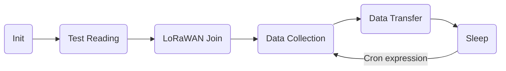

# Modbus (ASCII / RTU) over LoRaWAN Bridge
Version v0.3.0


{: style="width:30%;border:1px black solid;"}

## Target Measurement / Purpose
The Lobaro Modbus LoRaWAN Bridge is a low power device that can be used to read values
out of a variety of other devices via Modbus (ASCII/RTU) over a RS-485 interface
and forward them over LoRaWAN, so that they can be accessed from an attached system.
Typical applications include reading out electric and water meters or retrieving
data from environmental sensors like temperature and humidity.

{: style="width:50%; vertical-align: top;"}

The Modbus Bridge supports reading of all four object types that can be provided by 
Modbus slave devices: Coil, Discrete Input, Input Register, and Holding Register. 
Multiple different slave devices on the Bus can be accessed individually by a single 
Bridge device. Reading intervals and register definitions can be configured very 
flexibly to suit individual requirements.

**PDF Download**

* [Data Sheet with dimensions](files/Modbus-LoRaWAN-Specs.pdf)

## Work Cycle

The Modbus LoRaWAN Bridge has a simple work cycle. It spends most of the time in a deep sleep 
state, to conserve energy. For every reading it wakes up for a few seconds, requests values 
from the connected slave devices, uploads the data via LoRaWAN, and then goes to sleep again.
The following flowchart illustrates the work cycle:



Init
:   When the device starts (because it has just been connected to a power source, or after 
    a reboot) it begins in the *Init* state. A quick self-check is executed; if that succeeds, 
    the green on-board LED blinks once, slowly. After that the configuration is evaluated and 
    checked for invalid values. If any problems are detected during *Init*, the device's LED 
    will light up for three times, and the device will then reboot. If everything is okay, the 
    device will continue with the *Test Reading*.
Test Reading
:   

## Configuration
The configuration is done using [Lobaro Maintenance Tool](/tools/lobaro-tool/) and the Lobaro USB PC adapter.

### LoRaWAN
The connection to the LoRaWAN network is defined by multiple configuration parameters.
This need to be set according to your LoRaWAN network and the way your device is 
supposed to be attached to it, or the device will not be able to send any data.

There are two different methods to attach a device to a LoRaWAN network: 
Over-the-air-activation (OTAA) and Activation-by-personalisation (ABP). 
Depending on which method you are using you will have to set different values.

Several values are a number of bytes, that need to be entered as hexstrings (without 
`0x`-prefix). So e.g. the DevEUI is a value of 8 bytes encoded in hex will be 
16 hexdigits long. A sample value would be `0123456789abcdef`.

| name | used | type | description |
|------|------|------|-------------|
| `OTAA` | both | bool | `true` &equiv; use OTAA, `false` &equiv; use ABP |
| `DevEUI` | OTAA | hexbyte[8] | the 8 byte DevEUI identifies the hardware on the join operation. The default value is a world wide unique value predefined in the hardware. Should not be changed unless required by the network provider.
| `AppEUI` | OTAA | hexbyte[8] | ID defining the application used in the LoRaWAN network. |
| `AppKey` | OTAA | hexbyte[16] | Key used to encrypt communication with the LoRaWAN network. |
| `AppSKey` | ABP | hexbyte[16] | Application Session Key to be synced with the LoRaWAN network. |  
| `NetSKey` | ABP | hexbyte[16] | Network Session Key to be synced with the LoRaWAN network. |  
| `DevAdr` | ABP | hexbyte[4] | Device Address used to identify device in the LoRaWAN network. |  
| `SF` | both | int | Initial LoRa spreading factor used for transmissions. Valid range is 7-12. The actual spreading factor used by change during operation if ADR is used. |
| `ADR` | both | bool | Should adaptive data rate be used? `true` &equiv; use ADR, `false` &equiv; don't | 

### Modbus/UART
There are several values that define the configuration via Modbus. These 
values depend on the Slave devices that you want to read out. Please refer to your 
Modbus Devices's manual to find out the correct configuration.

| name | description | values |
|------|-------------|--------|
| `ModbusProtocol`   | Which Modbus-Protocol to use | `RTU`. `ASCII` |
| `ModbusBaud`       | UART Baud rate | `9600`, `19200`, `38400`, ... |
| `ModbusDataLendth` | UART data length | `7`, `8`, `9` |
| `ModbusStopBits`   | UART stop bits | `0.5`, `1`, `1.5`, `2` (written exactly like this) |
| `ModbusParity`     | UART parity | `NONE`, `EVEN`, `ODD` |

### Operation
Configuration values defining the behaviour of the device. 

| name | description | example value |
|------|-------------|----------------|
| `ModbusCron` | Cron expression defining when to read | `0 0/15 * * * *` for every 15 minutes |

See also our [Introduction to Cron expressions](/background/cron-expressions).

### Register/Coil definition
Modbus defines four different object types form which values can be read:
Coils, Discrete Inputs, Input Registers, and Holding Registers.
For an introduction please refer to 
[https://en.wikipedia.org/wiki/Modbus](https://en.wikipedia.org/wiki/Modbus).
There are four configuration values to define which values should be read by 
the Modbus Bridge, one for each of the types. 

| name | description | Modbus Function |
|------|-------------|----------------------| 
| `Coils` | Coils to read (single bit read-only values) | `0x01` |
| `DiscreteInputs` | Discrete Inputs to read (single bit read/write values) | `0x02` |
| `HoldingRegisters` | Holding Registers to read (2 byte read-only values) | `0x03` |
| `InputRegisters` | Input Register to read (2 byte read/write values) | `0x04` |

Each value can define multiple different registers/coils to be read on one or multiple 
devices connected via Modbus. The format is identical for all four types.

Each single definition consists of three values separated by colons (`:`). 

1. The address of the Modbus device that should be read from. Valid device addresses 
range from  1 to 247; with a single slave device on your bus this is often 1.
2. The address of the first register/coil to be read on the device. Register addresses 
are uint16 values and range from 0 to 65535.
3. The number of consecutive registers/coils to be read. This value is limited to 127, 
because longer answers cannot be encoded. Be aware that for registers a value higher 
than 22 leads to problems on high spreading factors so that the data will not 
be transferred completely via LoRaWAN.

Multiple of these register definitions can be used if they are separated by 
commas (`,` no spaces after the comma).

You can use one or multiple of the register/coil types. If you do not want to use 
a type e.g. `Coils`, set that definition to an empty string. The device will parse 
the four register strings on startup and reports invalid definitions. The device 
will not work while there are invalid definitions but will reboot repeatedly until 
you fix the configuration.

#### Example register definition strings
| definition | explanation |
|------|------|
| `1:0:3` | Read first three registers of device with address 1. |
| `2:40001:1,2:2000:10` | Read registers 40001 and 2000 to 2009 of device 2. |
| `4:0:2,5:0:2,5:20:1` | Read registers 0 and 1 of device 4 as well as registers 0, 1, and register 20 of device 5. |

## Payload formats
The Modbus Bridge sends different kinds of messages over different LoRaWAN ports:

| Port | Message |
| ---: | :-------|
|    1 | Status messages. |
|   11 | Data from reading Coils (function `0x01`). |
|   12 | Data from reading Discrete Inputs (function `0x02`). |
|   13 | Data from reading Holding Registers (function `0x03`). |
|   14 | Data from reading Input Registers (function `0x04`). |

#### Status messages

The Modbus Bridge sends a status messages report on the health of the device itself.
This messages are sent along when the device is sending data packages with a 
maximum of one status message per day. 

Status messages are transmitted on port 1 and have a fixed length of 14 bytes.

| name | pos | len | type | description | example |
|------|--:|--:|------|-------------|---------|
|version| 0 | 3 | `uint8[3]`| Version of firmware running on the device |`[1, 0, 4]` &equiv; `v1.0.4` |
|flag| 3 | 1 | `uint8` | Status flag, for internal use | `0` |  
|temperature| 4 | 2 | `int16` | Device's internal temperature in tenth °C | `246` &equiv; `24.6°C` |  
|voltage| 6 | 2 | `int16` | Voltage supplied by power source in mV | `3547` &equiv; `3.547V` |
|timestamp| 8 | 5 | `int40` | Internal date/time at creation of the status packet as UNIX timestamp | `1533055905` |
|mode | 13 | 1 | `uint8` | Operation mode the device runs | `1` |

#### Data messages
The principle message format is equal for all four types of registers/coils. 
The port used defines what kind of register/coil was read 
(see table "Payload formats" above). The format slightly differs for coils versus 
registers, since the amount of data per coil (1 bit) is different than the amount 
per register (16 bits).

Each data message is starts with a 40 bit timestamp followed by one or more data packs.
Each pack represents a single read operation caused by a single register definition 
in your configuration. The pack starts with 4 bytes repeating the information of the 
register definition extended by a single bit reporting errors on reading
letting you know what data you are presented with and if it was read successfully). 
That information is followed by the raw data bytes as they where given by the 
slave device (as the Bridge cannot know how the data is presented in those bytes). 
The length of the data is dependent on the register definition and on the type 
(registers versus coils). The length is not explicitly stated, as it can be 
determined from the definition. The data bytes are also included when an error 
has occurred, however in this case the content of those bytes is undefined.

###### Structure of a data pack

| name    | pos | len | type       | description |
| ------- | --: | --: | ---------- | ----------- |
| addr    |   0 |   1 | `uint8`    | Modbus address of slave device. |
| start   |   1 |   2 | `uint16`   | Address of first coil/register read. |
| cnt+err |   3 |   1 | `uint8`    | Highest bit: error indicator, 7 lower bits: number of consecutive coils/registers read. |
| data    |   4 |   n | `uint8[n]` | Raw data bytes as sent by the slave device. |

To get `cnt`, the number of coils/registers read, you need to only read the lower 7 
bits of the fourth byte (e.g. by using something like `data[3] & 0x7f`). The highest 
bit is `0` on successful reads and `1` if an error occurred. See our reference 
decoder if you have trouble reading the format.

The length of the data `n` for Coils and Discrete Inputs (Ports 11 and 12) the value 
of `cnt` divided by 8 rounded up (that is the minimal number of bytes needed to 
store `cnt` bits). For Registers (Ports 13 and 14) the data length is `cnt * 2`, since 
registers contain two bytes of data.

Please refer to the *reference decoder* usable in TTN at the end of this document.


## Complex setups
The Modbus Bridge as described in this manual can be individually configured to read out any
registers and coils. For some setups, this is not enough. There can be situations in which you want
to read registers at different intervals, e.g. you might need some values with hourly updates
and others only every other day. For measuring values with high variance it can be necessary
to take multiple reads over a period of time and create an average value. Maybe you need
to read a status register first and depending on its value you want to decide which registers
to read and transmit the values of. You could also want to write values into registers with
the Bridge.
All this scenarios are possible to solve using the Modbus Bridge, but their complexity leave the
scope of our standard firmware. If you need any special processing for your Modbus setup,
please contact us with your requirements, and we will make you an offer for an individual
firmware that processes data the way you need.
If you find that the data rate LoRaWAN offers is a limitation for your setup, we could also
provide you with a Modbus solution that uses alternate data transmission technologies, for
example NarrowBand-IoT.

## Appendices

### Technical characteristics

|                          |                                                                         |
|--------------------------|-------------------------------------------------------------------------|
| **Product**              |                                                                         |
| Type name                | Modbus485-LoRaWAN                                                       |
| Description              | Modbus over LoRaWAN Bridge                                              |
| **RF tranceiver**        |                                                                         |
| Type                     | Semtech SX1272                                                          |
| Frequency                | 863 MHz to 870 MHz                                                      |
| Max. TX Power            | max. +14 dBm                                                            |
| Typical RF Range         | &le;2km                                                                 |
| Ideal RF Range           | &le;10km (free line of sight)                                           |
| **LoRa communication**   |                                                                         |
| Protocol                 | Class A LoRaWAN 1.0.1 EU868                                             |
| Activation method        | Over-the-air-activation (OTAA) <br> Activation by personalization (ABP) |
| Encryption               | AES128                                                                  |
| **Modbus communication** |                                                                         |
| Bus                      | RS-485 twisted pair wires (with optional GND)                           |
| Protocol                 | RTU/ASCII                                                               |
| **Environmental Requirements** |                                                                   |
| Operating temperature    | -20°C &ndash; 55°C                                                      |
| Max installation height  | 2m                                                                      |
| **Standards** <br>   |
|                          |                                                                         |

### CE Declaration of Conformity

[CE Declaration of Conformity](files/modbus-lorawan-ce-conformity.pdf) (pdf).

### Disposal / WEEE / Entsorgung

[Information about the disposal of the Device](/background/weee-disposal).

### Reference decoder

This is a decoder written in JavaScript that can be used to parse the device's 
LoRaWAN messages. It can be used as is in 
[The Things Network](https://thethingsnetwork.org).

```javascript
function readVersion(bytes) {
    if (bytes.length<3) {
        return null;
    }
    return "v" + bytes[0] + "." + bytes[1] + "." + bytes[2];
}

function int40_BE(bytes, idx) {
    bytes = bytes.slice(idx || 0);
    return bytes[0] << 32 |
        bytes[1] << 24 | bytes[2] << 16 | bytes[3] << 8 | bytes[4] << 0;
}

function int16_BE(bytes, idx) {
    bytes = bytes.slice(idx || 0);
    return bytes[0] << 8 | bytes[1] << 0;
}

function decode_status(bytes) {
    return {
        "port":1,
        "version":readVersion(bytes),
        "flags":bytes[3],
        "temp": int16_BE(bytes, 4) / 10,
        "vBat": int16_BE(bytes, 6) / 1000,
        "timestamp": int40_BE(bytes, 8),
        "operationMode": bytes[13]
    };
}

function decode_data(bytes, port) {
    var fun = port - 10;
    var regs = [];
    if (bytes.length > 5) {
        var b = bytes.slice(5);
        while (b.length>=4) {
            var r = {
                "device":b[0],
                "start":int16_BE(b, 1),
                "count":b[3] & 0x7f,
                "error":!!(b[3]>>7),
                "data":null
            };
            var dataLen = 0;
            if (fun<=2) {
                // coils, one bit per address
                dataLen = Math.ceil(r.count/8.0);
            } else {
                // registers, 16 bits per address
                dataLen = r.count*2;
            }
            if (b.length >= dataLen+4) {
                r.data = b.slice(4, 4 + dataLen);
            }
            regs.push(r);
            b = b.slice(4+dataLen);
        }
    }
    return decoded = {
        "port": port,
        "function": fun,
        "timestamp": int40_BE(bytes, 0),
        "values": regs
    };
}

function Decoder(bytes, port) {
    switch (port) {
        case 1:
            return decode_status(bytes);
        case 11:
        case 12:
        case 13:
        case 14:
            return decode_data(bytes, port);
    }
    return {"error":"invalid port", "port":port};
}
```
[Copyright Modbus Logo]( http://www.modbus.org){: target="_blank"}
