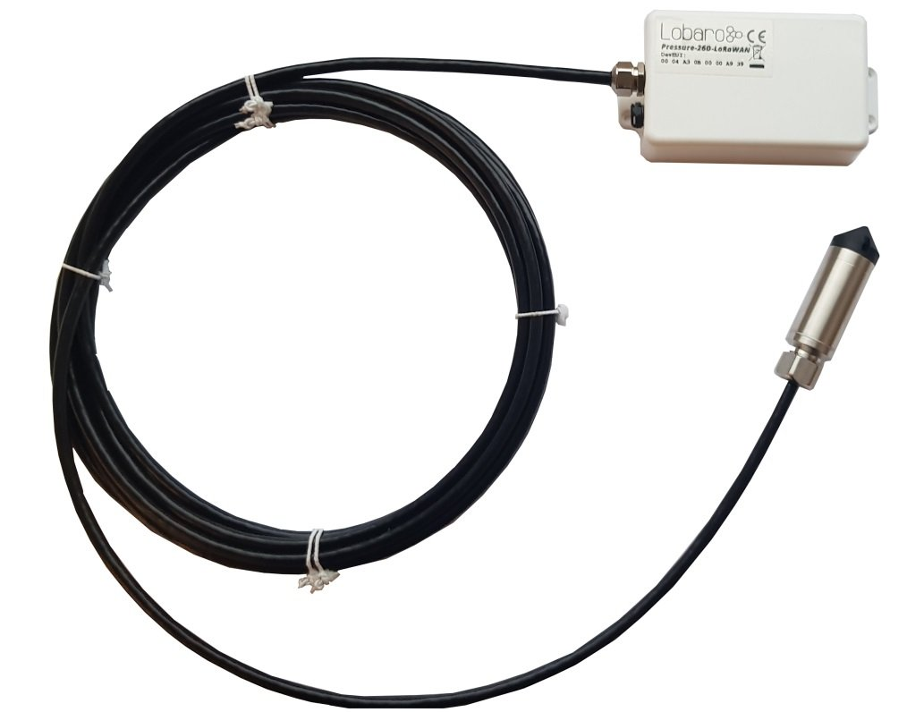
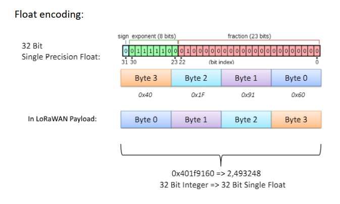

# Pressure Sensor LoRaWAN

{: style="height:350px;border:1px black solid;"}

## Target Measurement / Purpose
Precise liquid level measurement, e.g. for tanks, via LoRaWAN.

** Features **

* Cable length 1-15m
* 0..1 Bar (10m water level)
* Waterproof IP67 Housing
* Multi-year Battery life, ultra low power (< 10µA)

## Payload Format



### Parser: The Things Network

```javascript
function decodeFloat32(bytes) {
    var sign = (bytes & 0x80000000) ? -1 : 1;
    var exponent = ((bytes >> 23) & 0xFF) - 127;
    var significand = (bytes & ~(-1 << 23));

    if (exponent == 128)
        return sign * ((significand) ? Number.NaN : Number.POSITIVE_INFINITY);

    if (exponent == -127) {
        if (significand == 0) return sign * 0.0;
        exponent = -126;
        significand /= (1 << 22);
    } else significand = (significand | (1 << 23)) / (1 << 23);

    return sign * significand * Math.pow(2, exponent);
}

function decodeInt16(bytes) {
    if ((bytes & 1 << 15) > 0) { // value is negative (16bit 2's complement)
        bytes = ((~bytes) & 0xffff) + 1; // invert 16bits & add 1 => now positive value
        bytes = bytes * -1;
    }
    return bytes;
}

function int16_LE(bytes, idx) {
    bytes = bytes.slice(idx || 0);
    return bytes[0] << 0 | bytes[1] << 8;
}

function int32_LE(bytes, idx) {
    bytes = bytes.slice(idx || 0);
    return bytes[0] << 0 | bytes[1] << 8 | bytes[2] << 16 | bytes[3] << 24;
}

function Decoder(bytes, port) {
    // Decode an uplink message from a buffer
    // (array) of bytes to an object of fields.
    var decoded = {
        pressure: decodeFloat32(int32_LE(bytes, 0)),
        temp: decodeInt16(int16_LE(bytes,4)) / 100,
    };

    // if (port === 1) decoded.led = bytes[0];

    return decoded;
}
```
