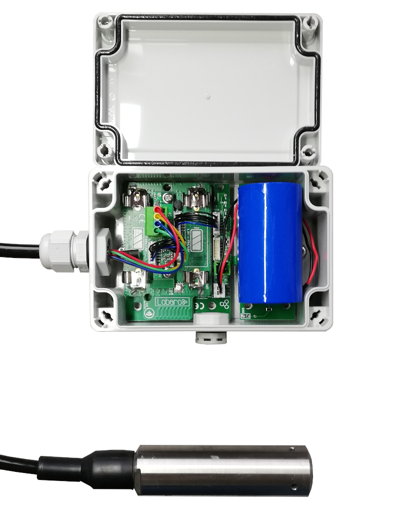

# Pressure Sensor LoRaWAN
`Order number: 8000089` <br>
{: style="height:500px;display: block; margin: 0 auto;"}

!!! info "Consider using the latest firmware on your hardware"
    * [**See available firmware downloads**](firmware.md){: target="_blank"}

## Target Measurement / Purpose
Precise liquid level measurement, e.g. for tanks, via LoRaWAN.

**Features**

* Cable length 1-15m
* 0..1,5 Bar (15m water level)
* Waterproof IP66 Housing
* Multi-year Battery life, ultra low power (~ 20µA)

## Configuration
The (initial) configuration is normally done using our free [Lobaro Maintenance Tool](/tools/lobaro-tool.html) 
and the [USB PC configuation adapter](/tools/usb-config-adapter.html).

Beside this the configuration can also be changed or read remotely in the field 
using LoRaWAN **downlink messages**, see [Downlinks](#downlink) description.

### LoRaWAN
The connection to the LoRaWAN network is defined by multiple configuration parameters.
This need to be set according to your LoRaWAN network and the way your device is 
supposed to be attached to it, or the device will not be able to send any data.

For a detailed introduction into how this values need to be configured, please 
refer to the chapter [LoRaWAN configuration](/background/lorawan.html#lorawan-configuration) 
in our LoRaWAN background article.

| Name       | Description | Type | Values |
|------------|-------------|------|-------|
|`OTAA`      |Activation: OTAA or ABP              |`bool`    | `true`= use OTAA, `false`= use ABP |
|`DevEUI`    |DevEUI used to identify the Device   |`byte[8]` | e.g. `0123456789abcdef` | 
|`JoinEUI`   |Used for OTAA (called AppEUI in v1.0)|`byte[8]` | e.g. `0123456789abcdef` | 
|`AppKey`    |Key used for OTAA (v1.0 and v1.1)    |`byte[16]`| |
|`NwkKey`    |Key used for OTAA (v1.1 only)        |`byte[16]`| |
|`SF`        |Initial / maximum Spreading Factor   |`int`     | `7` - `12` |
|`ADR`       |Use Adaptive Data Rate               |`bool`    | `true`= use ADR, `false`= don't |
|`OpMode`    |Operation Mode                       |`string`  | `A`= Class A, `C`= Class C |
|`TimeSync`  |Days after which to sync time        |`int`     | days, `0`=don't sync time | 
|`RndDelay`  |Random delay before sending          |`int`     | max seconds |
|`RemoteConf`|Support Remote Configuration         |`bool`    | `true`=allow, `false`=deactivate |
|`LostReboot`|Days without downlink before reboot  |`int`     | days, `0`=don't reboot |

### Operation
Configuration values defining the behaviour of the device. 
The Min and Max values will be preconfigured when receiving the device. In case of using "Restore Default" they will be reset to standard values and have
to be set again using the values printed on the sensor or given separately.

| name | description | example value |
|------|-------------|----------------|
| `sendCron` | Cron expression defining when to read and send| `0 0/15 * * * *` for every 15 minutes |
| `rangeMin` | min range in mh2o | in most cases 0 |
| `rangeMax` | max range in mh2o | in most cases 15 |
| `outputMin` | min digital output value of the sensor | in most cases 819 |
| `outputMax` | max digital output value of the sensor | in most cases 11664 |

See also our [Introduction to Cron expressions](/background/cron-expressions).

## Payload Format

Port: 1
Payload: 8 Bytes

Temperature is transmitted in 1/100&deg;C, battery voltage in Millivolt and pressure in Bar.

| PRESSURE | PRESSURE | PRESSURE | PRESSURE | TEMP | TEMP | V_BATT | V_BATT |
|------|------|------|------|-----|------|------|------|
|flaot32|float32|float32|float32|int16|int16|int16|int16|
|Byte 0|Byte 1|Byte 2|Byte 3|LSB|MSB|LSB|MSB|    


### Parser: The Things Network

```javascript
function decodeFloat32(bytes) {
    var sign = (bytes & 0x80000000) ? -1 : 1;
    var exponent = ((bytes >> 23) & 0xFF) - 127;
    var significand = (bytes & ~(-1 << 23));

    if (exponent == 128)
        return sign * ((significand) ? Number.NaN : Number.POSITIVE_INFINITY);

    if (exponent == -127) {
        if (significand == 0) return sign * 0.0;
        exponent = -126;
        significand /= (1 << 22);
    } else significand = (significand | (1 << 23)) / (1 << 23);

    return sign * significand * Math.pow(2, exponent);
}

function decodeInt16(bytes) {
    if ((bytes & 1 << 15) > 0) { // value is negative (16bit 2's complement)
        bytes = ((~bytes) & 0xffff) + 1; // invert 16bits & add 1 => now positive value
        bytes = bytes * -1;
    }
    return bytes;
}

function int16_LE(bytes, idx) {
    bytes = bytes.slice(idx || 0);
    return bytes[0] << 0 | bytes[1] << 8;
}

function int32_LE(bytes, idx) {
    bytes = bytes.slice(idx || 0);
    return bytes[0] << 0 | bytes[1] << 8 | bytes[2] << 16 | bytes[3] << 24;
}

function Decoder(bytes, port) {
    // Decode an uplink message from a buffer
    // (array) of bytes to an object of fields.
    var decoded = {
        pressure: decodeFloat32(int32_LE(bytes, 0)),
        temp: decodeInt16(int16_LE(bytes,4)) / 100,
        v_batt: decodeInt16(int16_LE(bytes,6)) / 1000,
    };

    // if (port === 1) decoded.led = bytes[0];

    return decoded;
}
```

## CE Declaration of Conformity

[CE Declaration of Conformity](files/ce-Pressure-lorawan.pdf) (pdf).
