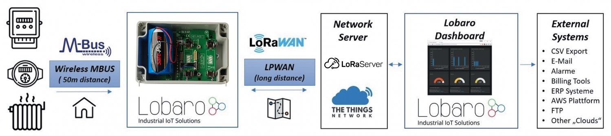
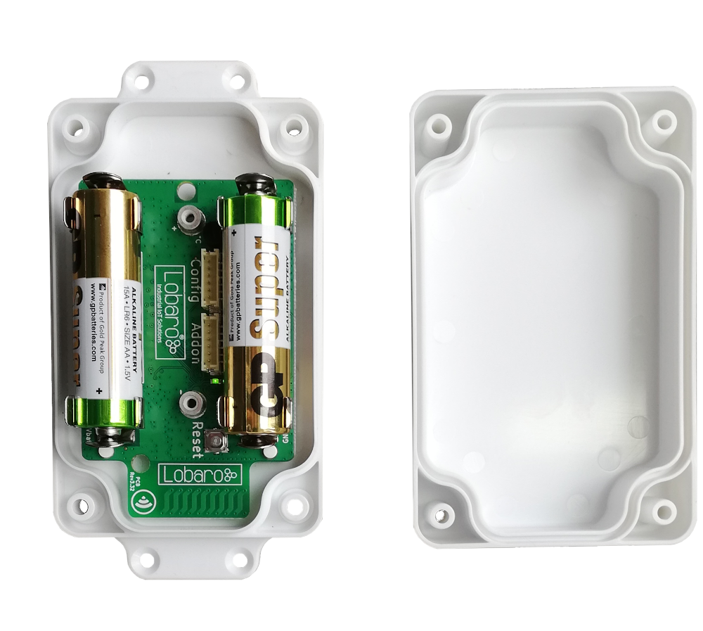
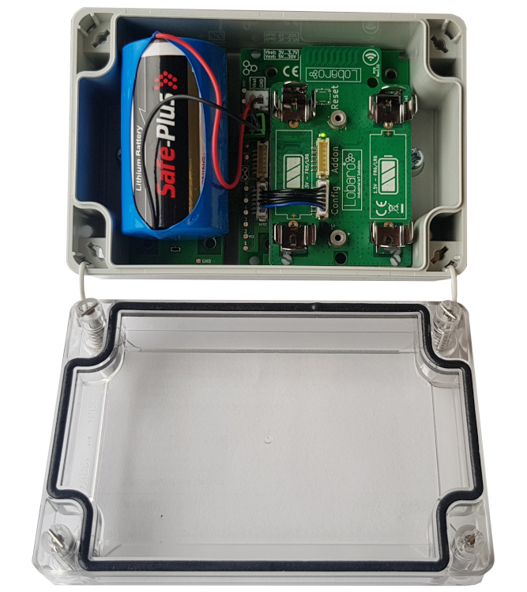
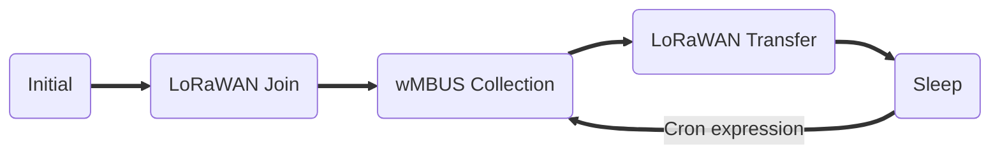
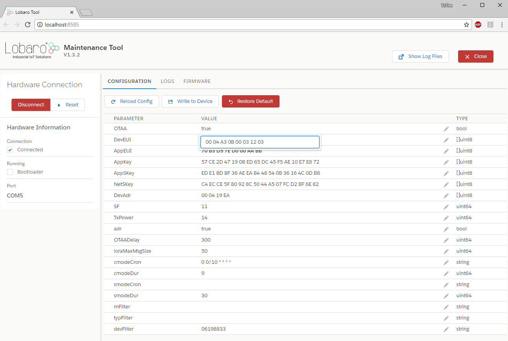
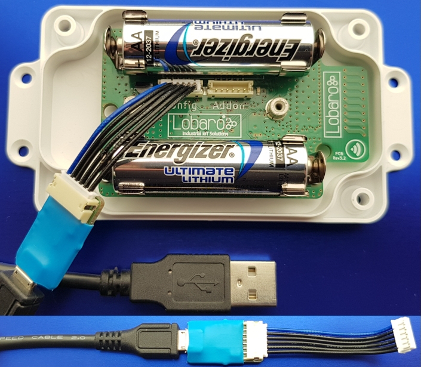
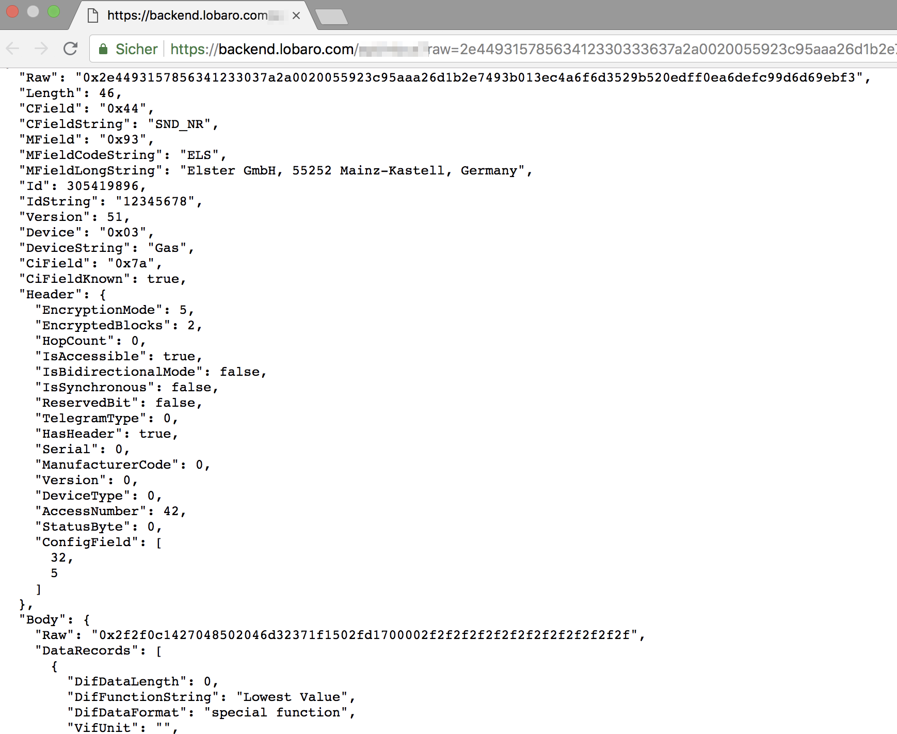
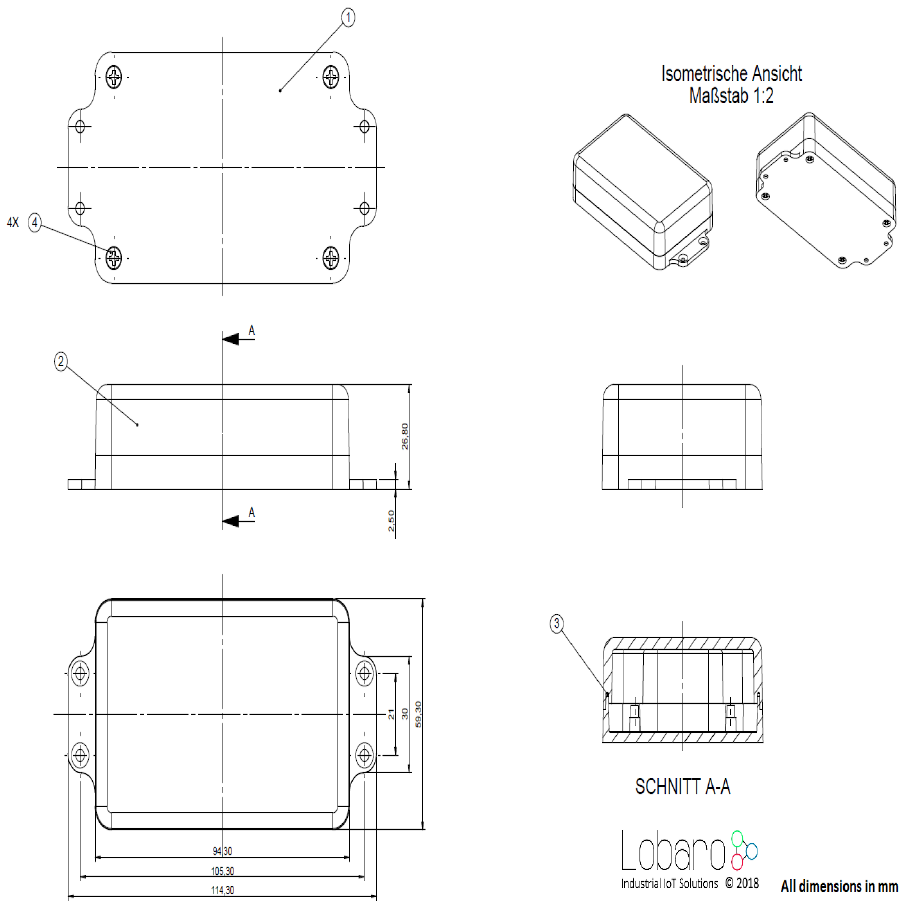

# Wireless mBUS over LoRaWAN Bridge
Outdated Version **v1.x** <br>
 
!!! error "Outdated document version"
    This manual is only valid for firmwares version up to **V1.6.0** and hardware revisions **V1.x**!
    Firmware V1.6.0 is deprecated since 02/2020. 
    For revision v2.x please refer to the [current documentation v2.x](..//index.md).
    
##Overview

The Lobaro wireless M-Bus (wMBUS) to LoRaWAN Bridge is a cost-effective & energy
efficient device that receives, caches and transparently forwards wireless M-Bus metering
data from up to 500 consumption meters via any LoRaWAN network onto the Internet.  
Many gas, water, electricity and heat meters can be read wirelessly today using the common
short range Wireless M-Bus standard. Because such wMBUS enabled meters use the classical
energy saving FSK radio modulation, the wireless range is often limited to less than 50m
and therefore requires the use of additional longer-range radio technologies to forward the
metering data onto the Internet. The advanced LoRa radio modulation used inside the Lobaro
wMBUS to LoRaWAN Bridge is such a key technology.

{: style="width:100%"}

LoRaWAN based LPWANs (Low Power wide area networks) allow connections to the Internet
from small battery powered devices with wireless ranges of up to 5 kilometers between
the transmitter and receiving gateway antenna - without the usual cellular network costs in
classical M2M or smart metering solutions. Also - unlike with cellular networks - it's possible
to setup own gateways if needed. This often results in much lower operational costs with the
Lobaro wMBUS bridge compared to conventional remote meter reading via LTE networks.
The metering data will not be decrypted by the LoRaWAN Bridge, instead an unchanged
1:1 forwarding takes place via one or more LoRaWAN packets (depending on the wMBUS
telegram byte size). Thus the end-to-end encryption of sensitive wireless MBUS consumption
data is preserved.
Initial configuration, firmware updates & status readouts are done user-friendly via USB on the
PC with the Lobaro Tool (Windows, Linux, Mac). An additional possibility of configuration in the field "over the air" by means of LoRaWAN downlinks will soon also be available via
firmware update.

**Please read the manual carefully before operating the device. A safe operation of the
device is only possible if you follow the guides provided in this manual. Using the device
differently than intended by Lobaro may cause damage to people, the environment, or
the device.**

!!! info "Consider using the latest firmware on your hardware"
    * [**See available firmware downloads**](../firmware.md){: target="_blank"}

## The Device 

!!! error "Variants no longer available"
    These device variants are no longer available. Please see current documentation for available options.
    
    Please refer to the [current documentation v2.x](..//index.md).

### Variant with compact housing (2xAA batteries)
`wMBUS LoRaWAN Bridge (AA-cells, compact IP65 housing), Order number: -` <br>
{: style="width:60%; display: block; margin: 0 auto;"}

### Variant with D-cell battery
`wMBUS LoRaWAN Bridge (XH battery-connector, IP67 housing), Order number: -` <br>
{: style="width:50%; display: block; margin: 0 auto;"}

---

###Device installation
The device must be fixed on a flat surface using the lateral mounting holes of the case, see
chapter "Housing Dimensions" for a detailed description of all housing dimensions. Alternatively we offer as
accessory a mounting clip for a standard 35mm DIN rail. The device can then easily snapped
on a such rails. It can therefore be added to a variety of racks alongside other devices.

!!! warning "Under any circumstances the device must not be mounted higher than 2 meters above ground to avoid any risks in case of falling down!"

For optimal RF performance (e.g. LoRa range) any metal obstacles near the internal antenna
should be avoided. In this case 'near' is defined as keep-out distance of about 3-5 centimeters
around the antenna. The internal helix antenna can be identified by the winding pcb traces
near the white printed encircled 'connectivity' symbol. In any case a device mounting directly
on top of a metal surface is not advisable since it will degrade the possible RF range. Stone
walls, wood or plastic standoffs are perfectly ok.
In case of challenging installation locations (e.g. in basements) or unavoidable long distances
to the next LoRaWAN gateway, Lobaro offers on request custom product variant equipped
with a 'SMA' connector to support a external antenna connection.

###Power Supply
The wMBUS over LoRaWAN Bridge default power supply consists of two series connected
off-the-shelf 1.5V 'AA' sized batteries. Be sure to get the polarity right, see the '+'-Symbol on
the board. In general only AA cells of the types Alkali-Manganese (1.5V, LR6) and Lithium-
Iron-Sulphide (1.5V, FR6) are allowed to be inserted in the device. Lobaro recommends the
use of FR6 batteries like the Energizer Ultimate Lithium over LR6 types because of the higher
capacity and better discharge properties.

!!! warning "Other Batteries or accumulators with a nominal voltage of more than 1.5V must not inserted into the device under any circumstances. In particular, lithium based cells with a nominal voltage of 3.6V or 3.7V must not be used on the AA battery slots!"

On request we can supply custom product variants with special housings powered by even
bigger batteries. For example a 3.6V C sized mono cell typically has a capacity of 9Ah with
leads to a 3x increased battery life compared to the standard AA-cells. With D sized cells of
typically 19Ah capacity this value can be doubled once again (6x). Also available on request
are options with permanent external power supply (230V, 9-24V, 5V USB).

###Battery life time
The battery life time of the wireless M-Bus to LoRaWAN Bridge can not be specifed trustworthy
without knowledge of the detailed installation scenario. At least estimations for the
following custom project based parameters have to be known:

+ Meter count per single wMBUS bridge, e.g. 10 different meters.

+ Needed LoRaWAN transmission interval, e.g. daily uploads.

+ Average wireless M-Bus telegram size in bytes, e.g. 35 byte.

+ Wireless M-Bus telegram transmission interval of the meter, e.g. every 10 seconds.

+ Typically used LoRa Spreading Factor / LoRa link quality, e.g. SF10.

Depending on these parameters battery life times from a few months to over 15 years can
be achieved. You may send us your use-case details as described above to info@lobaro.com
and we will return to you a custom battery lifetime calculation, a recommendation for the
best power supply scheme and the needed minimal battery capacity.

#### Example calculation
In this battery lifetime calculation scenario the target meters send a 35 byte long ('L-Field')
wireless M-Bus telegram constantly every 10 seconds. This behavior is for example very
similar to a 'Hydrus' ultrasonic water meter of [**Diehl Metering**](https://www.diehl.com/metering/){: target="_blank"}. The Diehl meter itself has a
specified battery life time of 12 years.
Because of the mentioned 10 second send interval it is sufficient to configure the bridge for
a wireless M-Bus listen period of 20 seconds by setting the bridge configuration parameter
cmodeDurSec to a value of 20 (refer to section "wMBUS bridge parameters"). This will ensure that all meters of
interest sent their consumption telegrams at least onces during the configured listen period
of the bridge.
For a worst-case battery-lifetime calculation the weakest possible LoRaWAN connectivity has
been selected. That means to reach a LoRaWAN Gateway the Lobaro hardware has to send
out its Uplink data very slowly (&ge; 2 seconds) and redundant by using a LoRa spreading factor
of 12. Beside this the actual usable battery capacity has been set to 80% of the nominal
value. The resulting worst-case minimal battery-life times are presented below.

**Battery life for daily LoRaWAN uploads with SF12**

|Collected meters|Battery Life (years) AA cell (3Ah)|Battery Life (years) Baby cell(9Ah)|
|-|-|-|
|1|10.7|32.0|
|5|7.0|21.1|
|10|4.9|14.8|
|20|3.1|9.3|
|40|1.8|5.3|
|80|1.0|2.9|

Estimations for the opposite situation with a excellent LoRa link quality and thus the possible
usage of SF7 are presented below.
In real world installations the possible spreading factor may be optimized anytime by setting
up additional LoRaWAN Gateways near the meters of interest.

**Battery life for daily LoRaWAN uploads with SF7**

|Collected meters|Battery Life (years) AA cell (3Ah)|Battery Life (years) Baby cell(9Ah)|
|-|-|-|
|1|12.1|36.4|
|5|11.8|35.4|
|10|11.4|34.4|
|20|10.6|31.9|
|40|9.4|28.3|
|80|7.7|23.0|


#### Usage scenario recommendations
As a simple rule of thumb using the Lobaro wireless M-Bus over LoRaWAN bridge is a good
fit in applications that require daily (or less often) consumption values of 1 to 40 installed
wireless M-Bus meters. For installations with a higher meter count simply more Lobaro
bridges may be used.
Another key factor for high battery lifetime is to select or configure your wireless M-Bus
meters in a way that they send short telegrams very frequently, proven good values are
periods smaller than 30 seconds and telegram sizes smaller 50 bytes. This helps to minimize
the needed wMBus listening time period and avoids the need for multiple LoRaWAN packets
per single telegram (data splitting). Beside this the bridge is naturally most economical when multiple meters per single bridge
can be collected and forwarded via LoRWAN. Although for some applications a 1:1 setup,
e.g. one bridge per meter, may deliver enough benefits to justify the invest.
For hourly or even more frequent meter data uploads, as requested by some of our customers,
LoRaWAN isn't the perfect match from a technology point of view. The same holds
for scenarios where hundreds of meters are expected to be transfered by a single bridge,
e.g. in 'sub-metering' applications with tons of installed heat cost allocators. For such more
demanding cases Lobaro can offer better solutions using higher bandwidth transmission techniques
like NB-IoT (Narrowband IoT) or classical 4G/LTE. Contact us if you need such a alternative solution
by sending your request to info@lobaro.com - either English or German is fine.

##Work Cycle


The Bridge has a simple work cycle that consists of five phases.

###Initial Phase
This is the phase that is executed after the device is started of restarted. The Bridge performs
a quick self test which you can easily spot by the green internal LED flashing. After that,
the configuration is evaluated. If successful, the LoRaWAN Join phase is executed next.

###LoRaWAN Join Phase
If the Bridge is configured to use over the air activation (OTAA), the OTAA join is performed
at this point. The device will repeatedly try to join its LoRaWAN network until the process
is successful. It then enters the Data Collection Phase.
If the Bridge is configured to use ABP instead of OTAA, this phase is left immediately and
the Data Collection Phase is entered according to the cron configuration.

###Data Collection Phase
During the wMBUS collection phase the device receives any wireless M-Bus data with valid
CRC and stores it for the following LoRaWAN upload phase but only if the received telegram
passes the user defined white list filters. Similar telegrams of one identical meter may be
received multiple times during this phase. In this case the newest telegram with the same
id, type and length will replace the previously received one. Only the latest telegram will be
uploaded via LoRaWAN.
After the configured amount of time for collecting data the LoRaWAN data transfer phase
is entered.

###Data Transfer Phase
During the Data Transfer Phase the Bridge uploads all previously stored wMBUS data using
LoRaWAN. Depending on original wMBUS telegram byte sitze this can require multiple LoRaWAN
messages to be sent. Since LoRa requires any device to respect a strict duty cycle,
it is possible, that the Bridge will need to wait before sending its messages. If this happens,
the device will enter a power saving modus while waiting for the next message. It is possible
that transferring all data will take several minutes.
In addition to the wireless M-Bus data, the Bridge sends a status packet once a day during
this phase. The status packet will always be transmitted prior to any data packets.
For a detailed description of the data sent refer to chapter "Data Packet".

###Sleep Phase
After transferring all data packets the Bridge enters the Sleep Phase. During this it is completely
inactive to avoid wasting power. It remains sleeping until one of the cron expressions
given in the configuration triggers. When that happens, it enters the Data Collection Phase
again.

##Configuration

###The Lobaro Maintenance Tool

{: style="width:60%; display: block; margin: 0 auto;"}

The initial device configuration can be done very comfortably from your PC via the serial
configuration interface. Beside the needed Lobaro USB to UART adapter the [**Lobaro Maintenance Tool**](../../../tools/lobaro-tool.md){: target="_blank"} needs to be installed. This tool is freely available for various operating systems
including Windows, Linux, Mac and Linux-ARM (e.g. Raspberry-PI) on and works with all
Lobaro sensors.
Technically this software opens a webserver on port 8585 that runs in a background console
window. The actual user interface can be accessed normally using a standard web browser
at address http://localhost:8585 (picture above). Normally your default browser should be
opened with this URL automatically after tool startup . Even remote configuration and logobservation
over the Internet is possible, e.g. having a Raspberry PI via USB connected to
the Lobaro device and accessing the maintenance tool from a remote machines browser over
the Internet.
Additionally to the device setup the tool can also be used for firmware updates ('Firmware
Tab') , watching real-time device diagnostic output ('Logs Tab') and initiating device restarts.

!!! info "Please note that the device is automatically restarted each time the configuration has been changed!"

###Connecting the USB config adapter

For configuration and firmware updates we provide a special serial-USB adapter that can be
connected as shown in the picture below. The corresponding connector on the PCB is marked with
the word 'Config'.
The USB-adapter will add a virtual serial 'COM' Port to your system. Your operating system
needs the [CP210x USB to UART Bridge](https://www.silabs.com/products/development-tools/software/usb-to-uart-bridge-vcp-drivers){: target="_blank"} driver installed. A download link is provided next
to the 'Connect' button when you start the Maintenance Tool.
While the config adapter is connected, the device will be powered from the USB port with
a regulated voltage of 3.3V. It is not necessary - although it would be no problem - having
batteries inserted or a different supply connected while using the config adapter. All
configuration parameters will be kept non-volatile regardless of the power supply.

{: style="width:60%; display: block; margin: 0 auto;"}

###System parameters

After being successfully connected to the hardware using the Lobaro Maintenance Tool you
can press 'Reload Config' in the 'Configuration' tab to read the current configuration from the
device. For every parameter a default value is stored non volatile inside the hardware to which
you can revert using the 'Restore default' button in case anything got miss configured.
All LoRaWAN & other firmware parameters are explained in the following.

#### LoRaWAN network parameters
A large part of the configuration parameters are used to control the device's usage of LoRaWAN.
There are two different ways to use LoRaWAN: over-the-air
activation (OTAA) and activation by personalization (ABP). Some configuration parameters
are only used with one of those methods, others are used for both.

|Name|Type|Used|Description|
|-|-|-|-|
|OTAA|bool|both|true: use over-the-air activation (OTAA) <br> false: use activation by personalization (ABP)|
|DevEUI|bytes[8]|OTAA|the 8 byte long DevEUI is used with OTAA to identify the device on join. The default is predefined in the hardware and guarantees an ID that is unique world wide. Should not be changed unless required by the network provider. Hex format without 0x prefix.|
|AppEUI|bytes[8]|OTAA|ID defining the application used in the LoRaWAN network. Hex format without 0x prefix.|
|AppKey|bytes[16]|OTAA|Application Key as defined by the LoRaWAN network operator. This is used to encrypt communication, so keep it secret. Hex format without 0x prefix.|
|OTAADelay|int|OTAA|Seconds to wait for a new attempt after an unsuccessful OTAA join. The actual waiting time will be randomly increased by up to a third of that amount, in order to avoid devices repeatedly interfering with each other through bad timing. The default value is 300, which means the timeout between attempts is 300-400 seconds.|
|AppSKey|bytes[16]|ABP|App Session Key as defined by the LoRaWAN network operator. Hex format without 0x prefix.|
|NetSKey|bytes[16]|ABP|Network Session Key ad defined by the LoRaWAN network operator. Hex format without 0x prefix.|
|DevAdr|bytes[4]|ABP|Device Address as defined by the LoRaWAN network operator. Hex format without 0x prefix.|
|SF|int|both|Initial LoRa spreading factor used for transmissions. Valid range is 7-12. The actual spreading factor used might change during operation of the device if Adaptive Data Rate (ADR) is used.|
|TxPower|int|both|Initial transmission output power in dBm. The LoRaWAN protocol allows only specific values: 2, 5, 8, 11, 14. The actual power used might change during operation if Adaptive Data Rate (ADR) is used.|
|ADR|bool|both|true: use adaptive data rate (ADR) <br> false: don't use adaptive data rate (ADR)|

#### wMBUS bridge parameters

|Name|Type|Description|
|-|-|-|
|loraMaxMsgSize|int|Received wireless M-Bus telegrams might have a byte size bigger than a single LoRaWAN message can hold. This parameter defines the bytes per LoRaWAN message before a partition over multiple LoRaWAN Uplink msg appears. (Range 10-50 bytes)|
|resetHours|int|Hours after which the firmware will reset and rejoin the network. Can support the change of LoRaWAN network providers with already deployed devices. (0 = never)|
|cmodeCron|string|Cron Expression defining when the device starts wMBUS T1/C1 mode receive phases. Please refer to chapter "Cron expression" for an introduction. (blank = no T1/C1 receive)|
|cmodeDurSec|int|Duration in seconds for each C1/T1-mode wMBUS receive phase, if cmodeCron != blank. Should be chosen in relation the wMBUS sendout interval of the target meter.|
|smodeCron|string|Cron Expression defining when the device starts wMBUS S1 mode receive phases. Please refer to chapter "Cron expression" for an introduction. (blank = no S1 receive)|
|smodeDurSec|int|Duration in seconds for each S1-mode wMBUS receive phase, if smodeCron != blank. Should be chosen in relation the wMBUS sendout interval of the target meter.|
|devFilter|string|wMBUS device id white-list filter using 8 digits with leading zeros list separated by ','. Example '88009035,06198833'. (blank = filter inactive)|
|mFilter|string|wMBUS manufacturer white-list filter separated by ',' . Example: 'DME,QDS' for receiving just telegrams from Diehl Metering GmbH and Qundis GmbH meters. Telegrams with different 3 character wMBUS manufacturer id will not be uploaded via LoRaWAN. (blank = filter inactive)|
|typFilter|string|wMBUS device type white-list filter list separated by ','. Example: '08,07' for Heat-Cost and Water meters. Please refer to appendix B.1 for a list of possible values. (blank = filter inactive)|

#### Cron expressions
Cron expressions are used to define specific points in time and regular repetitions of them.
The schedule for data collecting phases is defined using the [**CRON**](../../../background/cron-expressions.md){: target="_blank"} format which is very
powerful format to define repeatedly occurring events.

!!! info "Standard Lobaro devices typically do not need to know the real time for proper operation. All times are relative to the random time when batteries are inserted."

If needed by the target application Lobaro can deliver on request special hardware support for keeping
data acquisition intervals based on a real time clock which stays in sync with the real time.
Please contact Lobaro directly if you need such a custom product variant.
A cron expression consists of 6 values separated by spaces:

+ Seconds (0-59)

+ Minutes (0-59)

+ Hours (0-23)

+ Days (1-31)

+ Month (1-12)

+ Day of Week (SUN-SAT b= [0,6])

Examples of CRON definitions:

|||
|-|-|
|0 5 * * * *    |     Hourly at minute 5, second 0 (at 00:05:00, 01:05:00, ...) |
|0 1/10 * * * *  |    every 10 minutes from minute 1, second 0 (minutes 1, 11, 21, ...)|
|0 0 6 * * *      |   Daily at 6:00:00 |
|0 0 13 1,15 * *    | 1st and 15th day of every month at 13:00:00 |
|0 0 9 1-5 * *    |   Every month daily from day 1 till 5 at 9:00:00 |

##LoRaWAN Data Upload Formats

After collecting wireless M-Bus telegrams over the air, the Bridge starts uploading data
via LoRaWAN. There exist two data formats that are transmitted over different LoRaWAN
ports.
As LoRaWAN can only transmit very short messages, the message formats contain only data
bytes. The meaning of a byte is determined by its position within a message. The following
describes the package formats used by the wireless M-Bus Bridge.

###Status Packet

Port 1 - In order to provide some information about the health & connectivity state of the
device itself, the device sends a status update at a daily basis. The status packet is sent
on the first upload phase after activation of the device (after reboot) and then repeatedly in
every upload phase that takes place a day or longer after the previous status packet. It has
a fixed length of 7 bytes. The battery voltages and ambient temperature are encodes as 16
bit integer using little endian encoding.

|name|type|bytes|description|example|
|-|-|-|-|-|
|version|uint8[3]|0-2|Version of the firmware running on the device|1, 5, 1 ≡ v1.5.1|
|v_bat|uint16|3-4|Battery voltage in mV|2947 ≡ 2:947V|
|temp|int16|5-6|Temperature measured inside the device in 1/10 °C|246 ≡ 24.6°C|

We provide a JavaScript reference implementation of a decoder for this status packet on
[**GitHub**](https://github.com/lobaro/ttn-data-formats/blob/master/wmbus-bridge/decoder.js){: target="_blank"}, which can be used directly for decoding in [**The Things Network**](https://www.thethingsnetwork.org/){: target="_blank"}.

###Data Packet

After each wMBUS collecting phase, all saved telegrams (up to 500 can be stored) will be
uploaded via LoRaWAN uplink messages as fast as possible. The received wMBUS telegrams
that did pass the configured white list filters will be uploaded without any modification in one
or more LoRaWAN messages.
If a wMBUS telegram is bigger than the bridge configuration parameter loraMaxMsgSize the
transmission will be done using multiple LoRaWAN messages. This parameter is limited to ≤
50 bytes due to LoRaWANs maximum payload size restrictions. In case of telegram splitting
is needed the receiving backend application server as to reassemble the original wMBUS
telegram before decryption & parsing of the meter data. This is done by simply joining the
messages together in the order of receive.
The LoRaWAN port encodes identifies a LoRaWAN fragment of the original wireless M-Bus
telegram. This way partial messages can be identified using the LoRaWAN Port:

+ 10 < LoRaWAN Port < 100 ≡ (Part Number | Total Parts)

Gaps in the LoRaWAN Frame Counter are giving a hint for missing telegram parts which can
happen in LoRaWAN since it's a ALOHA based protocol, e.g. collisions and some packet
losses are accepted by principle of operation. In case the backend noticed a missing packet
the wMBUS telegram can't be assembled anymore as described before.

####Examples

Examples (with loraMaxMsgSize = 50):

+ A 48 Byte wMBUS telegram will be send on LoRaWAN port 11. Port 11 says it is the first message of only one message (no splitting).
+ A 75 byte wMBUS telegram will be send in two messages on LoRaWAN ports 12 and 22. Port 12 means this part one of a wMBUS telegram that got splitted into two LoRaWAN messages. Port 22 means that this data is the 2nd part of the original wMBUS data. Both parts have to been concatenated in the order of receive by the backend.
+ A 101 byte wMBUS telegram will be send in three messages on LoRaWAN ports 13, 23 and 33. Port 13 means this part one of a wMBUS telegram that got splitted into three LoRaWAN messages. Port 23 means that this data is the 2nd part of the original wMBUS data. Port 33 means that this data is the 3rd part of the original wMBUS data. All three parts have to been concatenated in the order of receive by the backend.

####Upload Rate
The bridge has to work in compliance with the European SRD 868 1% duty-cycle regulations.
This implies as a rule of thumb the device can upload at most wMBUS telegrams for 36
seconds every hour. The actual transmit time ('ToA: time on air') for each LoRaWAN
message depends on the byte size and the used LoRa spreading factor (SF) which denes how
redundant LoRa data is send. This means a device with good connectivity and consequently
using LoRa SF7 (ToA ≤ 0,050s) can upload much faster more data than a node using LoRa
SF11 (ToA ≥ 1s) due to a hard to reach LoRaWAN gateway. The bridge will upload in
conformity with the regulations automatically as fast as possible. When it has to wait it
enters a low power sleep mode until the next transmission is possible again.
The next data collection phase will be started only after completion of the previous upload
phase in respect to the configured cmodeCron or smodeCron, whichever is earlier. Because
of this it is advisable to define the cron parameters with an estimation of the upload duration
in mind. This will avoid unexpected 'skipping' of data collection phases.
If you find that the data rate LoRaWAN offers is a limitation for your setup, we could also
provide you with a wireless M-Bus solution that uses alternate data transmission technologies,
for example GSM/LTE or NarrowBand-IoT.
Find our contact information under https://www.lobaro.com/contact/, or simple send us
an email to info@lobaro.com - either English or German is fine.

####Decoding wireless M-Bus
After receiving the raw wireless M-Bus telegrams from your LoRaWAN network provider
the actual metering data has to be decrypted and decoded by a backend service for further
processing. The details of this are described in the EN 13757 norm and the newer [**OMS**](https://oms-group.org/en/download4all/oms-specification/){: target="_blank"}
specification, which is a clarification of the original underlying norm.
A universal wireless M-Bus decoder is a relatively complicated piece of software if you start
implementing it from scratch since the norm covers many different use cases, units, meter
types and data formats. If you know in advance the exact telegram format of the deployed
meters in your setup a hard coded data decoding may be a feasible approach. This is because
wireless M-Bus devices often send the same telegram format in every transmission. Please
contact the manufacturer of your meters for the needed telegram format details.

{: style="width:60%; display: block; margin: 0 auto;"}

An an alternative to support a quick evaluation of our hardware Lobaro offers a easy to use
webservice which is designed to decode all sorts of wMBUS input data including decryption
if the correct key has been provided (see picture above). This REST API returns a JSON object including all encapsulated fields, e.g. the actual metering values. This greatly simplifies the
bridge integration into your web based service or application.
A 12 months period of free access to this API is included in our 'wmbus bridge testpacket'
offer for quick device evaluation. API Integration into production systems is also possible,
but in this case a separate agreement about a royalty fee must be achieved up front. For
more information on licensing our wireless M-Bus parsing API plase send us your request via
email to info@lobaro.com - either English or German is fine.

## Technical characteristics
|||
|-|-|
|**Product**||
|Type name|wMBUS-LoRaWAN|
|Description|wMBUS over LoRaWAN Bridge|
|**RF transceiver**||
|Chipset|Semtech SX1272|
|Frequency Range|863 to 870 MHz|
|TX Power|≤ 14 dBm|
|**LoRa communication**||
|LoRaWAN Protocol|Class A / Class C LoRaWAN 1.1 EU868|
|Activation method|Over-the-air activation (OTAA) <br> Activation by personalization (ABP)|
|Encryption|AES128|
|Typically RF range|≤ 2km|
|Ideal RF range|≤ 10km (free line of sight)|
|**Wireless M-BUS communication**||
|Supported Modes (EN13757-4)|S1, C1, T1|
|Frequencies|868.3 MHz, 868.95 MHz|
|RF Range|≤ 30m|
|Telegram memory|up to 500 telegrams (on request: 1.500)|
|**Power Supply**||
|Nominal Supply Voltage|3V|
|Supply Voltage Range|2.2V - 3.7V|
|Power supply|2xAA battery, 1.5V (LR6/FR6) <br> 5V USB powered over Lobaro Adapter <br> On Request: 230V mains adapter, 3.6V Battery|
|**Current consumption @3V**||
|Normal|≤3 mA|
|Wireless M-BUS RX|≤14 mA|
|LoRa RX|≤14 mA|
|LoRa TX|≤80 mA|
|Sleep with RTC running|≤20 µA|
|**Mechanical dimensions**||
|Size|114.3 mm x 59.3 mm x 26.8 mm|
|Housing Material|ABS plastic|
|**Environmental Requirements**||
|Operating temperature range|-20°C to +55°C|
|Max. Installation height|2m|
|**Conformity**||
| ||

###Housing Dimensions

{: style="width:80%; display: block; margin: 0 auto;"}


## Target Measurement / Purpose
Forwarding of wireless M-BUS messages via LoRaWAN.

**Features**

* wMBUS C1/T1 and S1 modes
* 868 MHz only (433 MHz on request)

## Parser
### TTN

```javascript
function readVersion(bytes, i) {
    if (bytes.length < 3) {
        return null;
    }
    return "v" + bytes[i] + "." + bytes[i + 1] + "." + bytes[i + 2];
}

function Decoder(bytes, port) {
    // Decode an uplink message from a buffer
    // (array) of bytes to an object of fields.
    var decoded = {};

    if (port === 9) {
        decoded.devStatus = bytes[0];
        decoded.devID = bytes[1] | bytes[2] << 8 | bytes[3] << 16 | bytes[4] << 24;
        decoded.dif = bytes[5];
        decoded.vif = bytes[6];
        decoded.data0 = bytes[7];
        decoded.data1 = bytes[8];
        decoded.data2 = bytes[9];
    }

    // example decoder for status packet by lobaro
    if (port === 1 && bytes.length == 9) { // status packet
        decoded.FirmwareVersion = String.fromCharCode.apply(null, bytes.slice(0, 5)); // byte 0-4
        decoded.Vbat = (bytes[5] | bytes[6] << 8) / 1000.0; // byte 6-7 (originally in mV)
        decoded.Temp = (bytes[7] | bytes[8] << 8) / 10.0; // byte 8-9 (originally in 10th degree C)
        decoded.msg = "Firmware Version: v" + decoded.FirmwareVersion + " Battery: " + decoded.Vbat + "V Temperature: " + decoded.Temp + "°C";
    } else if (port === 1 && bytes.length == 7) {
        decoded.FirmwareVersion = readVersion(bytes, 0); // byte 0-2
        decoded.Vbat = (bytes[3] | bytes[4] << 8) / 1000.0; // originally in mV
        decoded.Temp = (bytes[5] | bytes[6] << 8) / 10.0; // originally in 10th degree C
        decoded.msg = "Firmware Version: " + decoded.FirmwareVersion + " Battery: " + decoded.Vbat + "V Temperature: " + decoded.Temp + "°C";
    }

    return decoded;
}


```
[^ 1]: Energy Meter, Water Meter and House Icons made by Freepik from www.flaticon.com is licensed by CC 3.0 BY
Heater Icon made by Nikita Golubev from www.flaticon.com is licensed by CC 3.0 BY
Map Icon Icons made by Darius Dan from www.flaticon.com is licensed by CC 3.0 BY
LoRaWAN Logo © LoRa Alliance, NB-IoT Logo © GSM Association, wM-Bus Logo © www.m-bus.com

## CE Declaration of Conformity / PDF Manual

* [PDF Manual (en) up to firmware V1.6.0](../files/lorawan-wmbus-bridge_en.pdf){: target="_blank"}
* [Product Flyer](../files/W-MBus Lora Bridge Flyer.pdf){: target="_blank"}
* [CE Declaration of Conformity](../files/ce-wmbus-lorawan.pdf){: target="_blank"}

## Firmware v1.x 

!!! warning "Old Firmware Release V1.6 - not recommended for use anymore!"
    Old stable v1.6 firmware release for reference only:
        
    Download: [app-wMbusLoraBridge-1.6.0.hex](../firmware/app-wMbusLoraBridge-1.6.0.hex)
    
    **Consider using the [current v2.x version](../firmware.md) instead!**
**Firmware Changelog:**    
    
### v1.6.0 (20.05.2019)
- Add additional config parameter "cmodeCompatibility" to allow wideband receive as fallback
- fix issue with crc validation of unencrypted meters

### v1.5.8 (18.02.2019)
- Reduce chance to miss wMbus packet when there is a lot of traffic

### v1.5.7 (07.01.2019)
- Fix issue with very large T1 mode telegrams

### v1.5.6 (20.11.2018)
- Support new FRAM memory type
- Improve random generator behaviour

### v1.5.5 (14.11.2018)
- internal use only

### v1.5.4 (25.10.2018)
- Support LoRaWAN NBTrans > 1
- Don't allow to set unsupported FSK DR during ADR

### v1.5.3 (18.10.2018)
- Fix bug with not working deduplication of same wMBUS messages during listen intervals

### v1.5.2
- Support LoRaWAN Rx1 DataRate Offset

### v1.5.1
- New parameter "resetHours" (default = 0): Hours after which the firmware will reset and rejoin the network (0 = never)

### v1.5.0
- Changed duration parameters to seconds: cmodeDur -> cmodeDurSec and smodeDur -> smodeDurSec
- Status packet is 2 byte shorter, version is encoded with 3 bytes now
- Upload correct battery status in DevStatusReq

LoRaWAN Changes:
- Support ADR ChMask to disable Channels
- Restore default channels when loosing uplink connectivity
- Support LoRaWAN NewChannelReq MAC command
- Support LoRaWAN DlChannelReq MAC command
- Support LoRaWAN RxParamSetupReq MAC command
- No LoraWAN MAC Commands are dropped when unknown MAC command is received
- Fix bug with endless loop when unknown LoRaWAN MAC command was received
- Improve debug logs of LoRaWAN stack

### v1.4.1
- Bugfix: Allow big wMBUS raw messages > 160 Bytes in T1 mode
- Improved cfg parameter explanation texts
- Improved wmbus telegram terminal output

### v1.4.0
- New Parameters for ADR (OTAA = false):  AppSKey, NetSKey, DevAdr
- New Parameter: OTAADelay to configure the delay between OTAA joins on fail + [0% ... 30%]
- Bugfix: Support LoRaWAN Status MAC command
- Bugfix: TxPower was not considered
- Requires Lobaro Tool > v1.3.1 for configuration

### v1.3.1
- Fix ADR Bugs

### v1.3.0
- Allow to enable ADR (default: enabled)

### v1.2.0
- Increase config version (Config will be reset)
- Introduce LoRaWAN default parameter

### v1.1.0
- New Filter: device id (devFilter), device type (typFilter), manufacturer (mFilter)