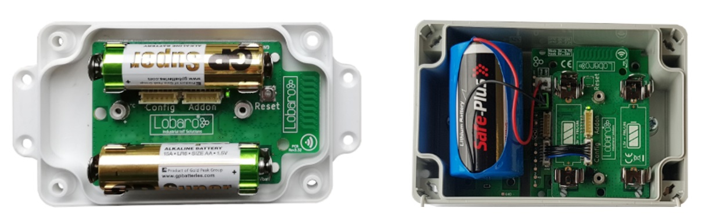

# Wireless mBUS over LoRaWAN Bridge

The latest firmware version is **v2.5.2** *(since 2020-02-25)*

!!! faq "Which firmware version am I using right now?"
    You can see the firmware version of your device by inspecting the USB log output in our PC maintenance tool. Or use the information
    send in the daily status uplink message send on LoRaWAN port 1 (see [Status Packet](index.md#status-packet)).
    
!!! faq "How do I update the firmware?"
    Please refer to [Updating Firmware](../../tools/lobaro-tool.md#updating-firmware){: target="_blank"} on the page 
    about our Lobaro Maintenance Tool.

## Firmware Downloads

!!! caution "Select correct Hardware revisions"
    Due to permanent development there exist two main hardware revisions of the Lobaro wMBUS over LoRaWAN bridge hardware.
    **Please use the images below to select the right firmware file for your given hardware.**
    
    The (dedicated) revision 2.x has a simpler production process which helped us to optimize bigger deployments. 

 
### Hardware Revision 2.x (active since 2020)

{: style="height:150px;display: block; margin: 0 auto;"}

Download: 

* [app-wMbusLoraBridge-2.5.2+hw2.hex](firmware/app-wMbusLoraBridge-2.5.2+hw2.hex) (hardware v2.x) [current release]
* [app-wMbusLoraBridge-2.5.1+hw2.hex](firmware/app-wMbusLoraBridge-2.5.1+hw2.hex) (hardware v2.x)
* [app-wMbusLoraBridge-2.4.0+hw2.hex](firmware/app-wMbusLoraBridge-2.4.0+hw2.hex) (hardware v2.x)

### Hardware Revision 1.x (active since 2017)

{: style="height:150px; display: block; margin: 0 auto;"}

Download:

* [app-wMbusLoraBridge-2.5.2+hw1.hex](firmware/app-wMbusLoraBridge-2.5.2+hw1.hex) (hardware v1.x) [current release]
* [app-wMbusLoraBridge-2.5.1+hw1.hex](firmware/app-wMbusLoraBridge-2.5.1+hw1.hex) (hardware v1.x)
* [app-wMbusLoraBridge-2.4.0+hw1.hex](firmware/app-wMbusLoraBridge-2.4.0+hw1.hex) (hardware v1.x)

!!! info "Please note revisions 1.x are no longer the default variant since 02/2020"
    The v1 hardware revisions are still active but only on special sales inquiry! 
    
    Please [contact Lobaro](https://www.lobaro.com/contact/){: target="_blank"} if you are interested in revisions 1.x hardware.

### Old v1.x firmware

!!! warning "Old v1.x firmware version"
    The v1.x firmware branch is no longer recommended for use. 
    
    If you rely on these older version you can find it at the end of the [v1 documentation](1.x/index.md).
    

## E-Mail release notifications 

!!! hint "Firmware Release Notifications"
    We normally send e-mail notifications upon release of new firmware versions. To receive this mails you can sign up
    to the Lobaro newsletter here.
    
    [**Subscribe to our email newsletter here**](http://eepurl.com/gQYRbH){: target="_blank"} 
    
    Make sure to select the **"Firmware Updates"** checkbox!    
    
## Release changelog

### v2.5.2 - 2020-06-17
- Time Sync only one attempt at bootup
- use Lobawan v1.2.2, fixes issues with OTAA Join under certain conditions

### v2.5.1 - 2020-05-15

### Changed
- Adjust to Lobawan v1.2.0

### v2.5.0 - 2020-04-02

#### Added
- Also send status message when not collecting telegrams.
- Add second cron expression for status message.
- Add remote command for triggering collection of telegrams outside of cron.
- Add `listenOnBoot` config parameter allowing to disable collection on boot.
- Send Status message before listening on boot.

### Removed
- Remove learning mode.

### Changed
- Status message has an additional byte "flags"

### v2.4.0 - 2020-02-25
- Add new Payload Format 2 with Timestamp and RSSI.

### v2.3.10 -2020-02-21
- Add version number of LoRaWAN-Stack to log.
- Fix crash on append function of remote config.

### v2.3.9 - 2020-01-21
- Fix minor memory Leak in wMBus parser

### v2.3.8 - 2020-01-09
- Enhance wMBus reception.

### v2.3.7 -2020-01-08
- Internal use only

### v2.3.6 -2020-01-07
- Increase wireless MBUS C1/T1 mode receive bandwidth
- Change detection method for incoming C1/T1 mode telegrams

### v2.3.5 -2019-12-23
- Improve wireless M-BUS C1/T1 mode receive sensitivity

### v2.3.4 -2019-12-13
- Improve reset line usage (dedicated pcb version)
- Fix issue with bad measurement timing for status message battery voltage (std. pcb version)

### v2.3.3 - 2019-12-10
- Optimize LoRaWAN RX1/RX2 window timing + add more precise downlink logs

### v2.3.2 - 2019-11-18
- Fix crash on receiving certain long non-standard telegrams.

### v2.3.1 - 2019-11-13
- Improve Filtering of non-standard wMBus-telegrams

### v2.3.0 2019-11-12
- Migrate to alternative dedicated board
- Fix Deep Sleep settings on dedicated board
- Fix rx/handling of S1-mode CRCs of unencrypted telegrams in wMBUS driver

### v2.2.0 - 2019-09-13
- Integrated with new LoRaWAN stack, now supporting v1.1, Class C, downlinks, ...

### v2.1.3 - 2019-03-11
- New Parameter: learnedListenSec to define how long to listen when meters was learned

### v2.1.2 - 2019-03-11
- Packet size depending on SF with payloadFormat = 1

### v2.1.1 - 2019-02-20
- New Parameter: timeSync - request time with status packet and upload status packets until we got a valid time
- New Parameter: payloadFormat - 0 = as in older versions, 1 = new split format including receive timestamp (see below)
- The upload is randomly delayed by 1-30 seconds to avoid collisions

New payload Format "1":

LoRaWAN Port: 101
Message: <5 byte Timestamp UTC><raw wMbus Telegramm>

Messages are split into chunks with 1 prefix byte:
Prefix byte bits: <7..2 RESERVED><1 LAST><0 FIRST>
The FIRST bit is set on the first packet.
The LAST bit is set on the last packet.
Together with the LoRaWAN framecounter, a whole message can be reconstructed in the backend.

### v2.0.0 - 2019-02-12
- Leanring mode to learn up to 20 devices with their intervals.
- New Parameter: learningMode - set to true to allow deep sleep based on learned intervals (default: false)
- New Parameter: meterIntervalSec - predefine the sending interval of the meter, so it needs not to be learned (default: 0 = learn intervals)

Learning mode:
Up to 20 devices are learned. When received the first time, the device is added to the list. When received the second time the interval is calculated.
The second step is omitted when "meterIntervalSec" ist set to any value but 0.
When learning was completed during one listening interval the device will only wakeup 10 seconds before and after receiving the learned meters in future.
When missing one device for whatever reason, the bridge will start the learning mode again and stay awake for one full listening period.

While receiving learned sensors the maximum receive interval is doubled but ends as soon as all learned devices are received.

---

### v1.6.0 - 2019-05-20
- Add additional config parameter "cmodeCompatibility" to allow wideband receive as fallback
- fix issue with crc validation of unencrypted meters

### v1.5.8 - 2019-02-18
- Reduce chance to miss wMbus packet when there is a lot of traffic

### v1.5.7 - 2019-01-07
- Fix issue with very large T1 mode telegrams

### v1.5.6 - 2018-11-20
- Support new FRAM memory type
- Improve random generator behaviour

### v1.5.5 - 2018-11-14
- internal use only

### v1.5.4 - 2018-10-25
- Support LoRaWAN NBTrans > 1
- Don't allow to set unsupported FSK DR during ADR

### v1.5.3 - 2018-10-18
- Fix bug with not working deduplication of same wMBUS messages during listen intervals

### v1.5.2
- Support LoRaWAN Rx1 DataRate Offset

### v1.5.1
- New parameter "resetHours" (default = 0): Hours after which the firmware will reset and rejoin the network (0 = never)

### v1.5.0
- Changed duration parameters to seconds: cmodeDur -> cmodeDurSec and smodeDur -> smodeDurSec
- Status packet is 2 byte shorter, version is encoded with 3 bytes now
- Upload correct battery status in DevStatusReq

LoRaWAN Changes:
- Support ADR ChMask to disable Channels
- Restore default channels when loosing uplink connectivity
- Support LoRaWAN NewChannelReq MAC command
- Support LoRaWAN DlChannelReq MAC command
- Support LoRaWAN RxParamSetupReq MAC command
- No LoraWAN MAC Commands are dropped when unknown MAC command is received
- Fix bug with endless loop when unknown LoRaWAN MAC command was received
- Improve debug logs of LoRaWAN stack

### v1.4.1
- Bugfix: Allow big wMBUS raw messages > 160 Bytes in T1 mode
- Improved cfg parameter explanation texts
- Improved wmbus telegram terminal output

### v1.4.0
- New Parameters for ADR (OTAA = false):  AppSKey, NetSKey, DevAdr
- New Parameter: OTAADelay to configure the delay between OTAA joins on fail + [0% ... 30%]
- Bugfix: Support LoRaWAN Status MAC command
- Bugfix: TxPower was not considered
- Requires Lobaro Tool > v1.3.1 for configuration

### v1.3.1
- Fix ADR Bugs

### v1.3.0
- Allow to enable ADR (default: enabled)

### v1.2.0
- Increase config version (Config will be reset)
- Introduce LoRaWAN default parameter

### v1.1.0
- New Filter: device id (devFilter), device type (typFilter), manufacturer (mFilter)
