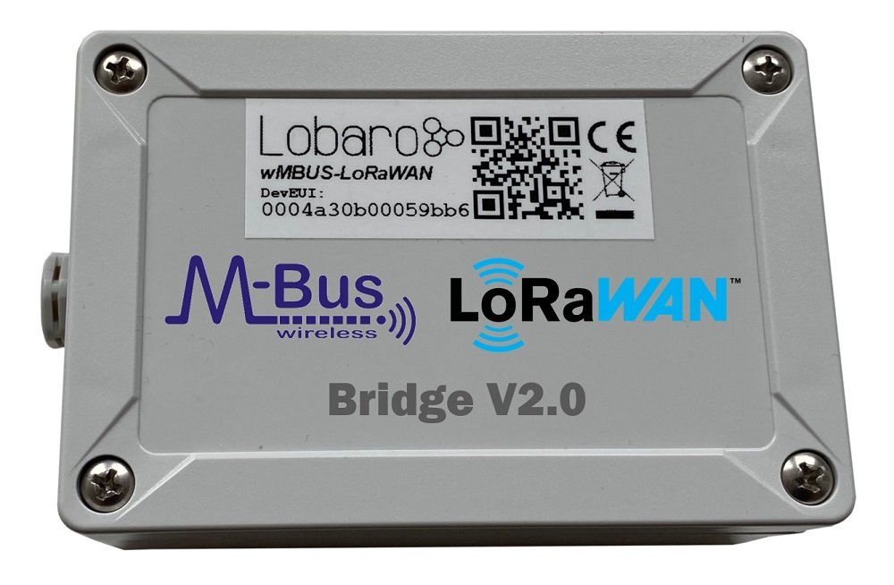
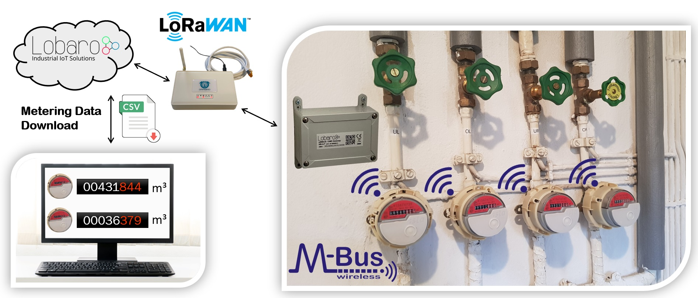
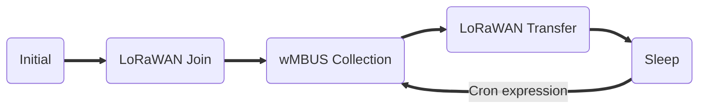
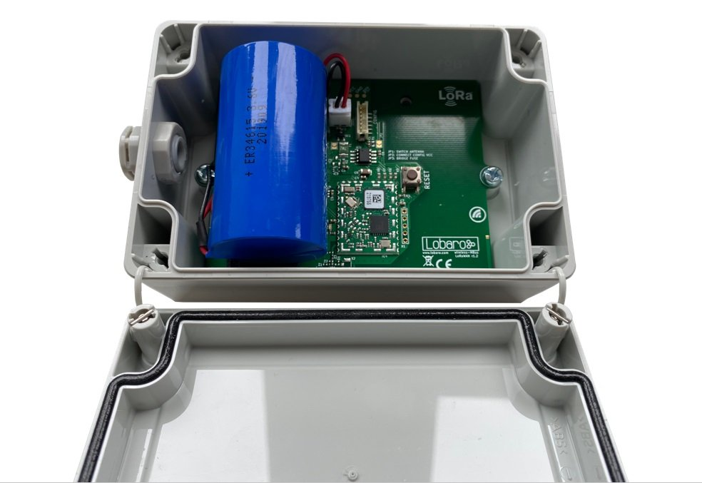
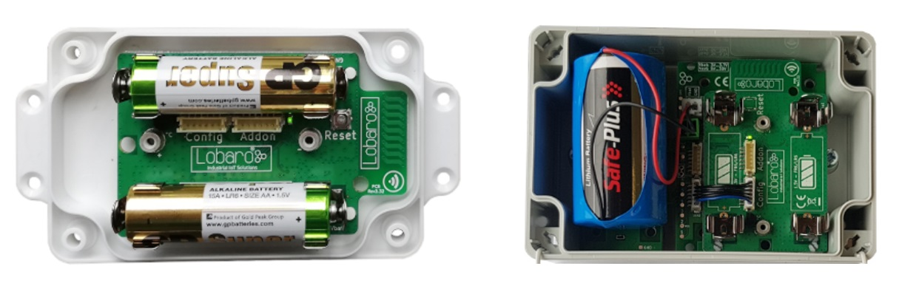
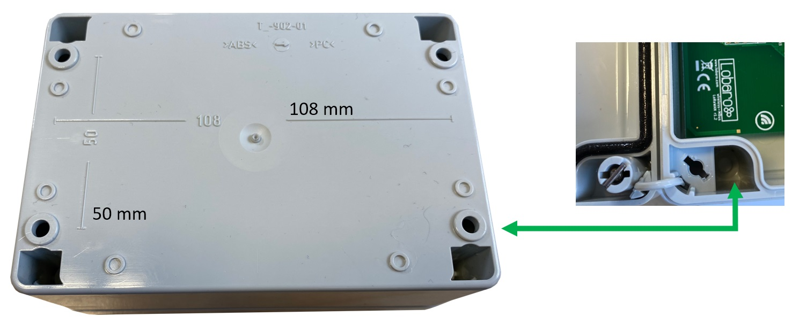
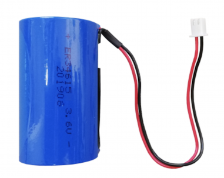
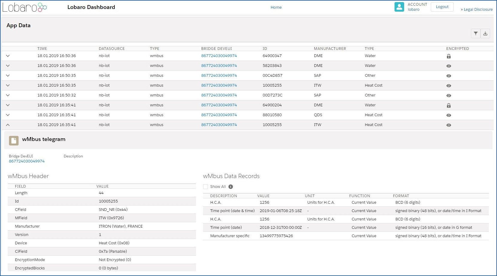
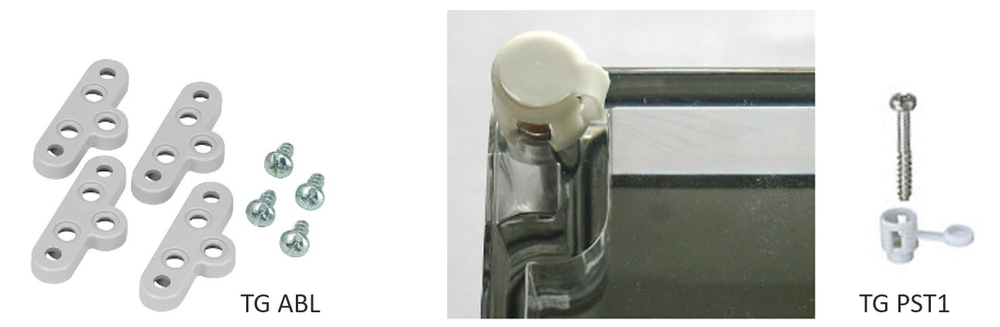

# Wireless mBUS over LoRaWAN Bridge V2

Version **v2.x** *(since 2020-02-18)* <br>
This is the latest version. The previous v1.x documentation can be found here: [doc v1.x](1.x/index.md).

{: style="height:250px"}

## Key Features
- [X] LoRaWAN 1.0.x and 1.1 network servers supported
- [X] LoRaWAN Class A or Class C operation
- [X] LoRaWAN 1.1 time synchronisation
- [X] Wireless MBus S1, C1 and T1 modes (868 MHz) compatible 
- [X] Learning mode of meter tx intervals for optimal battery lifetime
- [X] Configuration via USB or remotely via LoRaWAN downlink
- [X] Big 19Ah size "D" battery for 10 years+ possible battery lifetime
- [X] IP67 outdoor housing with pressure compensating element
- [X] Quick closing screws with cover retainer on housing
- [X] Optional: Lobaro wireless MBUS parsing REST API (free for testing)
- [X] Optional: complete Lobaro IoT Platform integration


##Overview

The Lobaro wireless M-Bus (wMBUS) to LoRaWAN Bridge is a cost-effective & energy
efficient device that receives, caches and transparently forwards wireless M-Bus metering
data from up to 500 utility meters via any LoRaWAN network onto the Internet. 
The metering data will not be decrypted by the LoRaWAN Bridge, instead an unchanged
1:1 forwarding takes place via one or more LoRaWAN packets (depending on the wMBUS telegram byte size). 
Thus the end-to-end encryption of sensitive wireless MBUS consumption data is preserved. 

{: style="width:100%"}
*Note: The Lobaro IoT platform is fully optional!*

Many gas, water, electricity and heat meters can be read wirelessly using the common
short range 868 MHz wireless M-Bus / OMS industry standard. Because such wMBUS enabled meters use the classical
energy saving FSK radio modulation, the wireless range is designed for less than 50m
and therefore requires the use of additional longer-range radio technologies to forward the
metering data over larger distances onto the Internet. The advanced LoRa radio modulation used 
inside the Lobaro wMBUS to LoRaWAN Bridge is one of such a key technologies. 

You can find details about LoRaWAN in our [background article](../../background/lorawan.md).

!!! warning "Please use always the latest firmware on your lorawan wmbus bridge!"
    * [**Check latest firmware releases available for download**](firmware.md){: target="_blank"}
    

### Compatible meters

| wMBUS meter  | Type | Manufacturer    | More information |
| :-------------|:     |:----------------|:----------------|
| Q caloric 5.5 | Heat cost     | Qundis          | [External Link](https://qundis.com/products/heat-cost-allocators/){: target="_blank"}  |
| Sontex 868 | Heat cost             | Sontex        | [External Link](https://sontex.eu/product_category/heizkostenverteilern-de/){: target="_blank"}  |
| SHARKY 775 | Heat             | Diehl Metering         | [External Link](https://www.diehl.com/metering/en/portfolio/thermal-energy-metering/){: target="_blank"}  |
| MULTICAL® 603 | Heat          | kampstrup       | [External Link](https://www.kamstrup.com/en-en/heat-solutions/heat-meters/multical-603){: target="_blank"}  |
| QALCOSONIC E1 | Heat & Cooling | Axioma Metering | [External Link](https://axiomametering.com/en/products/heat-metering-devices/ultrasonic/qalcosonic-e1-ultrasonic-heat-and-cooling-meter){: target="_blank"}  |
| Sonometer 30 | Heat & Cooling| Danfoss | [External Link](https://www.danfoss.com/en/products/energy-metering/dhs/energy-metering/sonometer-30/#tab-overview){: target="_blank"}  |
| INVONIC H | Heat & Cooling| Apator | [External Link](http://www.apator.com/en/offer/water-and-heat-metering/heat-meters/invonic-h-ultrasonic-heat-and-cooling-meter){: target="_blank"}  |
| iPERL® | Water             | Sensus        | [External Link](https://sensus.com/products/iperl-international/){: target="_blank"}  |
| Hydrus | Water              | Diehl Metering         | [External Link](https://www.diehl.com/metering/us/en/hydrus/){: target="_blank"}  |
| MULTICAL® 21 / flowIQ® 210x | Water          | kampstrup       | [External Link](https://www.kamstrup.com/en-en/water-solutions/smart-water-meters/multical-21){: target="_blank"}  |
| Q water 5.5 | Water         | Qundis       | [External Link](https://qundis.com/products/water-meters/){: target="_blank"}  |
| Modularis yFlow | Water addon | Hermann Pipersberg | [External Link](https://www.pipersberg.de/wp-content/uploads/2017/09/Wasser_119_Wireless-MBus-OMS-868MHz-yFlow.pdf){: target="_blank"}  |
| Munia | Temp. & Humidity      | Weptech         | [External Link](https://www.weptech.de/en/wireless-m-bus/humidity-temperature-sensor-munia.html){: target="_blank"}  |
| Qalcosonic W1 (Honeywell Q400) | Water | Axioma Metering | [External Link](https://www.axiomametering.com/en/products/water-metering-devices/ultrasonic/qalcosonic-w1){: target="_blank"} |

!!! success "Further utility meter compatibility"
    Beside the example meters in the list above the Lobaro wMBUS LoRaWAN bridge works with **every meter** using standard 868 MHz wireless MBus:
    
    * wireless MBUS S1, C1 or T1 mode (unidirectional 868 MHz modes following DIN EN 13757-4)
    * [Open metering specification](https://oms-group.org/en/){: target="_blank"} v3 & v4

##Work Cycle


The Bridge has a simple work cycle that consists of five phases.

###Initial Phase
This is the phase that is executed after the device is started of restarted. The Bridge performs
a quick self test which you can easily spot by the green internal LED flashing. After that,
the configuration is evaluated. If successful, the LoRaWAN Join phase is executed next.

###LoRaWAN Join Phase
If the Bridge is configured to use over the air activation (OTAA), the OTAA join is performed
at this point. The device will repeatedly try to join its LoRaWAN network until the process
is successful. It then enters the Data Collection Phase.
If the Bridge is configured to use ABP instead of OTAA, this phase is left immediately and
the Data Collection Phase is entered according to the cron configuration.

###Data Collection Phase
During the wMBUS collection phase the device receives any wireless M-Bus data with valid
CRC and stores it for the following LoRaWAN upload phase but only if the received telegram
passes the user defined white list filters. Similar telegrams of one identical meter may be
received multiple times during this phase. In this case the newest telegram with the same
id, type and length will replace the previously received one. Only the latest telegram will be
uploaded via LoRaWAN.
After the configured amount of time for collecting data the LoRaWAN data transfer phase
is entered.

###Data Transfer Phase
During the Data Transfer Phase the Bridge uploads all previously stored wMBUS data using
LoRaWAN. Depending on original wMBUS telegram byte sitze this can require multiple LoRaWAN
messages to be sent. Since LoRa requires any device to respect a strict duty cycle,
it is possible, that the Bridge will need to wait before sending its messages. If this happens,
the device will enter a power saving modus while waiting for the next message. It is possible
that transferring all data will take several minutes.
In addition to the wireless M-Bus data, the Bridge sends a status packet once a day during
this phase. The status packet will always be transmitted prior to any data packets.
For a detailed description of the data sent refer to chapter "Data Packet".

###Sleep Phase
After transferring all data packets the Bridge enters the Sleep Phase. During this it is completely
inactive to avoid wasting power. It remains sleeping until one of the cron expressions
given in the configuration triggers. When that happens, it enters the Data Collection Phase
again.

##The wMBUS LoRaWAN Bridge 

###Hardware revision 2.x (active since 2020)
`wMBUS LoRaWAN Bridge V2.0 (XH battery-connector, IP67 housing, DAE), PN: 8000095`

{: style="height:200px;display: block; margin: 0 auto;"}

###Hardware revision 1.x (active since 2017)

{: style="height:150px; display: block; margin: 0 auto;"}

!!! info "Please note revisions 1.x are no longer the default variant since 02/2020"
    The v1 hardware revisions are still active but only on special sales inquiry! 
    
    Please [contact Lobaro](https://www.lobaro.com/contact/){: target="_blank"} if you are interested in revisions 1.x hardware.

###Hardware differences
The main differences between hardware revision 1.x and revision 2.x are:

* HW1.x has an additional on board temperature sensor (seldom used)
* HW1.x is available in a 2x AA cell (1.5V) variant with compact housing (rarely requested)
* HW1.x may be combined with external power supply addon (5V...30V)

So the main reason to request revision 1.x is the smaller housing with two AA batteries or the need for an external power supply. The same firmware will always provided for both hardware revisions.

###Device installation

{: style="width:75%;display: block; margin: 0 auto;"}

The device must be fixed on a flat surface using the lateral mounting holes of the case, see
chapter "Housing Dimensions" for a detailed description of all housing dimensions. Alternatively we offer as
accessory a mounting clips.

!!! warning "Mounting height"
    Under any circumstances the device must not be mounted higher than 2 meters above ground to avoid any risks in case of falling down!

For optimal RF performance (e.g. LoRa range) any metal obstacles near the internal antenna
should be avoided. In this case 'near' is defined as keep-out distance of about 3-5 centimeters
around the antenna. The internal quarter wave monopole antenna can be identified by the pcb trace
near the white printed encircled 'connectivity' symbol. In any case a device mounting directly
on top of a metal surface is not advisable since it will degrade the possible RF range. Stone
walls, wood or plastic standoffs are perfectly ok.

In case of challenging installation locations (e.g. in basements) or unavoidable long distances
to the next LoRaWAN gateway, Lobaro offers on request custom product variant equipped
with a 'SMA' connector to support a external antenna connection.

###Power Supply
{: style="width:35%"}

The wMBUS over LoRaWAN Bridge default power supply consists of one connected 3.6V 'D' sized battery equipped with a JST XH 2pin connector. 

* Size: D-Cell (34mm x 61.5mm)
* Connector: JST XH series
* Voltage: 3.6V
* Operating temperature: -55°C...+60°C
* Li-SOCl2 (not rechargeable)

!!! warning "Battery warning"
    Other Batteries or accumulators with a nominal voltage of more or less than 3.6V must not used with
    the device under any circumstances. In particular, lithium based cells with a nominal voltage of 3.7V must not be used!

On request we can supply custom product variants with with permanent external power supply (230V, 9-24V, 5V USB) or smaller AA batteries.

###Battery life time
The battery life time of the wireless M-Bus to LoRaWAN Bridge can not be specifed trustworthy
without knowledge of the detailed installation scenario. At least estimations for the
following custom project based parameters have to be known:

+ Meter count per single wMBUS bridge, e.g. 10 different meters.

+ Needed LoRaWAN transmission interval, e.g. daily uploads.

+ Average wireless M-Bus telegram size in bytes, e.g. 35 byte.

+ Wireless M-Bus telegram transmission interval of the meter, e.g. every 10 seconds.

+ Typically used LoRa Spreading Factor / LoRa link quality, e.g. SF10.

Depending on these parameters battery life times from a few months to over 15 years can
be achieved. You may send us your use-case details as described above to support@lobaro.com
and we will return to you a custom battery lifetime calculation, a recommendation for the
best power supply scheme and the needed minimal battery capacity.

#### Example calculation
In this battery lifetime calculation scenario the target meters send a 35 byte long ('L-Field')
wireless M-Bus telegram constantly every 10 seconds. A real world image of a 4:1 (4 meters, 1 bridge) configuration can be found at the top of this documentation. 
The meter transmission interval is for example very similar to a 'Hydrus' ultrasonic water meter of [**Diehl Metering**](https://www.diehl.com/metering/){: target="_blank"}. 
The Diehl meter itself has a specified battery life time of 12 years.

Because of the mentioned 10 second send interval it is sufficient to configure the bridge for
a wireless M-Bus listen period of 20 seconds by setting the bridge configuration parameter
cmodeDurSec to a value of 20 (refer to section "Configuration"). This will ensure that all four meters of
interest send their consumption telegrams at least once during the configured listen period
of the bridge.

For this example battery-lifetime calculation the weakest and best possible LoRaWAN connectivity will be compared. 
Weak means to reach a LoRaWAN Gateway the Lobaro bridge has to send its LoRaWAN uplinks very slowly (&ge; 2 seconds) and redundant 
by using LoRa spreading factor 12 (SF12). Estimations for the opposite situation with a excellent LoRa link quality and thus the possible usage of SF7 
have been calculated too. In both coverage scenarios covered the actual usable battery capacity has been set to 80% of the nominal
value of 19Ah for the "D" sized mono 3.6V cell. The resulting worst-case minimal battery-life times in years for both coverage situations are presented below:

Worst-Case Battery life with **daily uploads** of x meters using LoRa SF12 and SF7:

|Collected meters|Battery life @ SF12|Battery life @SF7|
|-|-|-|
|1|24.3|40.0|
|5|15.0|38.1|
|10|9.1|35.2|
|20|5.1|30.6|
|40|2.7|24.3|
|80|1.4|17.2|
*All battery life numbers denote years*

#### Usage scenario recommendations
As a simple rule of thumb using the Lobaro wireless M-Bus over LoRaWAN bridge is a good
fit in applications that require daily (or less often) consumption values of 1 to 40 installed
wireless M-Bus meters. For installations with a higher meter count simply more Lobaro
bridges may be used.

Another key factor for high battery lifetime is to select or configure your wireless M-Bus
meters in a way that they send short telegrams very frequently, proven good values are
periods smaller than 30 seconds and telegram sizes smaller 50 bytes. This helps to minimize
the needed wMBus listening time period and avoids the need for multiple LoRaWAN packets
per single telegram (data splitting). 

Beside this the bridge is naturally most economical when multiple meters per single bridge
can be collected and forwarded via LoRWAN. Although for some applications a 1:1 setup,
e.g. one bridge per meter, may deliver enough benefits to justify the invest.

For hourly or even more frequent meter data uploads, as requested by some of our customers,
LoRaWAN isn't the perfect match from a technology point of view. The same holds
for scenarios where hundreds of meters are expected to be transferred by a single bridge,
e.g. in 'sub-metering' applications with tons of installed heat cost allocators. For such more
demanding cases Lobaro can offer better solutions using higher bandwidth transmission techniques
like NB-IoT (Narrowband IoT). 

##Configuration
The (initial) configuration is normally done using our free [Lobaro Maintenance Tool](/tools/lobaro-tool.html) 
and the [USB PC configuation adapter](/tools/usb-config-adapter.html) to be connected to the "config" connector on the hardware.

Beside this the configuration can also be changed or read remotely in the field 
using [LoRaWAN downlink messages](/background/lorawan.html#remote-configuration). 

### LoRaWAN
The connection to the LoRaWAN network is defined by multiple configuration parameters.
This need to be set according to your LoRaWAN network and the way your device is 
supposed to be attached to it, or the device will not be able to send any data.

For a detailed introduction into how this values need to be configured, please 
refer to the chapter [LoRaWAN configuration](/background/lorawan.html#lorawan-configuration) 
in our LoRaWAN background article.

| Name       | Description | Type | Values |
|------------|-------------|------|-------|
|`OTAA`      |Activation: OTAA or ABP              |`bool`    | `true`= use OTAA, `false`= use ABP |
|`DevEUI`    |DevEUI used to identify the Device   |`byte[8]` | e.g. `0123456789abcdef` | 
|`JoinEUI`   |Used for OTAA (called AppEUI in v1.0)|`byte[8]` | e.g. `0123456789abcdef` | 
|`AppKey`    |Key used for OTAA (v1.0 and v1.1)    |`byte[16]`| |
|`NwkKey`    |Key used for OTAA (v1.1 only)        |`byte[16]`| |
|`SF`        |Initial / maximum Spreading Factor   |`int`     | `7` - `12` |
|`ADR`       |Use Adaptive Data Rate               |`bool`    | `true`= use ADR, `false`= don't |
|`OpMode`    |Operation Mode                       |`string`  | `A`= Class A, `C`= Class C |
|`TimeSync`  |Days after which to sync time        |`int`     | days, `0`=don't sync time | 
|`RndDelay`  |Random delay before sending          |`int`     | max seconds |
|`RemoteConf`|Support Remote Configuration         |`bool`    | `true`=allow, `false`=deactivate |
|`LostReboot`|Days without downlink before reboot  |`int`     | days, `0`=don't reboot |

### wMBUS bridge

| name             | description            | values |
|------------------|------------------------|--------|
|`payloadFormat`   | wMBUS Bridge LoRaWAN Payload Format| `0`= Encoding in ports, `1`= prefixed with time, `2`= prefixed with time and rssi |
|`loraMaxMsgSize`  | Max. LoRa msg size before split (Payload Format `0` only) | `10`-`50` (bytes) |
|`listenCron `     | Cron expression<sup>&dagger;</sup> defining when to rx wMBUS| `0 0/15 * * * *`(every 15 minutes)|
|`cmodeDurSec`     | Duration (Seconds) of C1/T1-mode receive| `0`= Do not collect C1/T1 mode |
|`smodeDurSec`     | Duration (Seconds) of S1-mode receive| `0`= Do not collect S1 mode |
|`mFilter`         | wMBus manufacturer filter sep. by "," e.g. "dme,itw"| `blank`= no filter | 
|`typFilter`       | wMBus device type filter e.g. "08,07" for Heat Coast and Water | `blank`= no filter | 
|`devFilter`       | wMBus id filter e.g. "88009035, 06198833" (8 digits)| `blank`= no filter | 
|`learningMode`    | Enable tx interval learning mode| `false`= Do not use learning mode | 
|`meterIntervalSec`| Expected meter tx interval | `0` (Learning mode) | 
|`learnedListenSec`| Listen time with learned meeters.| `600` (Learning mode) | 

<sup>&dagger;</sup> See also our [Introduction to Cron expressions](/background/cron-expressions.html).

###Learning Mode
The larning mode can be enabled by setting `learningMode = true` in the configuration. 

If `meterIntervalSec` is set to `0` the algorithm will try to learn the tx intervals intervals and times of up to 20 meters to conserve energy
When a device is received the first time, it is added to an internal list of known devices. 
When received the second time the wMBUS transmission interval is calculated. 
The second step is omitted when `meterIntervalSec` ist set to any value but `0`. 
When missing one device for whatever reason, the bridge will start the learning phase again.

Learning of individual intervals can be skipped by setting `meterIntervalSec` to a value that is valid for all meters. 
If `meterIntervalSec` is `0` the bridge will wait for two packets from each wMbus device and calculates the sending interval based on the times. 
This might not always be correct due to possible jitter. 

**Procedure**

1. Power ON.
2. Enter "learning Phase" and listen for 2x `_modeDurSec` if `meterIntervalSec`, else for `_modeDurSec`.
3. Create an internal list with up to 20 meters, with either individual intervals or all intervals set to `meterIntervalSec`.
4. On next `listenCron` only wake up as little as possible based on the learned data.
5. When any learned meter is missing, goto 2. else sleep till `listenCron`.

!!!note "Example"
    A meter sends with jitter every 55-65 seconds. The bridge might learn an interval of 55 seconds after observing 2 messages around 12:00:00.
    The bridge will expect next data at 12:00:55, 12:01:50, 12:02:45, etc. and probably miss data, which leads to a new learning phase.
    
    When setting the `meterIntervalSec` to `60` the bridge needs only one wMbus packet e.g. at 12:00:00 and expects the next packets at 12:01:00, 12:02:00, etc.
    which is closer to reality.

To account possible jitter `learnedListenSec` can be used to tell the bridge how long it should stay awake to receive a meter at a learned point in time.
`learnedListenSec = 30` would wake up 15 seconds before the expected time and wait until the expected wMbus telegram is received or after 30 seconds.

##Payload formats

After collecting wireless M-Bus telegrams over the air, the Bridge starts uploading data
via LoRaWAN. There exist two data formats that are transmitted over different LoRaWAN
ports.
As LoRaWAN can only transmit very short messages, the message formats contain only data
bytes. The meaning of a byte is determined by its position within a message. The following
describes the package formats used by the wireless M-Bus Bridge.

M-Bus telegrams can be longer as the maximal size of a LoRaWAN-Message. For this cases, the Bridge needs 
to split a telegram into multiple pieces and upload it using multiple LoRaWAN-Messages. There are two 
different methods this is done, according by the Payload Format you set in the Bridge's configuration.

Payload Format `0` is focused on easy reassembly of the pieces. The parts are encoded by port numbers and the 
data can just be concatenated together. Payload Formats `1` and `2` add additional information to the telegram.
They focus on putting as much of a telegram in a single LoRaWAN-Message as possible with respecting the 
current Spreading Factor.

###Status Packet

Port 1 - In order to provide some information about the health & connectivity state of the
device itself, the device sends a status update at a daily basis. The status packet is sent
on the first upload phase after activation of the device (after reboot) and then repeatedly in
every upload phase that takes place a day or longer after the previous status packet. It has
a fixed length of 7 bytes. The battery voltages and ambient temperature are encodes as 16
bit integer using little endian encoding.

|name|type|bytes|description|example|
|-|-|-|-|-|
|version|uint8[3]|0-2|Version of the firmware running on the device|1, 5, 1 ≡ v1.5.1|
|v_bat|uint16|3-4|Battery voltage in mV|2947 ≡ 2:947V|
|temp|int16|5-6|Temperature measured inside the device in 1/10 °C|246 ≡ 24.6°C|

!!! warning "Temperature Sensor"
    The temperature sensor is not present anymore on dedicated V2 hardware, instead 0xffff will be returned.

We provide a JavaScript reference implementation of a decoder for this status packet on
[**GitHub**](https://github.com/lobaro/ttn-data-formats/blob/master/wmbus-bridge/decoder.js){: target="_blank"}, which can be used directly for decoding in [**The Things Network**](https://www.thethingsnetwork.org/){: target="_blank"}.

###Data Packet (Format 0)

After each wMBUS collecting phase, all saved telegrams (up to 500 can be stored) will be
uploaded via LoRaWAN uplink messages as fast as possible. The received wMBUS telegrams
that did pass the configured white list filters will be uploaded without any modification in one
or more LoRaWAN messages.
If a wMBUS telegram is bigger than the bridge configuration parameter loraMaxMsgSize the
transmission will be done using multiple LoRaWAN messages. This parameter is limited to ≤
50 bytes due to LoRaWANs maximum payload size restrictions. In case of telegram splitting
is needed the receiving backend application server as to reassemble the original wMBUS
telegram before decryption & parsing of the meter data. This is done by simply joining the
messages together in the order of receive.
The LoRaWAN port encodes identifies a LoRaWAN fragment of the original wireless M-Bus
telegram. This way partial messages can be identified using the LoRaWAN Port:

+ 10 < LoRaWAN Port < 100 ≡ (Part Number | Total Parts)

Gaps in the LoRaWAN Frame Counter are giving a hint for missing telegram parts which can
happen in LoRaWAN since it's a ALOHA based protocol, e.g. collisions and some packet
losses are accepted by principle of operation. In case the backend noticed a missing packet
the wMBUS telegram can't be assembled anymore as described before.

!!!note
    **[Reference Implementation in GoLang](https://gist.github.com/Niondir/7fe2da1924de8525fe47cfa4efe9a5a9)**

####Examples

Examples (with `loraMaxMsgSize` = 50):

+ A 48 Byte wMBUS telegram will be send on LoRaWAN port 11. Port 11 says it is the first message of only one message (no splitting).
+ A 75 byte wMBUS telegram will be send in two messages on LoRaWAN ports 12 and 22. Port 12 means this part one of a wMBUS telegram that got splitted into two LoRaWAN messages. Port 22 means that this data is the 2nd part of the original wMBUS data. Both parts have to been concatenated in the order of receive by the backend.
+ A 101 byte wMBUS telegram will be send in three messages on LoRaWAN ports 13, 23 and 33. Port 13 means this part one of a wMBUS telegram that got splitted into three LoRaWAN messages. Port 23 means that this data is the 2nd part of the original wMBUS data. Port 33 means that this data is the 3rd part of the original wMBUS data. All three parts have to been concatenated in the order of receive by the backend.

### Data Packet (Format 1)
When using Payload Format 1, collected telegrams are uploaded on a single Port: 101. For each telegram there 
will be added the timestamp of reception. The first byte of messages on Port 101 encodes splitting of messages 
as follows.

#### Splitting
Every Uplink on Port 101 is prefixed with a single byte, where the least significant Bit indicates if that 
Uplink is the first part of a message, and the second least significant Bit indicates if that Uplink is the 
last part or a message. So there are 4 different possible values for the first Byte of an Uplink on Port 101:

| Value  | Meaning |
|--------|---------|
| `0x03` | This Uplink is both first and final part of a message. So the remaining Bytes in this Uplink contain the whole message. |
| `0x02` | This Uplink is the last but not the first part of a message. There has been at least one Uplink before this one, that contained data that needs to be prepended to the current Uplink in order to get the full Message | |
| `0x01` | This Uplink is the first but not the last part of a message. There follows at least one Uplink that contains more data to be appended to the current's data in order to get the full message.  |
| `0x00` | This Uplink is neither first nor last part of a message. There has been at least one Uplink before this one that contains more data of the current Message, and there follows at least one more Uplink with data for this Message. |

So each message sent on Port 101, whether it is contained in a single Uplink or spread over multiple ones, starts 
with an Uplink where the least significant Bit of the first Byte is set. Each Message ends with an Uplink where 
the second least significant Bit of the first Byte is set. In cases where the Message fits in a single Uplink, 
that Uplink is both first and last Uplink, and therefore both Bits are set.

The combination of those two Bits and the Frame Counter of the Uplinks makes it possible to upload Messages of 
any length while allowing the receiving side to now exactly, if a Message has been transferred completely, or 
if part of it is missing (when there are Frame Counter values missing).

The Bridge puts as many Bytes in each Uplink as possible for the current Spreading Factor, even if the 
Spreading Factor changes between Uplinks because of ADR.

When the data of all Uplinks that are part of a single Message are appended in order of reception (after 
removing the first Byte of each Uplink), you get the payload Data of a full message.

#### Payload (Format 1)
The Payload Data after reassembly of the split parts consists of a 5 Byte Timestamp, that marks the 
point in time the Bridge did receive that telegram, followed by the Data of the Telegram. The Timestamp 
follows the convention of all our 40bit-Timestamps; you can find the details under 
[Timestamp in our LoRaWAN Background Information](/background/lorawan.html#timestamp).

#### Examples
For easier understanding, the wMBus-Telegram in the examples will always be `0102030405060708090a0b0c0d0e0f`.

**A message sent in a single Uplink**
```
# An Uplink of 21 Bytes on Port 101:
'03005e53f31a0102030405060708090a0b0c0d0e0f'
# Analised:
'03' -> First and Last Uplink of Message -> complete Message in this Uplink
'005e53f31a' -> Unix Timestamp 1582560026 -> 2020-02-24T16:00:26 UTC
'0102030405060708090a0b0c0d0e0f' -> wMBus Telegram
```

**A message split over two Uplinks**
```
# An Uplink of 11 Bytes on Port 101, Frame Counter 341:
'01005e53f31a0102030405'
'01' -> First Uplink of Message, more Uplinks follow
'05e53f31a0102030405' -> First Part of Message Data.
# Another Uplink of 11 Bytes on Port 101, Frame Counter 342:
'02060708090a0b0c0d0e0f'
'02' -> Last (but not first) Uplink of Message.
'060708090a0b0c0d0e0f' -> Second and final Part of Message Data.
# We Received a 'first' Part with Frame Counter 341 and a 'last' 
# Part with Frame Counter 342, so we know we did not miss any 
# Parts in between. We can now assembly the complete payload:
'05e53f31a0102030405060708090a0b0c0d0e0f'
# Payload anaylsed:
'005e53f31a' -> Unix Timestamp 1582560026 -> 2020-02-24T16:00:26 UTC
'0102030405060708090a0b0c0d0e0f' -> wMBus Telegram
```

**A message split over three Uplinks**
```
# An Uplink of 8 Bytes on Port 101, Frame Counter 519:
'01005e53f31a0102'
'01' -> First Uplink of Message, more Uplinks follow
'05e53f31a0102' -> First Part of Message Data.
# Another Uplink of 8 Bytes on Port 101, Frame Counter 520:
'0003040506070809'
'00' -> Middle Part of Message, there have been some Parts already, more Uplinks follow
'03040506070809' -> Second Part of Message Data.
# Another Uplink of 7 Bytes on Port 101, Frame Counter 521:
'020a0b0c0d0e0f'
'02' -> Last (but not first) Uplink of Message.
'0a0b0c0d0e0f' -> Third and final Part of Message Data.
# Frame Counters are consecuetive, so the complete Message is:
'05e53f31a0102030405060708090a0b0c0d0e0f'
```

**Missing a Part**
```
# An Uplink of 8 Bytes on Port 101, Frame Counter 123:
'01005e53f31a0102'
'01' -> First Uplink of Message, more Uplinks follow
'05e53f31a0102' -> First Part of Message Data.
# Another Uplink of 7 Bytes on Port 101, Frame Counter 125:
'020a0b0c0d0e0f'
'02' -> Last (but not first) Uplink of Message.
'0a0b0c0d0e0f' -> Third and final Part of Message Data.
# Frame Counter indicates, that a Part in the middle is missing, 
# so we have to drop the Message.
```

### Data Packet (Format 2)
Upload Format 2 works like Upload Format 1, with the same logic for splitting messages, but uploads are 
sent on Port 102. The Payload consists of a 5 Byte Timestamp marking the time of reception, followed by a 
`uint_8` that holds the (negated) RSSI value for that reception, followed by the Data of the Telegram.

#### Examples

```
# An Uplink of 22 Bytes on Port 102:
'03005e53f31a3f0102030405060708090a0b0c0d0e0f'
# Analised:
'03' -> First and Last Uplink of Message -> complete Message in this Uplink
'005e53f31a' -> Unix Timestamp 1582560026 -> 2020-02-24T16:00:26 UTC
'3f' -> 63 -> RSSI of wMBus reception = -63
'0102030405060708090a0b0c0d0e0f' -> wMBus Telegram
```

###Upload Speed / Duration
The bridge has to work in compliance with the European SRD 868 1% duty-cycle regulations.
This implies as a rule of thumb the device can upload at most wMBUS telegrams via LoRaWAN for 36
seconds every hour. 

The actual transmit time ('ToA: time on air') for each LoRaWAN
message depends on the byte size and the used LoRa spreading factor (SF) which defines how
redundant LoRa data is send. This means a device with good connectivity and consequently
using LoRa SF7 (ToA ≤ 0,050s) can upload much faster more data than a node using LoRa
SF11 (ToA ≥ 1s) due to a hard to reach LoRaWAN gateway. The bridge will upload in
conformity with the regulations automatically as fast as possible. When it has to wait it
enters a low power sleep mode until the next transmission is possible again.
The next data collection phase will be started only after completion of the previous upload
phase in respect to the configured `listenCron` parameter. Because of this it is advisable to define the cron parameter with an 
estimation of the upload duration in mind. This will avoid unexpected 'skipping' of data collection phases.    

##Decoding wMBUS telegrams
After receiving the raw wireless M-Bus telegrams from your LoRaWAN network provider
the actual metering data has to be decrypted and decoded by a backend service for further
processing. The details of this are described in the EN 13757 norm and the newer [**OMS**](https://oms-group.org/en/download4all/oms-specification/){: target="_blank"}
specification, which is a clarification of the original underlying norm.

A universal wireless M-Bus decoder is a relatively complicated piece of software if you start
implementing it from scratch since the norm covers many different use cases, units, meter
types and data formats. If you know in advance the exact telegram format of the deployed
meters in your setup a hard coded data decoding may be a feasible approach. This is because
wireless M-Bus devices often send the same telegram format in every transmission. Please
contact the manufacturer of your meters for the needed telegram format details.

An an alternative to support a quick evaluation of our hardware Lobaro offers a easy to use
webservice which is designed to decode all sorts of wMBUS input data including decryption
if the correct key has been provided. You can access the decoder service for free during testing. 
The API can be licensed for production usages.

!!! check "Free online wMBUS decoder (for testing)"

    * [**Lobaro wMBUS Online Parser**](https://platform.lobaro.com/#/wmbus/parser){: target="_blank"}
    * [**Lobaro wMBUS REST API**](https://platform.lobaro.com/#/wmbus/api){: target="_blank"}

!!! bug "Your meter fails to parse correctly?"
    Since wireless MBUS is a complex and grown specification some meters may fail to decode correctly. 
    We try to fix any decoding issues as quickly as possible if you [report us](https://www.lobaro.com/contact/){: target="_blank"} 
    problems with your specific wMBUS device.
   

##Optional: Lobaro IoT Platform
{: style="height:80px;display: block; margin: 0 auto;"}


{: style="width:100%;display: block; margin: 0 auto;"}

The bridge can also be integrated in the Lobaro IoT platform with the following benefits:
 
 * wMBUS data reassembling from raw (partial) LoRaWAN uplinks
 * Wireless MBUS data decryption
 * Device management including remote configuration
 * Std. Web APIs to connect external services
    - REST
    - MQTT
    - HTTP Push
    - CSV Exports 
 * LoRaWAN data import from many common LoRaWAN network servers:
    - TheThingsNetwork (TTN)
    - ShirpStack
    - Element-IoT
    - Actility
    - Loriot
    - Firefly
    - Everynet
   

!!! hint "Free 12 months test account"
    Please [contact Lobaro](https://www.lobaro.com/contact/){: target="_blank"} if you are interested in a free 12 months test account for your 1st bridge.


## Technical characteristics
|||
|-|-|
|**Product**||
|Type name|wMBUS-LoRaWAN-R2|
|Description|wMBUS over LoRaWAN Bridge|
|**RF transceiver**||
|Chipset|Semtech SX1272|
|Frequency Range|863 to 870 MHz|
|TX Power|≤ 14 dBm|
|**LoRa communication**||
|LoRaWAN Protocol|Class A / Class C LoRaWAN 1.1 EU868|
|Activation method|Over-the-air activation (OTAA) <br> Activation by personalization (ABP)|
|Encryption|AES128|
|Typically RF range|≤ 2km|
|Ideal RF range|≤ 10km (free line of sight)|
|**Wireless M-BUS communication**||
|Supported Modes (EN13757-4)|S1, C1, T1|
|Frequencies|868.3 MHz, 868.95 MHz|
|RF Range|≤ 30m|
|Telegram memory| 32KByte (up to 500 telegrams)|
|**Power Supply**||
|Nominal Supply Voltage|3.6V|
|Supply Voltage Range|2.2V - 3.7V|
|Power supply| 3.6V ER34615 3.6V battery|
|**Current consumption @3.6V**||
|Normal|≤3 mA|
|Wireless M-BUS RX|≤14 mA|
|LoRa RX|≤14 mA|
|LoRa TX|≤80 mA|
|Sleep with RTC running|≤15 µA|
|**Mechanical dimensions**||
|Size|122 mm x 82 mm x 55 mm|
|Housing Material|Industrial polycarbonate|
|Rating|IP67|
|**Environmental Requirements**||
|Operating temperature range|-20°C to +55°C|
|Max. Installation height|2m|
|**Conformity**||
| ||

Specifications of hardware revisions v1.x can be found in the [previous documentation](1.x/index.md).
###Housing Specification & Accessories
The Lobaro wireless Mbus bridge uses the [TG PC 1208-6-o](https://www.spelsberg.com/industrial-housing/plain-with-mounting-cams/20040401/){: target="_blank"}
feature rich IP67 housing from Spelsberg. For this housing the following accessories are available on request:

{: style="height:150px;display: block; margin: 0 auto;"}

*[Sealing kit (TG PST1)](https://www.spelsberg.com/accessories/spelsberg-general-accessories/18200401/){: target="_blank"}:*

May be used to seal the box to complicate unauthorized access to the device. 

*[External fixing lugs (TG ABL)](https://www.spelsberg.com/accessories/spelsberg-general-accessories/18200201/){: target="_blank"}:*

Allow the mounting without opening the (sealed) cover. 

## CE Declaration of Conformity 
* [CE Declaration of Conformity - Rev1 HW](files/ce-wmbus-lorawan.pdf){: target="_blank"}
* [CE Declaration of Conformity - Rev2 HW](files/ce_wMBUS-LoRaWAN-R2-scan.pdf){: target="_blank"}

## Example Parser
### TTN

```javascript
function readVersion(bytes, i) {
    if (bytes.length < 3) {
        return null;
    }
    return "v" + bytes[i] + "." + bytes[i + 1] + "." + bytes[i + 2];
}

function Decoder(bytes, port) {
    // Decode an uplink message from a buffer
    // (array) of bytes to an object of fields.
    var decoded = {};

    if (port === 9) {
        decoded.devStatus = bytes[0];
        decoded.devID = bytes[1] | bytes[2] << 8 | bytes[3] << 16 | bytes[4] << 24;
        decoded.dif = bytes[5];
        decoded.vif = bytes[6];
        decoded.data0 = bytes[7];
        decoded.data1 = bytes[8];
        decoded.data2 = bytes[9];
    }

    // example decoder for status packet by lobaro
    if (port === 1 && bytes.length == 9) { // status packet
        decoded.FirmwareVersion = String.fromCharCode.apply(null, bytes.slice(0, 5)); // byte 0-4
        decoded.Vbat = (bytes[5] | bytes[6] << 8) / 1000.0; // byte 6-7 (originally in mV)
        decoded.Temp = (bytes[7] | bytes[8] << 8) / 10.0; // byte 8-9 (originally in 10th degree C)
        decoded.msg = "Firmware Version: v" + decoded.FirmwareVersion + " Battery: " + decoded.Vbat + "V Temperature: " + decoded.Temp + "°C";
    } else if (port === 1 && bytes.length == 7) {
        decoded.FirmwareVersion = readVersion(bytes, 0); // byte 0-2
        decoded.Vbat = (bytes[3] | bytes[4] << 8) / 1000.0; // originally in mV
        decoded.Temp = (bytes[5] | bytes[6] << 8) / 10.0; // originally in 10th degree C
        decoded.msg = "Firmware Version: " + decoded.FirmwareVersion + " Battery: " + decoded.Vbat + "V Temperature: " + decoded.Temp + "°C";
    }

    return decoded;
}


```


[^ 1]: LoRaWAN Logo © LoRa Alliance, NB-IoT Logo © GSM Association, wM-Bus Logo © www.m-bus.com


