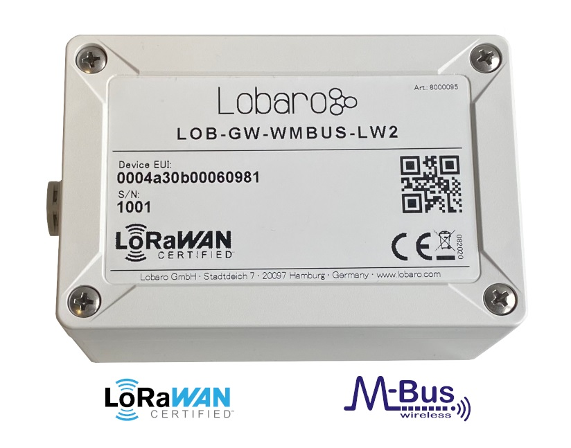

# LOB-GW-WMBUS-LW-2

Lobaro Wireless M-Bus Bridge V2 (for LoRaWAN®)

{: style="height:350px"}

# The documentation has moved.

*Please find the manual on its new location at [https://doc.lobaro.com](https://doc.lobaro.com/pages/viewpage.action?pageId=4194792)*
