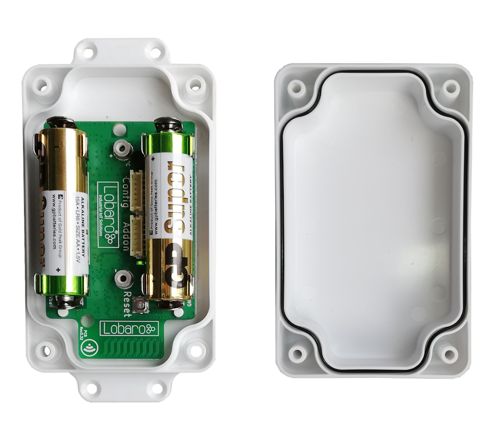

# Wireless mBUS over LoRaWAN Bridge

##Overview

The Lobaro wireless M-Bus (wMBUS) to LoRaWAN Bridge is a cost-effective & energye
efficient device that receives, caches and transparently forwards wireless M-Bus metering
data from up to 500 consumption meters via any LoRaWAN network onto the Internet.
Many gas, water, electricity and heat meters can be read wirelessly today using the common
short range Wireless M-Bus standard. Because such wMBUS enabled meters use the classical
energy saving FSK radio modulation, the wireless range is often limited to less than 50m
and therefore requires the use of additional longer-range radio technologies to forward the
metering data onto the Internet. The advanced LoRa radio modulation used inside the Lobaro
wMBUS to LoRaWAN Bridge is such a key technology.

{: style="width:100%"}

LoRaWAN based LPWANs (Low Power wide area networks) allow connections to the Internet
from small battery powered devices with wireless ranges of up to 5 kilometers between
the transmitter and receiving gateway antenna - without the usual cellular network costs in
classical M2M or smart metering solutions. Also - unlike with cellular networks - it's possible
to setup own gateways if needed. This often results in much lower operational costs with the
Lobaro wMBUS bridge compared to conventional remote meter reading via LTE networks.
The metering data will not be decrypted by the LoRaWAN Bridge, instead an unchanged
1:1 forwarding takes place via one or more LoRaWAN packets (depending on the wMBUS
telegram byte size). Thus the end-to-end encryption of sensitive wireless MBUS consumption
data is preserved.
Initial conguration, firmware updates & status readouts are done user-friendly via USB on the
PC with the Lobaro Tool (Windows, Linux, Mac). An additional possibility of configuration in the field "over the air" by means of LoRaWAN downlinks will soon also be available via
firmware update.

**Please read the manual carefully before operating the device. A safe operation of the
device is only possible if you follow the guides provided in this manual. Using the device
differently than intended by Lobaro my cause damage to people, the environment, or
the device.**

!!! info "Consider using the latest firmware on your hardware"
    * [**See available firmware downloads**](firmware.md){: target="_blank"}

##The Device 

###Example without Power Addon
{: style="width:60%; display: block; margin: 0 auto;"}

###Example with Power Addon
{: style="width:50%; display: block; margin: 0 auto;"}

###Device installation
The device must be fixed on a flat surface using the lateral mounting holes of the case, see
chapter 6.1 for a detailed description of all housing dimensions. Alternatively we offer as
accessory a mounting clip for a standard 35mm DIN rail. The device can then easily snapped
on a such rails. It can therefore be added to a variety of racks alongside other devices.

!!! warning "Under any circumstances the device must not be mounted higher than 2 meters above ground to avoid any risks in case of falling down!"

For optimal RF performance (e.g. LoRa range) any metal obstacles near the internal antenna
should be avoided. In this case 'near' is defined as keep-out distance of about 3-5 centimeters
around the antenna. The internal helix antenna can be identified by the winding pcb traces
near the white printed encircled 'connectivity' symbol. In any case a device mounting directly
on top of a metal surface is not advisable since it will degrade the possible RF range. Stone
walls, wood or plastic standos are perfectly ok.
In case of challenging installation locations (e.g. in basements) or unavoidable long distances
to the next LoRaWAN gateway, Lobaro offers on request custom product variant equipped
with a 'SMA' connector to support a external antenna connection.

###Power Supply
The wMBUS over LoRaWAN Bridge default power supply consists of two series connected
off-the-shelf 1.5V 'AA' sized batteries. Be sure to get the polarity right, see the '+'-Symbol on
the board. In general only AA cells of the types Alkali-Manganese (1.5V, LR6) and Lithium-
Iron-Sulphide (1.5V, FR6) are allowed to be inserted in the device. Lobaro recommends the
use of FR6 batteries like the Energizer Ultimate Lithium over LR6 types because of the higher
capacity and better discharge properties.

!!! warning "Other Batteries or accumulators with a nominal voltage of more than 1.5V must not inserted into the device under any circumstances. In particular, lithium based cells with a nominal voltage of 3.6V or 3.7V must not be used on the AA battery slots!"

On request we can supply custom product variants with special housings powered by even
bigger batteries. For example a 3.6V C sized mono cell typically has a capacity of 9Ah with
leads to a 3x increased battery life compared to the standard AA-cells. With D sized cells of
typically 19Ah capacity this value can be doubled once again (6x). Also available on request
are options with permanent external power supply (230V, 9-24V, 5V USB).

###Battery life time
The battery life time of the wireless M-Bus to LoRaWAN Bridge can not be specifed trustworthy
without knowledge of the detailed installation scenario. At least estimations for the
following custom project based parameters have to be known:

+ Meter count per single wMBUS bridge, e.g. 10 different meters.

+ Needed LoRaWAN transmission interval, e.g. daily uploads.

+ Average wireless M-Bus telegram size in bytes, e.g. 35 byte.

+ Wireless M-Bus telegram transmission interval of the meter, e.g. every 10 seconds.

+ Typically used LoRa Spreading Factor / LoRa link quality, e.g. SF10.

Depending on these parameters battery life times from a few months to over 15 years can
be achieved. You may send us your use-case details as described above to info@lobaro.com
and we will return to you a custom battery lifetime calculation, a recommendation for the
best power supply scheme and the needed minimal battery capacity.

####Example calculation
In this battery lifetime calculation scenario the target meters send a 35 byte long ('L-Field')
wireless M-Bus telegram constantly every 10 seconds. This behavior is for example very
similar to a 'Hydrus' ultrasonic water meter of Diehl Metering2. The Diehl meter itself has a
specified battery life time of 12 years.
Because of the mentioned 10 second send interval it is sufficient to configure the bridge for
a wireless M-Bus listen period of 20 seconds by setting the bridge configuration parameter
cmodeDurSec to a value of 20 (refer to section 4.3.2). This will ensure that all meters of
interest sent their consumption telegrams at least onces during the configured listen period
of the bridge.
For a worst-case battery-lifetime calculation the weakest possible LoRaWAN connectivity has
been selected. That means to reach a LoRaWAN Gateway the Lobaro hardware has to send
out its Uplink data very slowly (&ge; 2 seconds) and redundant by using a LoRa spreading factor
of 12. Beside this the actual usable battery capacity has been set to 80% of the nominal
value. The resulting worst-case minimal battery-life times are presented in table 1.

#####Table 1:Battery life for daily LoRaWAN uploads with SF12
|Collected meters|Battery Life (years) AA cell (3Ah)|Battery Life (years) Baby cell(9Ah)|
|-|-|-|
|1|10.7|32.0|
|5|7.0|21.1|
|10|4.9|14.8|
|20|3.1|9.3|
|40|1.8|5.3|
|80|1.0|2.9|

#####Table 2:Battery life for daily LoRaWAN uploads with SF7

|Collected meters|Battery Life (years) AA cell (3Ah)|Battery Life (years) Baby cell(9Ah)|
|-|-|-|
|1|12.1|36.4|
|5|11.8|35.4|
|10|11.4|34.4|
|20|10.6|31.9|
|40|9.4|28.3|
|80|7.7|23.0|

Estimations for the opposite situation with a excellent LoRa link quality and thus the possible
usage of SF7 are also presented in table 2.
In real world installations the possible spreading factor may be optimized anytime by setting
up additional LoRaWAN Gateways near the meters of interest.

####Usage scenario recommendations
As a simple rule of thumb using the Lobaro wireless M-Bus over LoRaWAN bridge is a good
fit in applications that require daily (or less often) consumption values of 1 to 40 installed
wireless M-Bus meters. For installations with a higher meter count simply more Lobaro
bridges may be used.
Another key factor for high battery lifetime is to select or configure your wireless M-Bus
meters in a way that they send short telegrams very frequently, proven good values are
periods smaller than 30 seconds and telegram sizes smaller 50 bytes. This helps to minimize
the needed wMBus listening time period and avoids the need for multiple LoRaWAN packets
per single telegram (data splitting). Beside this the bridge is naturally most economical when multiple meters per single bridge
can be collected and forwarded via LoRWAN. Although for some applications a 1:1 setup,
e.g. one bridge per meter, may deliver enough benefits to justify the invest.
For hourly or even more frequent meter data uploads, as requested by some of our customers,
LoRaWAN isn't the perfect match from a technology point of view. The same holds
for scenarios where hundreds of meters are expected to be transfered by a single bridge,
e.g. in 'sub-metering' applications with tons of installed heat cost allocators. For such more
demanding cases Lobaro can offer better solutions using higher bandwidth transmission techniques
like NB-IoT3 or classical 4G/LTE. Contact us if you need such a alternative solution
by sending your request to info@lobaro.com - either English or German is fine.

##Work Cycle


The Bridge has a simple work cycle that consists of five phases.

###Initial Phase
This is the phase that is executed after the device is started of restarted. The Bridge performs
a quick self test which you can easily spot by the green internal LED flashing. After that,
the configuration is evaluated. If successful, the LoRaWAN Join phase is executed next.

###LoRaWAN Join Phase
If the Bridge is congured to use over the air activation (OTAA), the OTAA join is performed
at this point. The device will repeatedly try to join its LoRaWAN network until the process
is successful. It then enters the Data Collection Phase.
If the Bridge is configured to use ABP instead of OTAA, this phase is left immediately and
the Data Collection Phase is entered according to the cron configuration.

###Data Collection Phase
During the wMBUS collection phase the device receives any wireless M-Bus data with valid
CRC and stores it for the following LoRaWAN upload phase but only if the received telegram
passes the user defined white list filters. Similar telegrams of one identical meter may be
received multiple times during this phase. In this case the newest telegram with the same
id, type and length will replace the previously received one. Only the latest telegram will be
uploaded via LoRaWAN.
After the configured amount of time for collecting data the LoRaWAN data transfer phase
is entered.

###Data Transfer Phase
During the Data Transfer Phase the Bridge uploads all previously stored wMBUS data using
LoRaWAN. Depending on original wMBUS telegram byte sitze this can require multiple LoRaWAN
messages to be sent. Since LoRa requires any device to respect a strict duty cycle,
it is possible, that the Bridge will need to wait before sending its messages. If this happens,
the device will enter a power saving modus while waiting for the next message. It is possible
that transferring all data will take several minutes.
In addition to the wireless M-Bus data, the Bridge sends a status packet once a day during
this phase. The status packet will always be transmitted prior to any data packets.
For a detailed description of the data sent refer to chapter 5.2.

###Sleep Phase
After transferring all data packets the Bridge enters the Sleep Phase. During this it is completely
inactive to avoid wasting power. It remains sleeping until one of the cron expressions
given in the configuration triggers. When that happens, it enters the Data Collection Phase
again.

##Configuration

###The Lobaro Maintenance Tool


## Target Measurement / Purpose
Forwarding of wireless M-BUS messages via LoRaWAN.

**Features**

* wMBUS C1/T1 and S1 modes
* 868 MHz only (433 MHz on request)


## PDF Documentation

* [PDF Manual (en) for firmware V1.5.1](files/lorawan-wmbus-bridge_en.pdf){: target="_blank"}
* [Product Flyer](files/W-MBus Lora Bridge Flyer.pdf){: target="_blank"}
* [Declaration of Conformity](files/scan-ce-conformity-wmbus-lorawan.pdf){: target="_blank"}


## Parser
### TTN

```javascript
function readVersion(bytes, i) {
    if (bytes.length < 3) {
        return null;
    }
    return "v" + bytes[i] + "." + bytes[i + 1] + "." + bytes[i + 2];
}

function Decoder(bytes, port) {
    // Decode an uplink message from a buffer
    // (array) of bytes to an object of fields.
    var decoded = {};

    if (port === 9) {
        decoded.devStatus = bytes[0];
        decoded.devID = bytes[1] | bytes[2] << 8 | bytes[3] << 16 | bytes[4] << 24;
        decoded.dif = bytes[5];
        decoded.vif = bytes[6];
        decoded.data0 = bytes[7];
        decoded.data1 = bytes[8];
        decoded.data2 = bytes[9];
    }

    // example decoder for status packet by lobaro
    if (port === 1 && bytes.length == 9) { // status packet
        decoded.FirmwareVersion = String.fromCharCode.apply(null, bytes.slice(0, 5)); // byte 0-4
        decoded.Vbat = (bytes[5] | bytes[6] << 8) / 1000.0; // byte 6-7 (originally in mV)
        decoded.Temp = (bytes[7] | bytes[8] << 8) / 10.0; // byte 8-9 (originally in 10th degree C)
        decoded.msg = "Firmware Version: v" + decoded.FirmwareVersion + " Battery: " + decoded.Vbat + "V Temperature: " + decoded.Temp + "°C";
    } else if (port === 1 && bytes.length == 7) {
        decoded.FirmwareVersion = readVersion(bytes, 0); // byte 0-2
        decoded.Vbat = (bytes[3] | bytes[4] << 8) / 1000.0; // originally in mV
        decoded.Temp = (bytes[5] | bytes[6] << 8) / 10.0; // originally in 10th degree C
        decoded.msg = "Firmware Version: " + decoded.FirmwareVersion + " Battery: " + decoded.Vbat + "V Temperature: " + decoded.Temp + "°C";
    }

    return decoded;
}


```
[^ 1]: Energy Meter, Water Meter and House Icons made by Freepik from www.flaticon.com is licensed by CC 3.0 BY
Heater Icon made by Nikita Golubev from www.flaticon.com is licensed by CC 3.0 BY
Map Icon Icons made by Darius Dan from www.flaticon.com is licensed by CC 3.0 BY
LoRaWAN Logo © LoRa Alliance, NB-IoT Logo © GSM Association, wM-Bus Logo © www.m-bus.com
