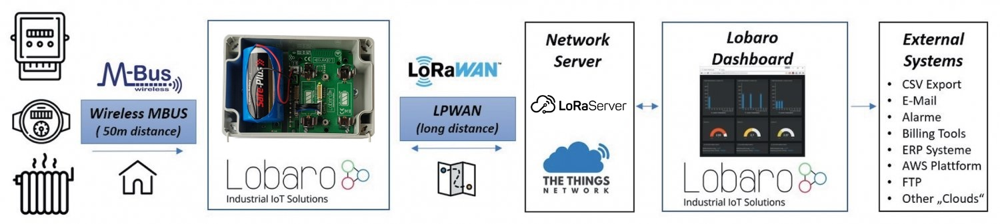

# Wireless mBUS over LoRaWAN Bridge

##Overview

The Lobaro wireless M-Bus (wMBUS) to LoRaWAN Bridge is a cost-effective & energye
efficient device that receives, caches and transparently forwards wireless M-Bus metering
data from up to 500 consumption meters via any LoRaWAN network onto the Internet.
Many gas, water, electricity and heat meters can be read wirelessly today using the common
short range Wireless M-Bus standard. Because such wMBUS enabled meters use the classical
energy saving FSK radio modulation, the wireless range is often limited to less than 50m
and therefore requires the use of additional longer-range radio technologies to forward the
metering data onto the Internet. The advanced LoRa radio modulation used inside the Lobaro
wMBUS to LoRaWAN Bridge is such a key technology.

{: style="width:100%"}

LoRaWAN based LPWANs (Low Power wide area networks) allow connections to the Internet
from small battery powered devices with wireless ranges of up to 5 kilometers between
the transmitter and receiving gateway antenna - without the usual cellular network costs in
classical M2M or smart metering solutions. Also - unlike with cellular networks - it's possible
to setup own gateways if needed. This often results in much lower operational costs with the
Lobaro wMBUS bridge compared to conventional remote meter reading via LTE networks.
The metering data will not be decrypted by the LoRaWAN Bridge, instead an unchanged
1:1 forwarding takes place via one or more LoRaWAN packets (depending on the wMBUS
telegram byte size). Thus the end-to-end encryption of sensitive wireless MBUS consumption
data is preserved.
Initial conguration, firmware updates & status readouts are done user-friendly via USB on the
PC with the Lobaro Tool (Windows, Linux, Mac). An additional possibility of configuration in the field "over the air" by means of LoRaWAN downlinks will soon also be available via
firmware update.

**Please read the manual carefully before operating the device. A safe operation of the
device is only possible if you follow the guides provided in this manual. Using the device
differently than intended by Lobaro my cause damage to people, the environment, or
the device.**

!!! info "Consider using the latest firmware on your hardware"
    * [**See available firmware downloads**](firmware.md){: target="_blank"}

##The Device 

###Example without Power Addon
{: style="width:60%; display: block; margin: 0 auto;"}

###Example with Power Addon
{: style="width:50%; display: block; margin: 0 auto;"}

###Device installation
The device must be fixed on a flat surface using the lateral mounting holes of the case, see
chapter 6.1 for a detailed description of all housing dimensions. Alternatively we offer as
accessory a mounting clip for a standard 35mm DIN rail. The device can then easily snapped
on a such rails. It can therefore be added to a variety of racks alongside other devices.

!!! warning "Under any circumstances the device must not be mounted higher than 2 meters above ground to avoid any risks in case of falling down!"

For optimal RF performance (e.g. LoRa range) any metal obstacles near the internal antenna
should be avoided. In this case 'near' is defined as keep-out distance of about 3-5 centimeters
around the antenna. The internal helix antenna can be identified by the winding pcb traces
near the white printed encircled 'connectivity' symbol. In any case a device mounting directly
on top of a metal surface is not advisable since it will degrade the possible RF range. Stone
walls, wood or plastic standos are perfectly ok.
In case of challenging installation locations (e.g. in basements) or unavoidable long distances
to the next LoRaWAN gateway, Lobaro offers on request custom product variant equipped
with a 'SMA' connector to support a external antenna connection.


## Target Measurement / Purpose
Forwarding of wireless M-BUS messages via LoRaWAN.

**Features**

* wMBUS C1/T1 and S1 modes
* 868 MHz only (433 MHz on request)


## PDF Documentation

* [PDF Manual (en) for firmware V1.5.1](files/lorawan-wmbus-bridge_en.pdf){: target="_blank"}
* [Product Flyer](files/W-MBus Lora Bridge Flyer.pdf){: target="_blank"}
* [Declaration of Conformity](files/scan-ce-conformity-wmbus-lorawan.pdf){: target="_blank"}


## Parser
### TTN

```javascript
function readVersion(bytes, i) {
    if (bytes.length < 3) {
        return null;
    }
    return "v" + bytes[i] + "." + bytes[i + 1] + "." + bytes[i + 2];
}

function Decoder(bytes, port) {
    // Decode an uplink message from a buffer
    // (array) of bytes to an object of fields.
    var decoded = {};

    if (port === 9) {
        decoded.devStatus = bytes[0];
        decoded.devID = bytes[1] | bytes[2] << 8 | bytes[3] << 16 | bytes[4] << 24;
        decoded.dif = bytes[5];
        decoded.vif = bytes[6];
        decoded.data0 = bytes[7];
        decoded.data1 = bytes[8];
        decoded.data2 = bytes[9];
    }

    // example decoder for status packet by lobaro
    if (port === 1 && bytes.length == 9) { // status packet
        decoded.FirmwareVersion = String.fromCharCode.apply(null, bytes.slice(0, 5)); // byte 0-4
        decoded.Vbat = (bytes[5] | bytes[6] << 8) / 1000.0; // byte 6-7 (originally in mV)
        decoded.Temp = (bytes[7] | bytes[8] << 8) / 10.0; // byte 8-9 (originally in 10th degree C)
        decoded.msg = "Firmware Version: v" + decoded.FirmwareVersion + " Battery: " + decoded.Vbat + "V Temperature: " + decoded.Temp + "°C";
    } else if (port === 1 && bytes.length == 7) {
        decoded.FirmwareVersion = readVersion(bytes, 0); // byte 0-2
        decoded.Vbat = (bytes[3] | bytes[4] << 8) / 1000.0; // originally in mV
        decoded.Temp = (bytes[5] | bytes[6] << 8) / 10.0; // originally in 10th degree C
        decoded.msg = "Firmware Version: " + decoded.FirmwareVersion + " Battery: " + decoded.Vbat + "V Temperature: " + decoded.Temp + "°C";
    }

    return decoded;
}


```
[^ 1]: Energy Meter, Water Meter and House Icons made by Freepik from www.flaticon.com is licensed by CC 3.0 BY
Heater Icon made by Nikita Golubev from www.flaticon.com is licensed by CC 3.0 BY
Map Icon Icons made by Darius Dan from www.flaticon.com is licensed by CC 3.0 BY
LoRaWAN Logo © LoRa Alliance, NB-IoT Logo © GSM Association, wM-Bus Logo © www.m-bus.com
