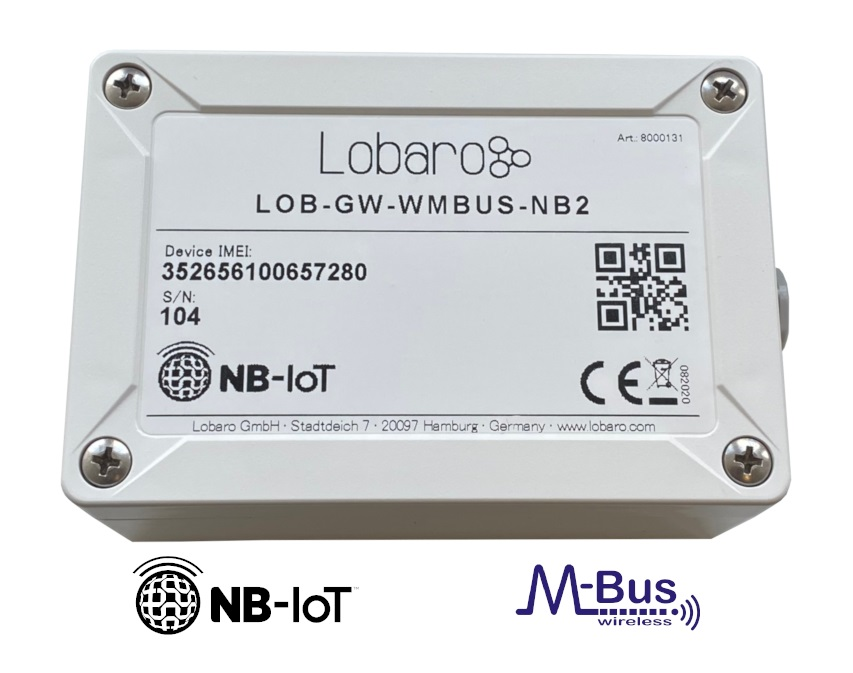

#LOB-GW-WMBUS-NB-2 
The Lobaro Wireless M-Bus NB-IoT Gateway.

{: style="height:350px"}

# The documentation has moved.

*Please find the manual on its new location at [https://doc.lobaro.com](https://doc.lobaro.com/doc/nb-iot-lte-m-sensors/wmbus-nb-iot-gateway-v2)*
