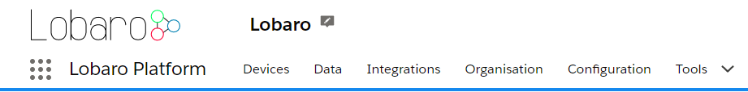

# Lobaro IoT Platform

The Lobaro IoT Platform offers device management and can process, display and forward data of IoT Devices.

The Platform is optimized for but not limited to handle Lobaro devices.

Public Lobaro instance: [platform.lobaro.com](https://platform.lobaro.com){: target="_blank"}

We offer On-Premise hosting and dedicated cloud instances. 
The documentation will always reference the Public Lobaro instance of the Platform.

## Overview

You can find your organisations name next to the Logo. Admins can change their organisation by clicking the small Icon next to it.

* **Devices**: Manage all devices of your organisation.
* **Data**: See incoming data of all your devices.
* **Integrations**: Manage data connections to and from other applications. (See: [Integrations](integrations.md)).
* **Organisation**: Manage all organisation related data.
* **Configuration**: Platform administration of global entities independent of the Organisation (Admins only).
* **Tools**: wMbus Parser and Hardware Activation.

The platform shows device data received via various data sources like LoRaWAN, NB.IoT, GSM, etc..

The connection to a device in handled by a `Datasource`. 
Incoming data is mapped to a matching `Device`.
Raw data is saved as `Uplink Message`. 
The `Uplink Message` gets processed by a `Parser`. 
The result of the parser is saved as `Device Data` used for visualization inside the dashboard and in outgoing API's.

