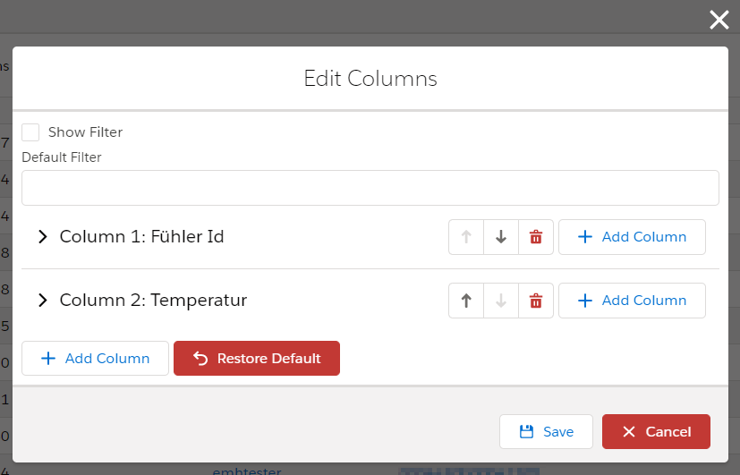
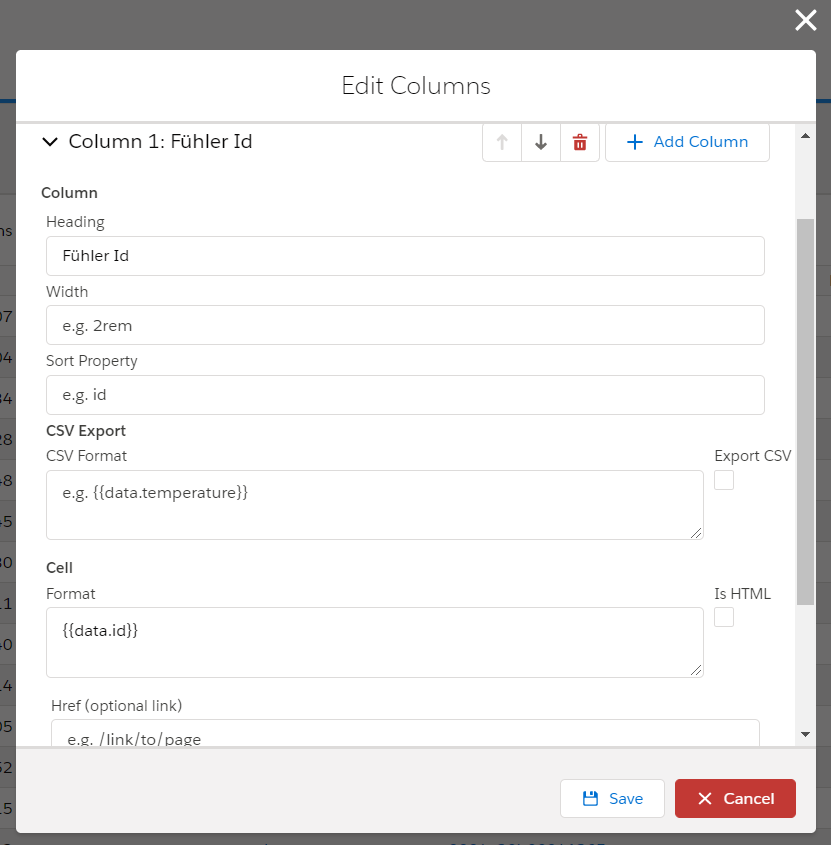
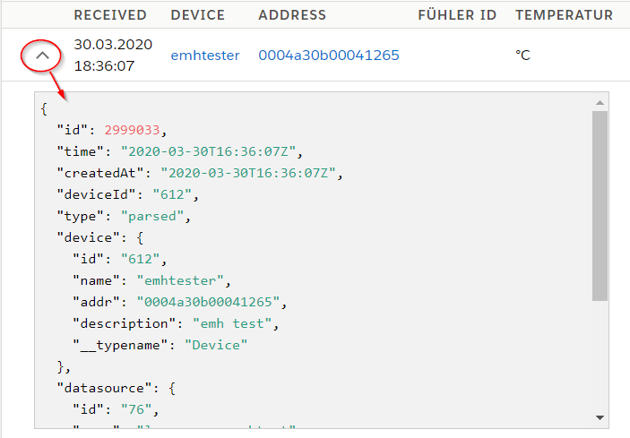

# Table Config

**Audience:** Platform Admins

Platform Admins can manage Table Configs for different tables in the Platform. (Currently only for Device Data)
The table config is shared between all devices of a device type.

**Navigate to:**

* Configuration -> Device Types -> Select a Device Type -> Data Table Config
* Data -> Gear Icon above table
* Devices -> Select a Device -> Device Data -> Gear Icon above table

{: style="width:40%"}
{: style="width:40%"}

**Column Fields:**

* **Heading:** Title of the column
* **Width:** Optional width of the column (use CSS)
* **Sort Property:** Optional: Path to property to allow sorting
* **CSV Export:** 
  * **Export CSV**: Check to enable CSV export for the column
  * **CSV Format:** Format for the CSV export
* **Cell:**
  * **Format:** Format of the value inside the table
  * **Is Html:** HTML is not escaped. This is unsafe. Do not use!
  * **Href:** Add a link to another page to the value

!!! note
    Formats are handlebar templates. See: [Format Template](#format-template)

## Format Templates {#format-template}

Formatting values in HTML or CSS output is done via [Handlebar Templates](https://handlebarsjs.com/){: target="_blank"}.
Please also have a look into the [Handlebar Documentation](https://handlebarsjs.com/guide/){: target="_blank"}

!!! note
    You can not use HTML directly for security reasons. There is a checkbox `Is HTML` to skip the escaping.
    We do not recommend using it and it might get removed in future versions.

The underling data structure can be seen when expanding the table:



Parser output is saved in the `data` field. But you can also render all other fields.
To replace part of the template with variable data you need to put the variable in double curly brackets: e.g. `{{variable}}`

!!! example
    To display the `temperature` field of the parser output you can simply write `{{data.temperature}}`.

For more advanced formatting you will need Handlebar Helpers.

### Handlebar Template Helpers

Handlebar Helpers can be used to apply advanced formatting to data outputs. Starting from conditionals to simple calculations.

All [built-in Handlebar Helpers](https://handlebarsjs.com/guide/builtin-helpers.html){: target="_blank"} can be used.

Helpers are used in the following format:  
`{{helper_name <required_parameters> [optional_parameters]}}`

#### date

Format a given time and date.

`{{date <date> [format]}}`

* `date` must be a valid input for [moment()](https://momentjs.com/docs/#/parsing/unix-timestamp/){: target="_blank"}. When using timestamps it must be in milliseconds.
* `format` must be a valid [moment.format() string](https://momentjs.com/docs/#/displaying/format/){: target="_blank"}.

**Example**

Template:
```
{{date data.time}}
```

Data:
```json
{
  "data": {
    "time": 1585823609000
  }
}
```

Output:
```text
02.04.2020 10:33:29
```

#### duration

Format given duration.

`{{duration <duration> [format]}}`

* `duration` must be a valid input for [moment.duration()](https://momentjs.com/docs/#/durations/){: target="_blank"}. When using timestamps it must be in milliseconds.
* `format` must be a valid [moment.format() string](https://momentjs.com/docs/#/displaying/format/){: target="_blank"}.

**Example**

Template:
```
{{duration duration}}
```

Data:
```json
{
  "data": {
    "duration": 10000
  }
}
```

Output:
```text
00:00:10
```

#### durationHumanize

Format a given duration in a human readable format.

`{{durationHumanize <duration>}}`

* `duration` must be a valid input for [moment.duration()](https://momentjs.com/docs/#/durations/){: target="_blank"}. When using timestamps it must be in milliseconds.

**Example**

Template:
```
{{durationHumanize data.duration}}
```

Data:
```json
{
  "data": {
    "duration": 10000
  }
}
```

Output:
```text
10 seconds
```


#### durationAs

Get a given duration in a certain unit of time.

`{{durationAs <duration> [unit_of_time]}}`

* `duration` must be a valid input for [moment.duration()](https://momentjs.com/docs/#/durations/){: target="_blank"}. When using timestamps it must be in milliseconds.
* `unit_of_time` must be a valid input for [moment.duration().as()](https://momentjs.com/docs/#/durations/as/){: target="_blank"}

**Example**

Template:
```
{{durationAs data.duration "milliseconds"}}
```

Data:
```json
{
  "data": {
    "duration": 10000
  }
}
```

Output:
```text
10000
```

#### fromNow

Display the time between now and a given time. See also: [moment().fromNow()](https://momentjs.com/docs/#/displaying/fromnow/){: target="_blank"}.

`{{fromNow <date>}}`

* `date` must be a valid input for [moment()](https://momentjs.com/docs/#/parsing/unix-timestamp/){: target="_blank"}. When using timestamps it must be in milliseconds.

**Example**

Template:
```
{{fromNow data.time}}
```

Data:
```json
{
  "data": {
    "time": 1585823609000
  }
}
```

Output:
```text
3 days ago
```


#### typeof

Display the js type of a value. Useful for debugging.

`{{typeof <value>}}`

* `date` must be a valid input for [moment()](https://momentjs.com/docs/#/parsing/unix-timestamp/){: target="_blank"}. When using timestamps it must be in milliseconds.

**Example**

Template:
```
{{typeof data.value}}
```

Data:
```json
{
  "data": {
    "value": 1337
  }
}
```

Output:
```text
number
```


#### toFixed (number of decimals)

Display a number with given amount of decimal places. For more advanced formatting see `numberFormat`.

`{{toFixed <value> [decimals]}}`

* `decimals` number of decimal places (Default: 2)

**Example**

Template:
```
{{toFixed data.value 3}}
```

Data:
```json
{
  "data": {
    "value": 1.2345
  }
}
```

Output:
```text
1.234
```

#### numberFormat

Format a number.

`{{numberFormat <value> [options]}}`

options:

* `thousandsSep` separator between 3 digits (Default: locale dependent)
* `decimalSep` decimal separator (Default: locale dependent)
* `decimals` number of decimal places (Default: 2)

**Example**

Template:
```
{{numberFormat 1024.23 thousandsSep="." decimalSep=","}}
```

Data:
```json
{
  "data": {
    "value": 1024.2345
  }
}
```

Output:
```text
1.024,23
```


#### Math: ceil, floor, div, max 

Mathematical operations.

* `{{ceil <value>}}` round up to integer
* `{{floor <value>}}` round down to integer
* `{{div <nom> <denom>}}` returns nom / denom
* `{{max <list> [property_path]}}` returns the biggest element from the list. Compares the given `property_path`.

#### Boolean operations

Boolean operations, useful for `#if` conditions.

* `{{not <value>}}` negate the value
* `{{eq <v1> <v2>}}` v1 == v2
* `{{lt <v1> <v2>}}` v1 < v2
* `{{lte <v1> <v2>}}` v1 <= v2
* `{{gt <v1> <v2>}}` v1 > v2
* `{{gte <v1> <v2>}}` v1 >= v2


#### icon

Render an Icon

`{{icon <name> [category]}}`

* `name` name of the icon. Find all icons here: [SLDS Icons](https://www.lightningdesignsystem.com/icons/){: target="_blank"}
* `category` category of the icon (Default: "utility").

