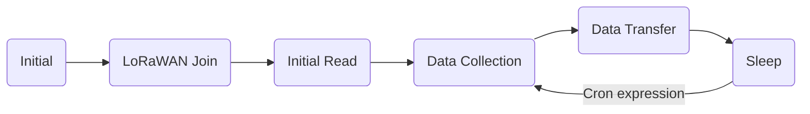

```mermaid
graph TD;
    A-->B;
    A-->C;
    B-->D;
    C-->D;
```

```mermaid
graph LR;
    init(Initial)-->join(LoRaWAN Join);
    join-->check(Initial Read);
    check-->read(Data Collection);
    read-->send(Data Transfer);
    send-->sleep("Sleep");
    sleep-->|Cron expression| read;
```
