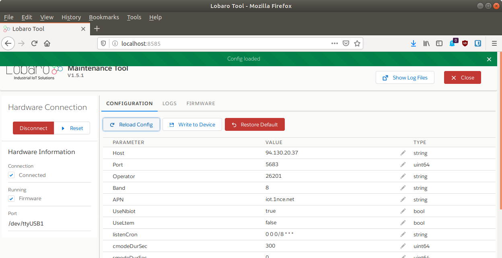
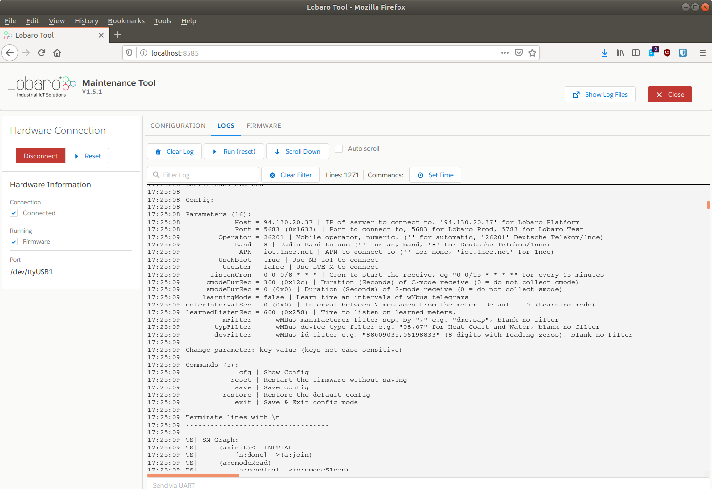

# Lobaro Maintenance Tool


!!! info "Downloads"
    * [**Lobaro Maintenance Tool Download (v1.5.4 Windows)**](https://github.com/lobaro/flash-tool-release/releases/download/1.5.4/lobaro-tool.exe){: target="_blank"}
    * [**Lobaro Maintenance Tool Download (v1.5.4 Linux)**](https://github.com/lobaro/flash-tool-release/releases/download/1.5.4/lobaro-tool-linux){: target="_blank"}
    * [**Lobaro Maintenance Tool Download (v1.5.4 Mac 64Bit)**](https://github.com/lobaro/flash-tool-release/releases/download/1.5.4/lobaro-tool-mac64){: target="_blank"}
    * [**Lobaro Maintenance Tool previous versions**](https://github.com/lobaro/flash-tool-release/releases){: target="_blank"}
    * [**CP2102 Driver Download**](https://www.silabs.com/products/development-tools/software/usb-to-uart-bridge-vcp-drivers){: target="_blank"}  
    
!!! danger "Device config not saved?"
    When upgrading the Lobaro Tool from version v1.4.x or earlier you have to hit "F5" or "Site full reload" in your browser once the Lobaro Tool started! 
    **Otherwise your device config can not be saved!** This is because your browser caches the incompatible frontend from earlier versions.

Supports the PC based configuration of all Lobaro IoT sensors. 

It is intended to be used in conjunction with our [**USB configuration adapter**](./usb-config-adapter.md). 

## Features

* Change static sensor configuration
* Perform firmware updates for your Lobaro devices
* Live monitoring of device diagnostic output
* Save diagnostric output into *.txt file

## System Requirements

* Operating system:
    * MacOS X
    * Windows 7/10
    * Linux
    
* Browser
    * Firefox
    * Chrome
    * Edge
       
!!! warning "USB Driver"

    The CP2102 USB driver **MUST** to be installed before using the Lobaro-tool.
    
    [**CP2102 Driver Download**](https://www.silabs.com/products/development-tools/software/usb-to-uart-bridge-vcp-drivers){: target="_blank"}       
    
## Download & Installation

### macOS / Linux 
After downloading the "lobaro-tool" file, e.g. to a directory "lobaro" in your home path. Then make the tool file executable:

```Bash
cd ~/lobaro
chmod +x lobaro-tool
./lobaro-tool
```

!!! info
    If MacOS shows up a security warning and refuses to start the tool: 
    You can solve this by right-clicking the lobaro-tool file, selecting open and overrule the warning.


### Windows
After downloading simply start the "lobaro-tool.exe" with double click. 

Alternativly download the windows installer and start this.

!!! note
    Windows might show up a security warning and ask you to proceed anyway. This is behavior is normal.


## Connecting to your device
### Physical connection
Connect your Lobaro Device to the USB-port of your computer using the [Lobaro Config Adapter](usb-config-adapter.md). 
The 6-pin connector must be plugged into the white rectangular socket on the device that is labeled with the 
word **CONFIG**. The location of the socket is dependent on the specific device and hardware version you are 
trying to attach.

!!! warning "Make sure to use the port labeled **CONFIG**"
    Some of our devices have multiple sockets the connector fits into. Be sure to use the correct one, 
    the one labeled **CONFIG**!

{: style="width:49%; display: inline-block; margin: 0 auto;"}
{: style="width:49%; display: inline-block; margin: 0 auto;"}

The LoRaWAN Board (left image) can be powered by the config adapter. Other devices, like the NB-IoT/LTE-M boards or 
the [wMBus-LoRaWAN-Bridge Hardware revision 2](/lorawan-sensors/wmbus-lorawan/index.html#hardware-revision-2x-active-since-2020), 
need to be connected to their normal power supply. *If in doubt, just make sure you have the device powered!*

### Software connection
When your device is successfully attached to your computer, you can build a connection with the Lobaro Maintenance Tool:


Under *Hardware Connectiom* select *auto* and click *Connect*, as seen in the screenshot above. If you know to 
which port the device is connected to your computer (either COM or ttyUSB), you can alternatively select it explicitly 
instead of using *auto*.


## Device Configuration


When you are connected to a Lobaro Device, you can use the Tab *CONFIGURATION* to read and change the 
configuration parameters of the Device. You can read out the current configuration from the device by pressing the  
*Reload Config* button (reading takes a few seconds).

!!! info "Reading/changing config reboots the device!"
    Every time you use one of the buttons *Reload Config*. *Write to Device*, or *Restore Default*, the connected 
    device will be rebooted! Also keep in mind that the operations triggered by pressing the buttons include 
    communication with the device over a serial bus and they will take a few seconds.
    
    To avoid errors, please do not those buttons repeatedly!

When the configuration is read, you can alter the parameters by clicking on the pencil icon on the right. Values 
that you changed will by printed in bold font. When you have adjusted all values you want to change, you must press 
*Write to Device* to actually change anything on the Device. Writing the values will reboot the device.

The Button *Restore Default* will reset all config parameters of the connected Device to their internal default 
values. The device will reboot, and the listed values of the configuration in the Lobaro Maintenance Tool well be 
updated.

!!! warning "Always reload the config before changing it!"
    When you are working with multiple devices, make sure that your always press *Reload Config* after attaching 
    a new device before you start updating values. If you fail to do so, you might accidentally transfer values from 
    the previously attached device to the newly connected. This is especially a problem when working with LoRaWAN 
    sensors, as you will copy the DevEUI from one device to the other!

You can watch the rebooting of the Device and check the altered configuration parameters by locking in the *LOGS* Tab.


## Device Logging

All of our Devices provide extensive logging information over the *CONFIG* port. When you are connected to a Device
in the Lobaro Maintenance Tool, you can read the log messages in the *LOGS* Tab. This feature is helpful if you 
try to find out the cause of problems you experience. You can also find out a lot of information about your Device, 
for example you can find the parameters used to connect your LoRaWAN Devices to your Network Server 
(DevEUI, AppKey, etc.).

All messages are displayed in the big textarea, each line is prefixed by the time it is received (using the clock 
of your computer). You can use *Clear Log* to start again with an empty textarea. The cleared messages will still be 
available through the log files that the tool creates.

When starting, our devices print out their current configuration parameter values. Most Devices also have a power on 
test, that checks if attached sensors can be read successfully. Any Problems that the Device detects will be printed 
to the log.

### Restarting
The *LOGS* Tab also contains a button *Run (reset)*. This button triggers a reboot of the attached device. This 
can be useful when you start working with your device or if you try to fix issues with connected sensors.

### Log files
The log is also written to a file on your computer whenever a Device is attached to the Maintenance Tool. Every time 
you start the Lobaro Maintenance Tool, a new log file is created. When you press the button *Show Log Files*, a 
file browser is opened at the location where log files are kept. 

### Sending to the Device
Below the textarea is an input field *Send via UART*. Text entered here (and confirmed with Enter) will be sent to 
the connected Device via UART. Some of our Devices use this feature, for example the 
[LoRaWAN Modbus Bridge](/lorawan-sensors/modbus-lorawan.html#dialog-mode) for its interactive Dialog Mode.

### Log parsing
If need to parse the log messages of one of our Devices with your own tools, you can connect to it without the 
Maintenance Tool by using any serial UART reader. You can find the UART parameters at the page for our 
[Config Adapter](usb-config-adapter.md#default-uart-configuration).

## Updating Firmware
TODO:

## Changelog
### 1.5.4 - 11.02.2020
- Fix a bug where the configuration can not be changed

### 1.5.3 - 07.02.2020
- Minor: Add "...flash -t" command line argument to speedup manual flash startup time

### 1.5.2 - 05.02.2020
- Avoid browser caching of frontend code

### 1.5.1 - 31.01.2020
- Support nRF9160 Config and Firmware update on Lobaro hardware
- Improve progress indicator and error checks during Flash

### 1.4.10 - 11.10.2019
- No relevant changes

### 1.4.9 - 17.09.2019
- Fix a bug where flashing firmware fails due to UART buffer issues

### 1.4.4 - 11.09.2019
- Fix a bug that failed to flash very big firmware files.
- Add delays when communicating with Bootloader to avoid timing issues.
- Flash command now support --verbose flag

### 1.4.3 - 30.07.2019
- Fix a bug where writing the config does not work.

### 1.4.2 - 29.07.2019
- Fix a bug where the program hangs up while connecting to a wrong serial port in "auto" mode.
- Fix a bug where the tool crashes when flashing the firmware while not connected.

### 1.4.0 - 10.08.2018

- Log Tool events like Connect, Disconnect, Read Config, etc. to UART Log
- Switch to firmware mode after connecting with "auto" port

### 1.3.4 - 09.08.2018
- Always switch to Firmware run mode after: Connect, Load Config, Restore Config.

### 1.3.3
- Internet Explorer support

### 1.3.2 - 09.07.2018
- Fix reading configs bigger than 256 Bytes (needed for wMbus Bridge)

### 1.3.0 - 21.03.2018
- Improve connection detection
- Allow to connect to specific serial port
- Do not reset to boot mode when connecting to selected serial port

### 1.2.5 - 07.03.2018
- Fix issues with loading a configuration file. Default is now "config.yaml"
- Remove horizontal scrollbars in tabs
- Add "Set Time" button to send "time=<now>" via UART
- Add send UART input below Log
- Display if Firmware or Booloader is running
- Add success message when loading config

### 1.2.4 - 07.03.2018

- Allow to replace assets e.g. the logo by placing /assets/logo.png next to the executable

### 1.2.3 - 05.03.2018
- Log Timestamp in UART log file on disk
- Allow to set http server ip and port to allow remote access

### 1.2.2 - 19.02.2018
- Fix CBOR decoding error that was introduced in 1.2.0 (see: https://github.com/ugorji/go/issues/232)

### 1.2.0 - 16.02.2018
- Fix Serial port issues that appear on MAC, Linux and in rare cases on Windows

### 1.2.0 - 15.02.2018
- Log UART output to file in $HOME/.lobaro/

### 1.1.x
- Restore Default Config
- Close button
- Closing the browser window now also shut down the server

