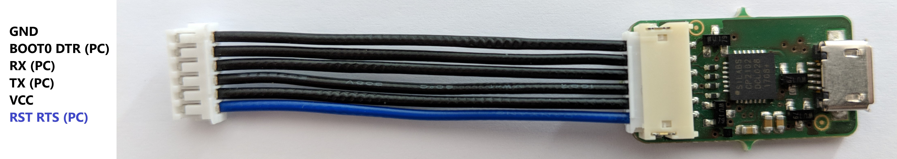

# Lobaro USB configuration adapter



The USB configuration adapter can be used for:

* Sensor initial configuration
* Firmware log diagnostics
* Firmware updates

using the our free [Lobaro Maintenance Tool](./lobaro-tool.md) PC software.

## Driver Download
The adapter uses a CP2102 USB to UART bridge internally. The driver is available for free download and must be installed prior first use:

[CP2102 Driver Download](https://www.silabs.com/products/development-tools/software/usb-to-uart-bridge-vcp-drivers) (MacOS, Windows, Linux)

## Hardware Connection (LoRaWAN Sensors)

* ```Boot0``` of the Lobaro LoRa Hardware (STM32 based) is connected to ```DTR``` of the UART
* ```Reset``` (active low) of the Lobaro LoRa Hardware (STM32 based) is connected to ```RTS``` of the UART

Normally the handling of these uart control is done internally by the [Lobaro PC tool](lobaro-tool).

When using any other uart terminal make sure you control RTS and DTR of the UART correctly or cut the DTR/RTS wires 
from the USB adapter connection if not needed.

### DTR control line

* ```Low / true``` => Run Firmware after Reset (Default since BOOT0 has internal pull-down)
* ```High / false``` => Run Bootloader after Reset


### RTS control line

* ```High / false``` => Run Firmware / Bootloader (Default since RESET has internal pull-up)
* ```Low / true``` => Chip in RESET mode (not running)

## Adapter Schematic
[Picture USB Config Adapter](./img/config-adapter-schematic.png)


