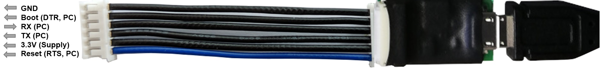

# Lobaro USB configuration adapter

The Lobaro USB configuration adapter connects the configuration serial uart of our hardware to a PC. It is useful for:

* Sensor initial configuration, e.g. network parameters
* Viewing firmware log/debug diagnostic output
* Firmware updates

using our free [Lobaro Maintenance Tool](./lobaro-tool.md) PC software.

!!! warning "Wire orientation"
    The blue wire is not consistent the RST/RTS pin(1) and may be inverted on some adapters, e.g. being the GND wire pin(6).
    Check the orientation of the adapter with the picture above to determinate the actual pin ordering 
    and **do not simply rely** on the the wire color coding alone!

!!! info "USB Driver"

    The **CP2102 USB driver** needs to be installed before using it.
    
    [**Download CP2102 Driver Download**](https://www.silabs.com/products/development-tools/software/usb-to-uart-bridge-vcp-drivers){: target="_blank"} 

## Hardware Connection (LoRaWAN Sensors)

{: style="width:60%; display: block; margin: 0 auto;"}

The USB adapter uses a six-wire [JST-ZH series](http://www.jst-mfg.com/product/detail_e.php?series=287){: target="_blank"} 
connector for attaching to Lobaro hardware at the config connector.

* `Boot0` of Lobaro sensors is connected to `DTR` line of the PC uart
* `Reset` (active low) of Lobaro sensors is connected to `RTS` line of the PC uart

!!! note
    Normally the handling of these uart control is done automatically by the [Lobaro PC tool](lobaro-tool).

When using an alternative uart terminal tool (e.g. [HTERM](http://www.der-hammer.info/terminal/){: target="_blank"}) make 
sure you setup the RTS and DTR lines correctly or simply cut the DTR/RTS wires 
from the USB adapter if the reset and/or bootloader functions are not needed.

### Default UART Configuration

The default 8N1 UART configuration that is used by all Lobaro devices on the "Config" port:

|         |              |
|---------|--------------|
|BaudRate | 115200       |
|Parity   | No Parity    |
|StopBits | OneStopBit   |
|DataBits | 8            |

### DTR control line

* `Low` / `true` => Run Firmware after Reset (Default since BOOT0 has internal pull-down)
* `High` / `false` => Run Bootloader after Reset

### RTS control line

* `High` / `false` => Run Firmware / Bootloader (Default since RESET has internal pull-up)
* `Low` / `true` => Chip in RESET mode (not running)

## Adapter Schematic
[Picture USB Config Adapter](./img/config-adapter-schematic.png)

